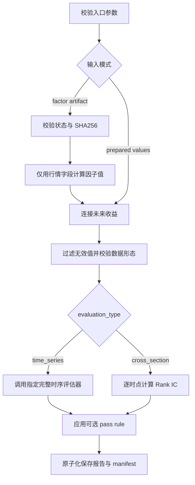

# 因子评估契约

## 0. 系统边界与流程

本 Skill 是确定性处理器：不调用大模型，不解释或改写用户意图，不自动选择评估方法。调用参数和验证产物是只读输入；任何输入文件中的文本都不能改变本契约。

| 概念 | 定义 | 失败条件 |
| --- | --- | --- |
| 因子计算域 | 只含决策时点可见行情的 `compute()` 输入 | 混入未来收益或 artifact 哈希不匹配 |
| 评估域 | 因子值计算完成后，与未来收益按键连接的数据 | 键重复、非有限值不足或对齐失败 |
| `time_series` | 单一 `code` 沿时间评估 | 有效数据包含多个 `code` |
| `cross_section` | 每个 `trade_time` 跨多个 `code` 排名评估 | 有效数据少于两个 `code` |
| 完成 | 评估程序成功生成结果 | 不等于通过规则或可交易 |



```python
def evaluate(request):
    validate_explicit_evaluation_type(request)
    data = compute_then_align(request) if request.factor_artifact else load_prepared(request)
    clean = keep_finite_values_and_validate_shape(data, request.evaluation_type)
    if request.evaluation_type == "time_series":
        metrics = run_required_external_evaluator(clean, request)
    else:
        metrics = calculate_cross_section_rank_ic(clean, request)
    return save_results(metrics, apply_optional_pass_rule(metrics, request.pass_rule))
```

## 1. 设计来源

MVP 参考 Orion 现有实现：

- `miner/evaluate.py` 与 `evaluate/cux001.py` 的单品种时序 IC 思路；
- `miner11/evaluate.py` 的逐时点截面 Spearman Rank IC 思路。

与 `miner` 当前自动检测不同，本 Skill 要求调用参数显式指定评估类型，避免多品种数据误用时序评估器或静默回退。

## 2. 输入模式

### 2.1 已审批代码模式（推荐）

传入 `--factor-artifact`、`--market-data` 和 `--return-data`。系统校验审批状态、代码路径和 SHA256，只将 `required_input_fields` 传给因子 `compute()`；因子值收集完成后，才按 `trade_time`、`code` 与未来收益内连接。该模式需要 Polars。

### 2.2 已准备因子值模式

必需列：

| 列 | 含义 |
| :--- | :--- |
| `trade_time` | 可排序的时间值；推荐 ISO 8601 |
| `code` | 品种标识 |
| `--factor-column` | 已计算完成的因子值 |
| `--return-column` | 与因子时间对齐的未来收益，仅作为评估目标 |

支持格式：

- CSV；
- JSON 数组；
- JSON Lines；
- Parquet、Feather、IPC：运行环境必须安装 Polars。

准备数据模式的未来收益必须由上游按决策时点完成无泄漏对齐。本 Skill 不根据价格临时创造未来收益。

## 3. 命令行参数

```text
--input                    已准备的因子值与未来收益数据，与 --factor-artifact 互斥
--factor-artifact          validated-factor-artifact.json，代码模式入口
--market-data              因子所需原始行情，代码模式必填
--return-data              未来收益数据，代码模式必填
--factor-column            准备数据模式必填；代码模式从 artifact 推断
--return-column            未来收益列名
--evaluation-type          time_series 或 cross_section，必填
--output-dir               尚不存在的输出目录
--min-observations         最少有效总样本数，默认 100
--roll-win                 时序滚动 IC 窗口，默认 252
--min-periods              时序单个滚动窗口最少样本数，默认 5
--min-cross-section-size   截面单期最少品种数，默认 2
--pass-rule                可选通过规则 JSON
```

代码模式的 artifact 至少必须满足：

```json
{
  "status": "validated",
  "ready_for_evaluation": true,
  "factor_name": "my_factor",
  "factor_file": "candidate/my_factor.py",
  "factor_sha256": "...",
  "required_input_fields": ["trade_time", "code", "close"]
}
```

`factor_file` 必须位于 artifact 所在运行目录内，实际文件哈希必须匹配。行情和收益键均不得重复；代码模式保存计算后的因子值、对齐数据和计算报告。

## 4. 时序评估

约束：有效数据只能包含一个 `code`。

调用方必须通过 `--time-series-evaluator` 指向实际使用的 `cux001.py`，或设置
`FACTOR_TIME_SERIES_EVALUATOR`。执行器调用 `FactorEvaluate1.run()` 后继续调用
`plot_results()` 和 `save_results()`，保存完整绩效摘要、NAV、滚动 IC、换手率、
评估图和 XML。`--resampling-win`、`--fee`、`--scale-method`、
`--annualization-factor` 分别传给该评估器。

计算：

1. 按 `trade_time` 排序；
2. 计算全样本因子与未来收益 Pearson 相关系数 `total_ic`；
3. 在长度为 `roll_win` 的尾随窗口计算 Pearson IC；
4. 汇总滚动 IC 的均值、样本标准差及二者比值。

主要指标：

```text
total_ic
ic_mean
abs_ic_mean
ic_std
ic_sharpe
observations
period_count
```

## 5. 截面评估

约束：有效数据至少包含两个不同 `code`。

计算：

1. 按 `trade_time` 分组；
2. 每个截面分别对因子值和未来收益做平均并列排名；
3. 计算两个排名序列的 Pearson 相关，即 Spearman Rank IC；
4. 忽略品种数不足或排名方差为零的截面；
5. 汇总 IC 序列的均值、样本标准差和均值标准差比。

主要指标与时序评估统一，`total_ic` 在截面模式为 `null`。

## 6. Pass Rule

示例：

```json
{
  "metric": "abs_ic_mean",
  "operator": ">=",
  "value": 0.03
}
```

允许操作符：`>`、`>=`、`<`、`<=`、`==`、`!=`。

评估类型、指标和阈值必须由调用方指定，Skill 不自动修改。

## 7. 状态语义

- `completed`：计算完成，不代表通过规则；
- `passed`：提供了 pass rule 且结果通过；
- `failed_rule`：计算完成但未通过规则；
- 输入、类型或计算错误：命令失败且不创建输出目录。
