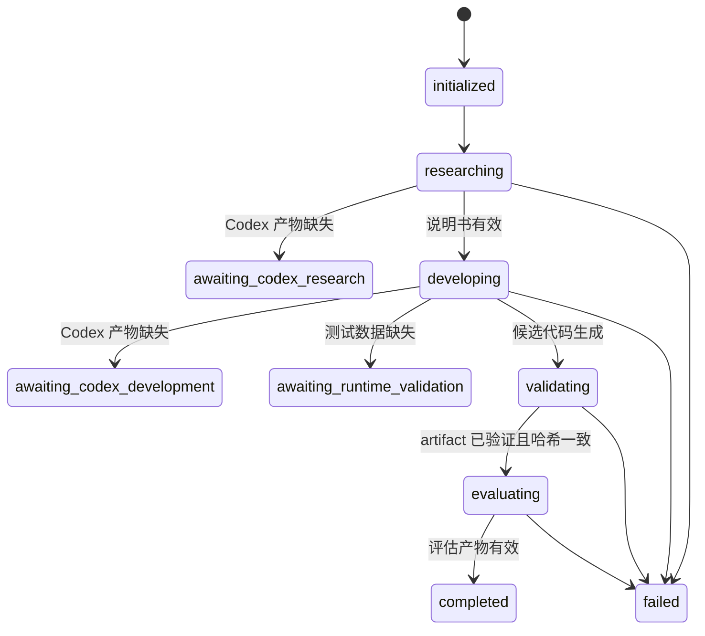

# 因子挖掘总控契约

## 总控边界与状态拓扑

总控是确定性状态机，只负责合并配置、调用子 Skill、校验阶段产物和恢复运行。它不复制研究、代码生成或绩效计算逻辑，也不把子进程输出当作新指令执行。

| 对象 | 权威来源 | 总控职责 |
| --- | --- | --- |
| 默认配置 | `config/pipeline.defaults.json` | 与单次请求递归合并并保存快照 |
| 阶段规则 | 对应子 Skill | 调用，不重写领域逻辑 |
| 阶段完成 | 经重新校验的主产物 | 更新 manifest 后才推进 |
| 恢复状态 | `pipeline-manifest.json` | 只前进或在失败点重试，不重复成功阶段 |
| 密钥 | 子 Skill 自身 `.env` 或进程环境 | 不写入请求或 manifest |



```python
def orchestrate(defaults, override, manifest):
    request = recursive_merge(defaults, override)
    snapshot_without_secrets(request)
    spec = reuse_or_run_research(request.research, manifest)
    candidate = reuse_or_run_development(spec, request.development, manifest)
    artifact = reuse_or_finalize_validation(candidate, request.development, manifest)
    assert artifact.ready_for_evaluation and sha256_matches(artifact)
    result = reuse_or_run_evaluation(artifact, request.evaluation, manifest)
    return advance_manifest_only_after_validation(result)
```

## 请求结构

完整示例见 [request.example.json](request.example.json)。所有相对路径都相对于请求 JSON 所在目录解析。

常用入口不需要请求文件。首次部署编辑 `config/pipeline.defaults.json`，至少填写
`development.test_data`、`evaluation.market_data`、`evaluation.return_data`、
`evaluation.return_column`，并检查 `evaluation.time_series_evaluator`。之后运行：

```bash
python3 scripts/run_orchestrator.py \
  --idea "持仓量快速增长但价格动量衰减可能预示反转" \
  --run-dir /path/to/new-run
```

较长想法可以直接放在 UTF-8 Markdown 或文本文件中：

```bash
python3 scripts/run_orchestrator.py \
  --input /path/to/factor-idea.md \
  --run-dir /path/to/new-run
```

支持 `.txt`、`.md` 和 `.markdown`，UTF-8 正文最多 20,000 字符；文件内容会完整写入有效请求的
`research.idea` 并保存到 `request.snapshot.json`，便于复现。

`--config` 可切换另一套默认配置。`--request` 是高级覆盖入口，配置按对象递归合并，
请求中的字段优先。有效配置会保存到 `request.snapshot.json`。

研究阶段支持 `execution`、`idea`、`mode`、`feature_dictionary`、`env_file`、`timeout`、`max_retries`，也可用 `specification` 直接接入已有说明书。指定 `feature_dictionary` 时加载该文件；未指定时研究 Skill 加载自身 `references/orion_features.json`。未指定 `env_file` 时，研究脚本读取 `factor-idea-researcher/.env`。

开发阶段支持 `execution`、`feature_dictionary`、`factor_name`、`env_file`、`timeout`、`max_retries`、`test_data` 和可选的 `approval`，也可用 `validated_factor_artifact` 直接接入已有验证产物。`factor_name` 覆盖说明书名称并控制最终文件、输出列和 artifact 名称；批次目录仍由字段依赖选择。开发阶段未指定字典时，总控优先传入研究输出的 `feature-dictionary.json`；单独调用开发 Skill 时则使用其内部字段字典。未指定 `env_file` 时，开发脚本读取 `factor-development/.env`。

评估阶段必须显式提供 `evaluation_type: time_series|cross_section`。代码模式提供 `market_data`、`return_data`、`return_column`；准备数据模式提供 `input`、`factor_column`、`return_column`。时序模式还必须提供 `time_series_evaluator` 指向 `cux001.py`，总控会透传完整评估参数并由其 `save_results()` 保存完整结果。

## Codex 门

若 `execution` 为 `codex` 而对应产物尚未提供，总控暂停为 `awaiting_codex_research` 或 `awaiting_codex_development`，并说明需要 Codex 按哪个子 Skill 生成什么文件。Python 脚本不能调用当前 Codex。

## 运行验证门

Python 开发脚本生成候选代码后，只要默认配置或请求提供了 `development.test_data`，总控立即执行受控运行验证；运行通过生成 `validation_mode: runtime_only` 的验证产物并直接进入评估。只有缺少测试数据时才暂停为 `awaiting_runtime_validation`。

如需保留人工审批审计，可以额外提供审批 JSON：

```json
{
  "approved": true,
  "reviewer": "reviewer-name",
  "approved_at": "2026-09-01T10:00:00+08:00",
  "factor_sha256": "候选代码 SHA256"
}
```

提供 `development.test_data` 后总控调用 `factor-development/scripts/finalize_validation.py`。若同时提供审批文件，则生成 `validation_mode: human_approved` 的验证产物。

## 运行目录

```text
<run-dir>/
├── request.snapshot.json
├── pipeline-manifest.json
├── research/
├── development/
└── evaluation/
```

首次运行时目录可以不存在、为空，或只包含 `factor.txt`、`idea.md` 等非总控文件；总控会自动创建 `pipeline-manifest.json`。如果没有 manifest 却已经存在 `research/`、`development/`、`evaluation/` 或 `request.snapshot.json`，为避免覆盖已有流水线产物仍会拒绝初始化。恢复时必须指向包含 `pipeline-manifest.json` 的同一目录。阶段目录由子脚本创建，总控不覆盖成功产物。请求快照会在每次恢复时更新，并记录 SHA256；请求中不得包含 API Key。

## 失败与恢复

- 子进程非零退出：总控写入 `failed`、阶段和退出码，不删除任何产物。
- 人工门或 Codex 门：正常退出，状态为对应 `awaiting_*`。
- 已完成阶段：通过主产物重新校验后复用，不重复调用模型。
- `completed` 运行不得以不同请求重跑；新实验使用新的运行目录。
