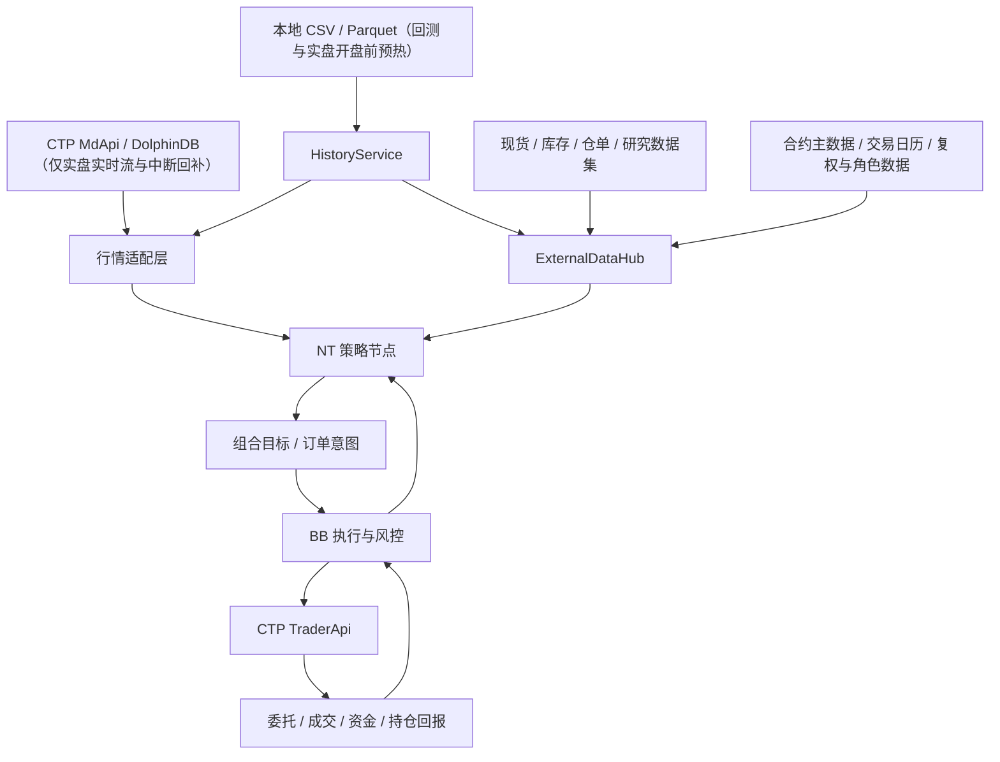
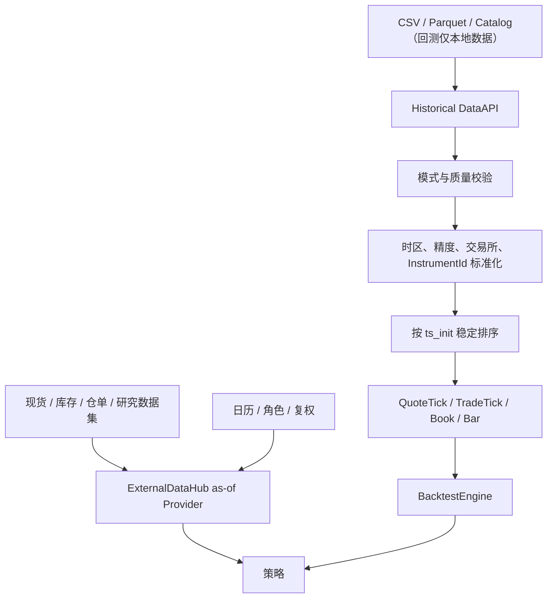
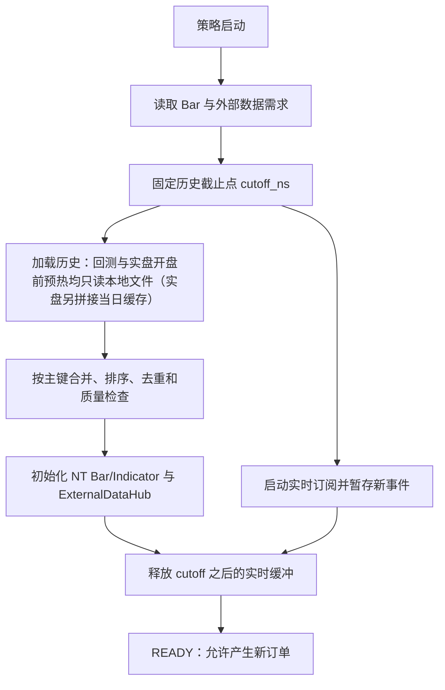
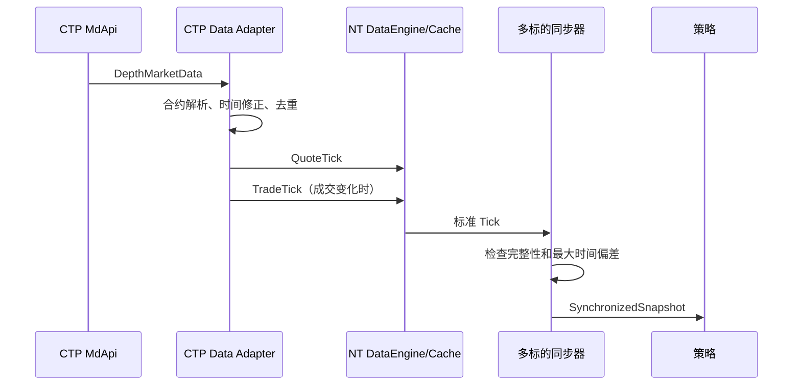
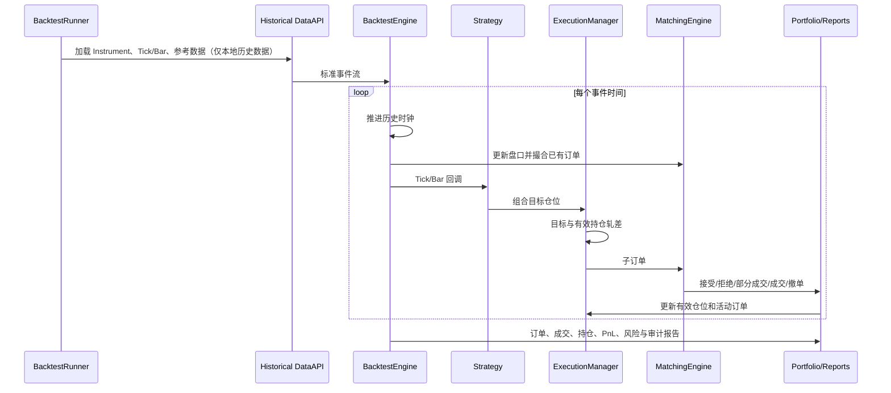
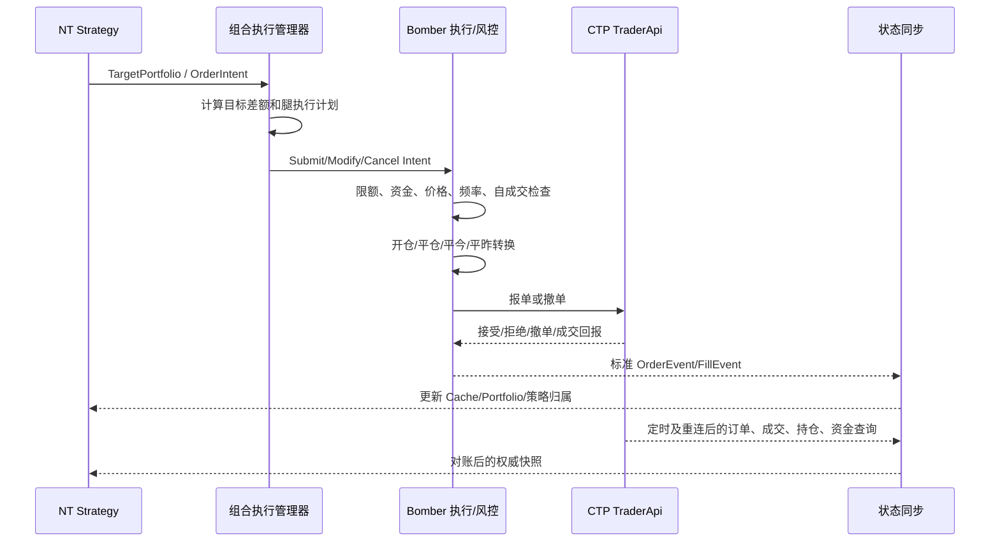

# Bomber 与 NautilusTrader 集成架构

> 实现状态更新（2026-09-20）：本文保留系统级目标架构；当前`pro`代码的
> 模块位置、分阶段验证和唯一状态台账见
> [`STRATEGY_ARCHITECTURE.md`](/Users/kerry/work/bomber1/pro/doc/STRATEGY_ARCHITECTURE.md)。
> 已确认的实现边界是：`market` 作为唯一行情入口；模拟与实盘执行共同实现
> `ExecutionBackendPort`；`NautilusSimExecutionBackend`内部唯一的
> `BacktestEngine`掌握模拟时钟和撮合；交易所差异由Profile和OrderPlanner组合，
> 而不是派生并改写整个BacktestEngine。

## 1. 文档目的

本文定义 NautilusTrader（以下简称 NT）作为 Bomber（以下简称 BB）策略节点时的系统边界，覆盖：

- 历史行情和辅助数据；
- 策略启动时的历史预热、当日缓存拼接与实时流追赶；
- 可扩展外部数据的研究导出、历史加载和实盘订阅；
- CTP、DolphinDB 等实盘数据流；
- 本地回测与 SimNow/实盘运行；
- 目标仓位、订单执行和持仓管理；
- 国内期货、期权及组合策略；
- NT 订单类型与国内交易通道的适配原则；
- 首期部署的原因和后续 Linux 演进方式。

本文描述目标架构，也标明当前 Demo 已有能力与尚未完成的生产能力。

## 2. 核心结论

NT 作为 BB 的一个策略节点，负责接收标准化数据、计算信号并产生组合目标。首期实盘建议由 BB 负责最终开平转换、风控和 CTP 下单，并把委托、成交、资金和持仓回报同步给 NT。

必须明确一个原则：**实盘订单和账户持仓只能有一个权威来源**。建议以 BB/CTP 查询结果为账户级权威状态，NT 保存策略目标、策略归属仓位以及从 BB 同步得到的本地镜像。



## 3. 职责边界

| 模块 | 主要职责 | 不承担的职责 |
|---|---|---|
| 数据源 Adapter | 连接本地文件、DolphinDB 或 CTP，转换为 NT 标准事件 | 策略信号、仓位决策 |
| Instrument Provider | 合约代码、交易所、乘数、价差、精度、到期日、期权属性 | 动态交易决策 |
| HistoryService | 按统一请求加载 Bar 和外部数据历史，拼接本地文件与当日缓存，实盘接入 DolphinDB 实时流并执行中断回补 | 策略信号、实时事件分发 |
| ExternalDataHub | 现货、库存、仓单、主次力角色等外部数据的历史窗口、as-of 快照和质量检查 | 伪造可交易行情、订单路由 |
| NT 策略节点 | Tick/Bar 处理、指标、组合信号、目标仓位 | CTP 开平今昨等柜台细节 |
| 组合执行管理器 | 目标轧差、腿顺序、裸腿控制、超时和补偿 | 交易所连接 |
| BB 执行与风控 | 通道路由、开平转换、交易前风控、CTP 报单和撤单 | 策略指标计算 |
| 状态同步模块 | 委托、成交、资金、持仓查询与重连恢复 | 生成新的策略目标 |
| 回测撮合器 | 历史事件重放、模拟成交、费用、PnL | 真实柜台行为 |

策略不根据“回测、SimNow 或实盘”写分支。Runner 选择数据源、时钟、执行端和状态存储，策略始终消费统一事件并输出统一目标。

## 4. 统一运行模型

### 4.1 模式划分

| 模式 | 市场数据 | 时钟 | 执行端 | 权威持仓 |
|---|---|---|---|---|
| 回测 | 仅本地 CSV/Parquet/Catalog（禁止接入 DolphinDB） | 历史事件时钟 | NT/BB 本地撮合器 | 回测 Portfolio |
| SimNow | CTP MdApi 或实时 DolphinDB | 实时时钟 | BB → CTP TraderApi | SimNow 查询结果 |
| 实盘 | CTP MdApi 或 DolphinDB 实时流（含中断回补） | 实时时钟 | BB → CTP TraderApi | 经纪商/交易所查询结果 |

**回测 / 研究数据隔离约束**：

- 回测与研究所用数据全部本地化，只能使用本地 CSV / Parquet / Catalog 文件；
- 回测与研究环境不配置任何 DolphinDB 连接，DolphinDB 对所有回测和研究场景完全不可见；
- DolphinDB 在 SimNow/实盘中仅承担实时行情流播放与盘中断线数据回补，不承担历史数据加载；实盘开盘前的全部数据（含历史预热）由本地历史文件读取；
- 研究产出必须经 `export` 落为本地 Parquet / Catalog 文件后，才能进入回测链路（见第 5.5 节）。

### 4.2 Runner 装配

```text
CommonStrategy
  ├── BacktestRunner
  │     ├── HistoricalDataClient
  │     ├── SimulatedExecutionClient
  │     └── HistoricalClock
  ├── SimNowRunner
  │     ├── CtpDataClient / DolphinDBLiveClient
  │     ├── BomberExecutionClient
  │     └── LiveClock
  └── LiveRunner
        ├── CtpDataClient / DolphinDBLiveClient
        ├── BomberExecutionClient
        └── LiveClock
```

Runner 负责注册 Venue、Instrument、数据客户端、执行客户端、策略和执行算法。策略只通过 `InstrumentId`、标准行情事件、Portfolio 和订单接口工作。

## 5. 历史数据架构

### 5.1 数据分类

历史与运行数据按用途分为三类，不能混用：

1. **可交易市场数据**：QuoteTick、TradeTick、OrderBookDelta、Bar。它们可以驱动策略、撮合和估值。
2. **可扩展外部数据**：股指分钟现货、商品日频现货、库存、仓单、利率、汇率和研究导出的数据集。它们可以参与信号计算，但不能直接作为可交易行情驱动撮合。
3. **系统参考数据**：交易日历、合约角色、复权因子和 Instrument 主数据。它们通过 DataHub 按决策时点查询。

完全由标准 Bar 的 OHLC、成交量、成交额和持仓量计算出的 MA、MACD、ATR 等指标，由策略或指标模块在收到 Bar 后计算，不进入自定义数据协议。自定义数据协议只解决 Bar 之外、需要独立生产和交付的数据。

连续合约和复权价格只能用于信号，订单必须解析到真实可交易合约，撮合也必须使用真实合约的未复权行情。

### 5.2 历史数据流



历史 DataAPI 至少应完成以下校验：

- 时间戳带明确时区，统一转换为 UTC 纳秒；
- 同一数据流按事件时间有序，重复键有明确处理策略；
- 价格、数量有限且符合 Instrument 精度；
- 合约已注册，Venue 与代码一致；
- 夜盘数据使用交易日映射，不能直接使用自然日；
- 辅助数据包含 `event_ns` 和 `available_ns`，禁止读取当时尚不可见的数据；
- 外部数据包含稳定的 `dataset_id`、`schema_version`、记录键和修订号；
- 缺失、乱序、停牌、涨跌停和换月必须记录审计事件。

### 5.3 Tick 与 Bar

NT 支持 Tick 驱动：

- `QuoteTick` 驱动买一、卖一及一档数量变化；
- `TradeTick` 驱动逐笔成交；
- `OrderBookDelta(s)` 驱动深度盘口；
- Tick 可在引擎内部聚合为时间 Bar、Tick Bar 或成交量 Bar；
- 外部 Bar 也可以直接加载。

策略可以实现 `on_quote_tick`、`on_trade_tick`、`on_order_book_deltas` 或 `on_bar`。回测引擎先用行情事件更新模拟交易所并撮合已有订单，再将事件送入数据引擎和策略，保证事件处理顺序确定。

### 5.4 启动热加载与历史预热

本文的“热加载”指策略启动或重启时，加载计算所需的历史窗口并无缝衔接实时流，不是运行时替换策略代码。典型需求包括 240 根分钟 Bar、过去 20 个交易日的现货数据，以及当天已经进入缓存的数据。

策略只声明数据需求，不直接访问文件或 DolphinDB：

```python
HistoryRequest(
    dataset_id="commodity.rb.spot.daily",
    keys=("RB.SHANGHAI.GRADE3", "RB.HANGZHOU.GRADE3"),
    end_ns=cutoff_ns,
    trading_days=20,
    available_as_of_ns=cutoff_ns,
)
```

`HistoryRequest` 至少支持 `last_n` 与 `trading_days` 两种窗口。前者表示最后若干条记录，后者表示若干交易日，不能将“20 条分钟数据”和“20 个交易日”混为一谈。



合并主键使用 `dataset_id + key + ts_event + revision`。同一记录来自多个来源时，默认优先级为“实时流/当日缓存（含 DolphinDB 中断回补数据）> 本地历史文件”，具体优先级必须配置并记录审计信息。Bar 还要检查完整窗口、交易日、夜盘和是否已经收盘。

策略数据状态统一为：

```text
CREATED → WARMING_UP → CATCHING_UP → READY
                         ↘ DEGRADED
```

- `WARMING_UP`：加载历史并初始化指标和外部数据窗口；
- `CATCHING_UP`：按 `ts_init` 释放加载期间缓存的实时事件；
- `READY`：全部必需数据完整且新鲜，允许下单；
- `DEGRADED`：出现缺口、过期、队列溢出或订阅中断，停止增加风险并触发补数/告警。

回测由 `LocalHistoricalProvider` 提供历史并按 `ts_init` 回放；实盘开盘前预热同样只读本地文件并拼接当日缓存，开盘后接入 CTP/DolphinDB 实时流，断线缺口由 DolphinDB 回补。策略和 `HistoryRequest` 不随运行模式变化。

### 5.5 可扩展自定义数据

自定义数据采用“固定事件外壳 + 可注册 Payload Schema”，不伪装成标准 Bar，也不使用无约束的 `dict[str, object]` 作为生产协议。核心记录为：

```python
PayloadT = TypeVar("PayloadT")


@dataclass(frozen=True)
class ExternalDataRecord(Generic[PayloadT]):
    dataset_id: str
    schema_version: int
    key: str
    payload: PayloadT     # 由 dataset_id 对应的强类型 Schema 约束
    ts_event: int         # 数据代表的业务时间
    ts_init: int          # 数据最早可被策略使用的时间
    revision: int
    source: str
    quality_flags: int
```

每种数据通过 `DatasetSpec` 注册频率、记录键、字段、时区、交易日历、修订规则、默认对齐方式和最大数据年龄。新增数据只增加 DatasetSpec、Payload 类型、Provider 和契约测试，不修改策略框架。

研究、回测和实盘共用同一数据生命周期接口：

```python
class DatasetPort(Protocol):
    def export(self, dataset_id, records, destination) -> None: ...
    async def load_history(self, request) -> AsyncIterator[ExternalDataBatch]: ...
    async def subscribe(self, request, handler) -> Subscription: ...
```

- 研究阶段通过 `export` 生成符合 Schema 的 Parquet/Catalog 数据；
- 回测通过本地 Provider 执行 `load_history` 并按 `ts_init` 回放；
- 实盘启动通过本地历史 Provider 加载历史，运行中通过 `subscribe` 接收相同的 `ExternalDataRecord`，断线缺口由 DolphinDB 回补；
- 生产环境只加载公司审核并注册的 Schema 和 Provider，不执行数据消息携带的 Python 函数或 pickle 对象。

时间对齐由 ExternalDataHub 统一完成：

| 数据关系 | 对齐方式 | 示例 |
|---|---|---|
| 同周期分钟数据 | `EXACT` | 股指期货 1 分钟 Bar 与对应现货指数分钟数据 |
| 1 分钟聚合为 5 分钟 | `WINDOW` | 五根完整 1 分钟 Bar 聚合为 5 分钟窗口 |
| 日频数据用于分钟决策 | `ASOF` | 商品期货分钟 Bar 使用决策时点前最新已发布现货价 |

日频现货不能复制成看似每分钟更新的伪 Bar。ExternalDataHub 在每个决策时点按 `ts_init <= as_of_ns` 选择最新可见记录，并检查 `max_age`。历史修订必须保留实际发布时间，否则回测会提前使用最终修订值。

多地区、多品级的现货数据以同一 `dataset_id` 下的多条强类型记录返回：

```python
snapshot = data_hub.snapshot(
    dataset_id="commodity.rb.spot.daily",
    keys=("RB.SHANGHAI.GRADE3", "RB.HANGZHOU.GRADE3"),
    as_of_ns=bar.ts_init,
)
```

策略可以在 `on_bar` 中查询 ExternalDataHub，也可以由框架将 Bar 和所需 `DatasetSnapshot` 组装成 `StrategyFrame` 后通过单一入口推送。`StrategyFrame` 是消费视图，底层存储和传输仍使用 `ExternalDataRecord`。标准 Bar 始终进入 NT DataEngine、Cache 和 Indicator；外部数据不改变 NT 的撮合语义。

## 6. 实盘数据架构

### 6.1 CTP 行情流



CTP 的 `DepthMarketData` 通常同时包含最新价、累计成交量、持仓量和多档/一档报价。Adapter 应避免把每个行情回调都无条件转换成一笔新成交：只有成交价、累计成交量或成交标识发生有效变化时才生成 `TradeTick`；报价变化生成 `QuoteTick`。

### 6.2 DolphinDB 实时流与中断回补

在本架构中，DolphinDB 只承担两个职责：**实时流播放**和**盘中断线数据回补**，不承担任何历史数据加载。两类流的语义不同：

```text
DolphinDB market subscription
    → schema validation
    → InstrumentId/时间/精度标准化
    → QuoteTick/TradeTick/Bar
    → NT DataEngine

DolphinDB external-data subscription
    → DatasetSpec/schema validation
    → ExternalDataRecord
    → ExternalDataHub
```

同一策略同时订阅多个数据客户端时，应明确每个 Instrument 的唯一主行情源，避免 CTP 与 DolphinDB 对同一合约重复发布 Tick。现货、库存等外部数据可以使用独立流表，但必须通过第 5.5 节的统一协议进入 ExternalDataHub。

### 6.2.1 职责边界（以股指期货为例）

以股指期货实盘为例，数据链路按时间切分为两段：

| 阶段 | 数据来源 | 说明 |
|---|---|---|
| 开盘之前（init / 历史预热） | 仅本地历史文件 | 策略启动时所需的历史 Bar、外部数据窗口、参考数据全部由本地 CSV/Parquet 读取，并拼接当日开盘前已产生的缓存数据 |
| 当日开盘期 | DolphinDB 实时订阅 | 开盘后 Tick/Bar 通过 DolphinDB market subscription 实时播放，经适配层标准化后进入 NT DataEngine |
| 盘中断线 / 缺口 | DolphinDB 回补 | 断线恢复后按缺口区间从 DolphinDB 查询回补 |

中断回补机制要求：

1. 断线恢复后，状态同步/数据层计算缺口区间（最后收到的事件时间到恢复时刻）；
2. 从 DolphinDB 按区间回补数据，走与实时流完全相同的校验、去重和标准化流程；
3. 回补数据写入当日缓存后与实时流拼接，合并优先级遵循第 5.4 节的规定；
4. 回补数据与实时流使用同一事件协议（`QuoteTick/TradeTick/Bar`、`ExternalDataRecord`），策略不感知来源差异；
5. 回补完成、数据恢复新鲜之前，策略维持 `DEGRADED` 状态，不产生新开仓。

### 6.3 多标的同步

期现、跨期、跨品种和期权组合的各腿不会同时到达。同步器需要：

- 缓存每个标的最新事件；
- 所有必需标的就绪后才形成组合快照；
- 限制组合各腿的最大事件时间偏差；
- 忽略倒退到该标的最新事件之前的乱序数据；
- 对数据陈旧、缺腿和断流发布状态事件；
- 区分行情完整性与成交原子性。

## 7. 回测流程



回测需要配置与实盘一致的：

- Instrument 主数据和交易时段；
- 账户类型、净持仓或双向持仓模式；
- 手续费、保证金和资金币种；
- 盘口深度、成交量消耗、滑点和延迟；
- IOC/FOK、部分成交、拒单和撤单语义；
- 期货到期结算、期权到期归零/现金结算/转标的；
- 组合执行中的腿间延迟和失败补偿。

仅使用 Bar 回测不能精确还原盘口、市价冲击、排队和同一 Bar 内的触发顺序。执行算法和高频组合应优先使用 QuoteTick、TradeTick 或订单簿数据。

## 8. 实盘交易流程



实盘启动必须先完成：

1. 登录与结算确认；
2. 查询合约主数据、账户、持仓、活动委托和当日成交；
3. 将外部状态与 NT Cache 对账；
4. 恢复策略目标和执行状态；
5. 确认行情新鲜后才允许新开仓。

断线期间暂停增加风险的订单。恢复后不能直接重放旧下单命令，应先通过 CTP 查询重建状态，再按目标仓位与有效仓位重新轧差。

## 9. 持仓管理

### 9.1 三类状态

| 状态 | 定义 | 权威来源 |
|---|---|---|
| 账户实际持仓 | 经纪商账户真实多空、今昨仓 | BB/CTP 查询 |
| 策略归属持仓 | 实际成交按 StrategyId/OrderId 分配后的仓位 | BB 分配记录并同步 NT |
| 策略目标持仓 | 策略希望达到的每腿数量 | NT 策略状态 |

有效仓位计算不能只看已成交持仓：

```text
effective_position
  = filled_position
  + signed_leaves_quantity_of_active_orders
```

目标执行量为：

```text
delta = target_position - effective_position
```

这样可以防止 Tick 高频触发时重复下单。拒单、撤单或部分成交不会清除策略目标；后续有效行情到来后，执行管理器继续协调剩余差额。

### 9.2 国内期货持仓拆分

国内期货至少需要保存：

- 多头今仓、多头昨仓；
- 空头今仓、空头昨仓；
- 投机、套保、套利属性；
- 冻结开仓和平仓数量；
- 账户级持仓与策略归属持仓的映射。

NT 的通用净持仓不足以单独决定上期所/能源中心的平今和平昨。该转换应由 BB 基于 CTP 权威持仓完成，并把最终 OffsetFlag 和成交结果写入审计记录。

## 10. 下单执行模块

### 10.1 输入与输出

执行模块建议接收高层意图，而不是让策略直接生成 CTP 字段：

```python
TargetPortfolio(
    strategy_id="calendar-spread-01",
    revision=1024,
    targets={
        "rb2601.SHFE": 2,
        "rb2605.SHFE": -2,
    },
    execution_policy="LEG_COORDINATED",
    deadline_ns=...,
)
```

执行模块输出：

- 标准母订单和子订单；
- BB/CTP 报单、改单和撤单请求；
- 目标接受、执行中、部分完成、完成、失败和补偿事件；
- 组合级裸腿暴露和执行质量指标。

每个意图需要稳定的 `strategy_id + revision/idempotency_key`，BB 必须去重，防止网络重试造成重复报单。

### 10.2 单标的执行算法

| 算法 | 当前 NT 情况 | 生产要求 |
|---|---|---|
| 立即执行 | 原生订单可实现 | 增加交易所能力检查和保护价 |
| TWAP | 有 `TWAPExecAlgorithm` 示例 | 增加限价、追单、成交反馈、涨跌停和恢复 |
| VWAP | 有 VWAP 指标，无现成 VWAP 执行算法 | 需要成交量曲线、实时参与率和偏差修正 |
| POV | 需自定义 | 基于实时市场成交量限制参与率 |
| Iceberg | 可通过执行算法拆单 | 需处理显示量、撤单重挂和申报频率 |

### 10.3 多腿执行状态机

```text
IDLE
  → VALIDATING
  → SUBMIT_FIRST_LEG / SUBMIT_ATOMIC_COMBO
  → WAITING_FILLS
  → HEDGING_REMAINDER
  → COMPLETED
  ↘ CANCELING → COMPENSATING → FAILED
```

执行政策至少应支持：

- 同时提交各腿；
- 先流动性差的一腿，再对冲流动性好的一腿；
- 使用交易所原生组合指令；
- 限制最大裸腿数量和最大裸腿时间；
- 部分成交后按实际 Delta 补另一腿；
- 超时撤单、保护价追单和失败反向补偿；
- 换月时先撤旧单、平旧仓、确认归零，再切换路由。

## 11. NT 订单与国内交易映射

### 11.1 NT 可表达的订单

NT 当前包含：

- `MARKET`；
- `LIMIT`；
- `STOP_MARKET`；
- `STOP_LIMIT`；
- `MARKET_TO_LIMIT`；
- `MARKET_IF_TOUCHED`；
- `LIMIT_IF_TOUCHED`；
- `TRAILING_STOP_MARKET`；
- `TRAILING_STOP_LIMIT`。

“NT 可以表达”不代表“国内交易所原生支持”。Adapter 必须按交易所、产品、账户和当前交易规则确定原生下发、本地模拟、转换或拒绝。

### 11.2 推荐能力矩阵

| NT 能力 | 国内通道处理 |
|---|---|
| `LIMIT` | 作为第一阶段基础能力，映射 CTP 限价单 |
| `MARKET` | 交易所支持时映射市价；否则转换为带保护价格的 IOC 限价单 |
| `IOC` | 映射 FAK/立即成交剩余撤销 |
| `FOK` | 映射立即全部成交否则撤销 |
| `DAY` | 映射 CTP 当日有效/GFD |
| `GTC` | 不直接假设交易所支持；转换为当日有效或由本地跨日管理 |
| `GTD` | 通常由本地定时撤单管理 |
| Stop/MIT/LIT/Trailing | 默认由 NT OrderEmulator 监听行情后释放基础订单 |
| OCO/OTO/Bracket | 默认由本地订单状态机管理 |
| Post-only | 通道明确支持才下发，否则拒绝或使用价格策略模拟 |
| Reduce-only | 转换为 CTP 平仓、平今、平昨，不作为单一布尔字段直接透传 |
| 交易所组合单 | 独立能力；不能用多个普通订单宣称原子成交 |

市价和 FAK/FOK 的可用性及最大报单量可能随交易所和品种变化，必须以 Adapter 启动时加载的能力表为准。能力表至少包含：

```text
venue + product/instrument
  → supported_order_types
  → supported_time_in_force
  → max_order_quantity
  → market_order_variant
  → supports_close_today
  → supports_native_combo
  → supports_option_exercise
```

### 11.3 CTP 字段转换

BB/CTP Adapter 需要生成并保存以下字段：

- `Direction`；
- `CombOffsetFlag`：开仓、平仓、平今、平昨；
- `CombHedgeFlag`：投机、套保、套利；
- `OrderPriceType`；
- `LimitPrice`；
- `TimeCondition`；
- `VolumeCondition`；
- `MinVolume`；
- `ContingentCondition`；
- `ForceCloseReason`。

转换前后都要落审计日志，以便从 NT 母订单追踪到 BB 请求、CTP OrderRef、交易所委托号和所有成交。

## 12. 国内品种支持边界

NT 通过 Instrument 类型描述品种，没有国内品种白名单。模型层能够表示：

- 上期所、大商所、郑商所、中金所、能源中心、广期所的期货；
- 商品期权、股指期权；
- 期货价差和期权组合；
- 接入其他证券柜台后的股票、ETF 和 ETF 期权。

实际支持一个品种需要同时满足：

1. Instrument Provider 能取得完整且正确的合约主数据；
2. 行情 Adapter 能订阅并转换该合约的数据；
3. 执行 Adapter 支持该交易所和产品的报单字段；
4. 账户已经开通对应交易权限；
5. 风控、手续费、保证金、交易时段和到期规则已配置；
6. SimNow 与实盘均通过订单生命周期和重连测试。

因此不能仅根据 NT 中存在 `FuturesContract` 或 `OptionContract` 就宣称“所有国内品种已经支持”。应通过自动化能力探测和验收矩阵逐项发布。

## 13. 期货到期与期权行权

NT 回测引擎支持简化的到期处理：

- 期货在到期时按配置结算价或市场价关闭；
- 虚值期权到期归零；
- 实值指数期权可按内在价值现金结算；
- 实值非指数期权可模拟关闭期权腿并按执行价生成标的持仓。

这不等于真实商品交割。仓单、交割等级、地点、发票、税费、交割保证金和违约处理需要独立交割模块。

实盘结算、行权、指派和交割由交易所及期货公司执行。BB 负责发起 Adapter 已支持的行权/放弃请求并同步查询结果；NT 根据同步事件更新策略状态。未实现行权接口前，不应让策略持有期权跨越到期日而假设系统会自动处理。

## 14. 当前 Demo 与目标架构的差距

`tests/experience_tests` 当前已经具备：

- 本地 CSV 转换为标准 `TradeTick`；
- Tick 驱动的多标的策略；
- 多腿最新行情同步和最大时间偏差检查；
- DataHub as-of 辅助数据查询；
- 固定策略模板和整组目标净仓位；
- 根据已成交持仓和活动订单计算差额；
- 回测订单、成交、持仓和目标审计；
- CTP DataClient/ExecClient 的 Runner 接口定义。

当前尚未完成：

- 统一 `HistoryRequest`、实时缓冲追赶和 `READY/DEGRADED` 热加载状态机；
- 版本化 `ExternalDataRecord/DatasetSpec` 及研究导出、历史加载、实盘订阅契约；
- 仓库内可运行的 CTP Adapter；
- BB 与 NT 之间的订单意图、事件回报和幂等协议；
- CTP 开平今昨、套保标志和交易所能力映射；
- 启动、重连和日终对账；
- 生产级 TWAP/VWAP；
- 多腿成交协调和裸腿控制；
- 完整手续费、保证金、涨跌停、申报限制和异常交易规则；
- 实盘状态持久化、高可用和监控告警。

当前模板使用默认 `GTC` 的 `MarketOrder` 生成目标差额，这只证明回测链路成立。接入国内实盘前，应把执行策略改为“按能力选择原生市价 IOC 或保护限价 IOC/FOK”，并由 BB 完成开平今昨转换。

## 15. 建议接口契约

### 15.1 行情事件

```text
MarketEvent {
  instrument_id
  venue
  event_type
  ts_event
  ts_init
  sequence
  payload
  source
}
```

### 15.2 目标意图

```text
TargetPortfolio {
  strategy_id
  revision
  ts_event
  targets[instrument_id] = signed_quantity
  execution_policy
  deadline_ns
  limits
}
```

### 15.3 执行回报

```text
ExecutionEvent {
  strategy_id
  intent_revision
  client_order_id
  bb_order_id
  ctp_order_ref
  exchange_order_id
  instrument_id
  status
  filled_quantity
  leaves_quantity
  average_price
  offset_flag
  hedge_flag
  reject_reason
  ts_event
}
```

### 15.4 持仓快照

```text
PositionSnapshot {
  account_id
  trading_day
  instrument_id
  long_today
  long_yesterday
  short_today
  short_yesterday
  frozen_close
  hedge_flag
  source_revision
  ts_event
}
```

协议应支持版本号、幂等键、顺序号、断点续传和全量快照覆盖。增量事件用于低延迟更新，全量查询用于启动及重连后的最终纠偏。

## 16. 分阶段实施

### 阶段一：最小实盘闭环

- NT 作为 BB 节点运行；
- 实现 HistoryService，完成 Bar/外部数据预热、实时缓冲追赶和下单前 READY 门禁；
- 实现 `ExternalDataRecord/DatasetSpec/DatasetPort`，先打通一种分钟现货和一种日频商品现货；
- CTP/DolphinDB Tick 接入；
- 期货、期权 Instrument 主数据；
- 限价单、撤单、IOC/FAK、FOK；
- 开仓、平仓、平今、平昨；
- 委托、成交、资金和持仓查询；
- 单标的和双腿跨期 SimNow 验证；
- 重启对账和重复下单防护。

### 阶段二：统一目标与组合执行

- `TargetPortfolio` 协议；
- 策略归属持仓；
- 多腿执行状态机；
- 保护限价、超时、追价和失败补偿；
- 换月、动态角色和组合级风险限额；
- 回测与 SimNow 订单语义对齐。

### 阶段三：算法执行和更多品种

- 生产级 TWAP、VWAP、POV；
- 交易所原生组合指令；
- 期权行权、放弃和自对冲；
- 股指、国债、商品期货和期权逐品种验收；
- 如需证券市场，增加独立证券柜台 Adapter。

### 阶段四：Linux 与生产运行

- 编译和验证 Linux CTP/数据库依赖；
- 容器化或服务化部署；
- 状态存储、主备、监控和告警；
- 灰度、限额和紧急停机流程；
- Windows 与 Linux 使用同一协议兼容性测试。

## 17. 验收标准

一个交易通道或品种只有满足以下条件才能标记为“已支持”：

- Instrument 主数据与交易所数据一致；
- Tick/Bar 时间、交易日和精度校验通过；
- 策略启动时能够按声明加载所需 Bar 和外部数据窗口，历史与实时交界无重复、无缺口；
- 外部数据在本地回测和 DolphinDB 实盘中使用相同 dataset/schema/time 语义；
- 分钟数据的 EXACT 对齐和日频数据的 ASOF 对齐均不暴露未来数据；
- 数据缺失、过期、队列溢出或订阅中断时不能进入或继续保持可开仓的 READY 状态；
- 支持矩阵中的订单类型逐项通过 SimNow/仿真测试；
- 开平今昨和多空持仓与 CTP 查询一致；
- 部分成交、拒单、撤单、超时、断线和重连均可恢复；
- 相同目标 revision 重发不会重复下单；
- 回测、SimNow 和实盘产生一致的策略目标语义；
- 多腿策略满足最大裸腿时间和暴露限制；
- 所有订单可以从策略目标追踪到交易所成交；
- 到期、换月、停牌、涨跌停和日终流程有明确结果。

## 18. 最终边界

目标架构不是把 NT 简单嵌入 BB 后直接调用一个 `sendOrder`。完整链路应是：

```text
数据源
  → HistoryService 热加载与实时流追赶
  → 标准行情与 ExternalDataHub 因果外部数据
  → NT 策略和组合目标
  → 执行管理器
  → BB 权威风控与 CTP 交易
  → 标准订单/成交/持仓回报
  → NT 状态恢复与下一次目标协调
```

首期由 BB 承担实盘下单和账户持仓权威，可以最大程度复用现有交易基础设施。NT 负责策略、组合目标和可复用执行逻辑，并维护与 BB 对账后的策略状态。接口稳定后, 数据、策略、订单意图和回报语义都保持一致。

## 19. BB 订单、成交与持仓接入 NT 的源码结论

### 19.1 结论

如果 BB 把完整、顺序正确且可去重的订单和成交事件传给 NT，NT 可以根据成交自动建立、增加、减少、关闭和反转持仓，并更新平均开仓价、平均平仓价、手续费、已实现收益和持仓事件。

这个结论有四个边界：

1. 持仓主要由 `OrderFilled` 构建，不是把 BB 的持仓数值直接写进 `Position`；
2. NT 已知订单和 BB/CTP 外部订单的接入路径不同；
3. `PositionStatusReport` 主要用于对账，发现差异后通过合成订单/成交修复事件状态；
4. 国内期货的今仓、昨仓和开平标志不能只依赖 NT 的通用净持仓，仍需由 BB 保存并负责下单转换。

### 19.2 NT 如何根据成交维护持仓

NT 执行客户端提供 `generate_order_filled(...)`。该方法构造 `OrderFilled`，然后发送到 `ExecEngine.process`：

- 源码：[`execution/client.pyx:820`](/Users/kerry/work/code1/nautilus_trader/nautilus_trader/execution/client.pyx:820)
- 消息发送：[`execution/client.pyx:913`](/Users/kerry/work/code1/nautilus_trader/nautilus_trader/execution/client.pyx:913)

ExecutionEngine 收到成交后的主要路径是：

```text
OrderFilled
  → 查找并更新 Order
  → trade_id 重复检查
  → 超量成交检查
  → 根据 NETTING/HEDGING 确定 PositionId
  → 新建、更新或反转 Position
  → 写入 Cache
  → 发布 PositionOpened/PositionChanged/PositionClosed
  → 更新 Portfolio
```

对应源码：

- 查找订单、成交去重、检查 overfill：[`execution/engine.pyx:1245`](/Users/kerry/work/code1/nautilus_trader/nautilus_trader/execution/engine.pyx:1245)
- 进入订单和持仓处理：[`execution/engine.pyx:1317`](/Users/kerry/work/code1/nautilus_trader/nautilus_trader/execution/engine.pyx:1317)
- 根据 OMS 生成 PositionId：[`execution/engine.pyx:1452`](/Users/kerry/work/code1/nautilus_trader/nautilus_trader/execution/engine.pyx:1452)
- NETTING PositionId 规则：[`execution/engine.pyx:1561`](/Users/kerry/work/code1/nautilus_trader/nautilus_trader/execution/engine.pyx:1561)
- 建仓、更新和反转分派：[`execution/engine.pyx:1689`](/Users/kerry/work/code1/nautilus_trader/nautilus_trader/execution/engine.pyx:1689)
- 创建 Position 和 `PositionOpened`：[`execution/engine.pyx:1737`](/Users/kerry/work/code1/nautilus_trader/nautilus_trader/execution/engine.pyx:1737)
- 应用成交并发布 Changed/Closed：[`execution/engine.pyx:1786`](/Users/kerry/work/code1/nautilus_trader/nautilus_trader/execution/engine.pyx:1786)

`Position` 本身以开仓成交初始化，并保存成交列表和 `trade_id` 集合：

- 构造函数要求 `Instrument` 与 Fill 的 `instrument_id` 一致，且 Fill 有 `position_id`：[`model/position.pyx:38`](/Users/kerry/work/code1/nautilus_trader/nautilus_trader/model/position.pyx:38)
- 每笔成交通过 `Position.apply(fill)` 更新：[`model/position.pyx:532`](/Users/kerry/work/code1/nautilus_trader/nautilus_trader/model/position.pyx:532)
- 重复 `trade_id` 会被拒绝：[`model/position.pyx:550`](/Users/kerry/work/code1/nautilus_trader/nautilus_trader/model/position.pyx:550)
- 根据成交后的有符号数量设置 LONG、SHORT 或 FLAT：[`model/position.pyx:614`](/Users/kerry/work/code1/nautilus_trader/nautilus_trader/model/position.pyx:614)

因此，BB 推送成交时至少要稳定提供：

| 字段 | 用途 |
|---|---|
| `account_id` | 归属账户 |
| `instrument_id` | 归属合约，必须已注册 Instrument |
| `client_order_id` | 关联 NT/BB 母订单 |
| `venue_order_id` | 关联 CTP/交易所委托 |
| `trade_id` | 成交去重，必须全局稳定 |
| `order_side` | BUY/SELL，决定持仓方向变化 |
| `order_type` | 原订单类型 |
| `last_qty` | 本次成交量，不能传累计成交量 |
| `last_px` | 本次成交价，不能只传均价 |
| `commission` | 本次成交手续费，没有时传同币种零值 |
| `liquidity_side` | Maker/Taker/Unknown 的标准枚举 |
| `ts_event` | 交易所或柜台成交时间 |
| `venue_position_id` | 通道有独立持仓号时传入，否则由 OMS 决定 |

### 19.3 两种正确接入路径

#### 路径 A：订单由 NT 发起，BB 负责执行

这是推荐主路径。NT 创建订单时已经把订单写入 Cache，BB 回传相同 `client_order_id` 的状态和成交即可：

```text
NT SubmitOrder(client_order_id)
  → BB/CTP 报单
  → OrderSubmitted
  → OrderAccepted(venue_order_id)
  → OrderFilled(trade_id, last_qty, last_px, ...)
  → OrderCanceled/Rejected/Expired（按实际结果）
```

订单和成交的映射必须保持：

```text
NT client_order_id
  ↔ BB order_id
  ↔ CTP FrontID + SessionID + OrderRef
  ↔ ExchangeID + OrderSysID
```

普通 `OrderFilled` 事件要求 NT 能通过 `client_order_id`，或者通过已经建立的 `venue_order_id` 索引找到订单。找不到订单和 VenueOrderId 时，ExecutionEngine 会拒绝继续处理：[`execution/engine.pyx:1251`](/Users/kerry/work/code1/nautilus_trader/nautilus_trader/execution/engine.pyx:1251)。

#### 路径 B：订单由 BB、人工终端或其他节点发起

这类订单对 NT 而言是外部订单，应使用 LiveExecutionEngine 的 reconciliation report 接口：

1. 先发送 `OrderStatusReport`，让 NT 创建 external order 并建立 VenueOrderId 索引；
2. 再发送对应的 `FillReport`；
3. 启动和重连时发送包含订单、成交、持仓的 `ExecutionMassStatus`；
4. 策略需要接管这些订单时配置 `external_order_claims`，否则归属 `EXTERNAL` 策略。

源码依据：

- 实时 report 分派：[`live/execution_engine.py:1816`](/Users/kerry/work/code1/nautilus_trader/nautilus_trader/live/execution_engine.py:1816)
- 未知订单由 `OrderStatusReport` 创建并加入 Cache：[`live/execution_engine.py:3038`](/Users/kerry/work/code1/nautilus_trader/nautilus_trader/live/execution_engine.py:3038)
- external order 的归属说明：[`docs/concepts/execution.md:650`](/Users/kerry/work/code1/nautilus_trader/docs/concepts/execution.md:650)
- `FillReport` 字段定义：[`execution/reports.py:619`](/Users/kerry/work/code1/nautilus_trader/nautilus_trader/execution/reports.py:619)
- `external_order_claims` 和 `EXTERNAL` 策略：[`docs/concepts/live.md:128`](/Users/kerry/work/code1/nautilus_trader/docs/concepts/live.md:128)

当前 Python LiveExecutionEngine 中，如果单独的 `FillReport` 先于订单报告到达且 VenueOrderId 尚未建立索引，会返回失败并等待后续对账，见 [`live/execution_engine.py:2183`](/Users/kerry/work/code1/nautilus_trader/nautilus_trader/live/execution_engine.py:2183)。所以 BB→NT 协议必须支持短暂缓存和重排，不能假设成交回调一定晚于报单回调。

### 19.4 启动和重连后的持仓对账

LiveExecutionEngine 原生支持启动对账，ExecutionClient 需要生成：

- `generate_order_status_reports`；
- `generate_fill_reports`；
- `generate_position_status_reports`。

源码说明见 [`docs/concepts/live.md:144`](/Users/kerry/work/code1/nautilus_trader/docs/concepts/live.md:144)。

`PositionStatusReport` 包含账户、合约、方向、数量、可选平均开仓价和可选 VenuePositionId，定义见 [`execution/reports.py:859`](/Users/kerry/work/code1/nautilus_trader/nautilus_trader/execution/reports.py:859)。

需要准确理解它的行为：NT 的 Position 仍然从成交事件派生。持仓报告负责比较通道持仓和本地持仓；当数量不一致且 `generate_missing_orders=True` 时，LiveExecutionEngine 生成合成的已成交订单来补齐差异：

- NETTING/HEDGING 对账入口：[`live/execution_engine.py:2323`](/Users/kerry/work/code1/nautilus_trader/nautilus_trader/live/execution_engine.py:2323)
- HEDGING 差异生成 reconciliation order：[`live/execution_engine.py:2349`](/Users/kerry/work/code1/nautilus_trader/nautilus_trader/live/execution_engine.py:2349)
- NETTING 汇总并比较账户合约净仓：[`live/execution_engine.py:2466`](/Users/kerry/work/code1/nautilus_trader/nautilus_trader/live/execution_engine.py:2466)
- 生成带价格的 LIMIT 或无价格时的 MARKET 合成报告：[`live/execution_engine.py:2839`](/Users/kerry/work/code1/nautilus_trader/nautilus_trader/live/execution_engine.py:2839)

如果希望正确恢复成交均价、手续费和策略归属，应尽可能持久化并重放完整订单与逐笔成交。只依赖最终持仓快照虽然能校正数量，但可能丢失真实成交路径和成本信息。

### 19.5 NETTING 与 HEDGING 的选择

NT 支持两种 OMS：

- `NETTING`：同一策略和 Instrument 使用净持仓；默认 PositionId 为 `instrument_id-strategy_id`；
- `HEDGING`：可以使用通道持仓号或为每次独立持仓生成 PositionId。

对于当前以目标净仓位驱动的 BB 策略节点，可以在 NT 策略层使用 NETTING，计算和查询简单；BB 账户层仍必须保存 CTP 的多空、今昨仓明细。若业务要求 NT 分别管理多个独立持仓生命周期，再使用 HEDGING 并稳定传递 `venue_position_id`。

NT 的 `PositionStatusReport` 通用模型只有方向、数量、均价和可选持仓 ID，没有 CTP 的今仓/昨仓、投机/套保/套利拆分。因此：

```text
NT 净仓/策略仓位 ≠ CTP 可平今昨仓明细
```

BB 在生成 CTP 报单前必须以 CTP 权威明细决定 `CombOffsetFlag` 和 `CombHedgeFlag`。

### 19.6 持仓到期如何处理

#### 回测

当前 NT BacktestEngine 确实实现了合约到期检查，而不是设计假设：

- 每轮撮合迭代调用到期检查：[`backtest/engine.pyx:5919`](/Users/kerry/work/code1/nautilus_trader/nautilus_trader/backtest/engine.pyx:5919)
- 到期后撤销该合约活动订单：[`backtest/engine.pyx:5934`](/Users/kerry/work/code1/nautilus_trader/nautilus_trader/backtest/engine.pyx:5934)
- 期货等非期权合约生成 reduce-only 市价平仓，并按配置结算价或市场价成交：[`backtest/engine.pyx:5947`](/Users/kerry/work/code1/nautilus_trader/nautilus_trader/backtest/engine.pyx:5947)
- `settlement_prices` 配置语义：[`backtest/config.py:135`](/Users/kerry/work/code1/nautilus_trader/nautilus_trader/backtest/config.py:135)

期权到期实现包括：

- 根据标的最后价格判断 Call/Put 是否实值：[`backtest/engine.pyx:5983`](/Users/kerry/work/code1/nautilus_trader/nautilus_trader/backtest/engine.pyx:5983)
- 虚值期权以零值或自定义结算价关闭：[`backtest/engine.pyx:6028`](/Users/kerry/work/code1/nautilus_trader/nautilus_trader/backtest/engine.pyx:6028)
- 标的是 `IndexInstrument` 时现金结算：[`backtest/engine.pyx:6048`](/Users/kerry/work/code1/nautilus_trader/nautilus_trader/backtest/engine.pyx:6048)
- 非指数标的模拟实物行权，关闭期权腿并按执行价建立标的持仓：[`backtest/engine.pyx:6078`](/Users/kerry/work/code1/nautilus_trader/nautilus_trader/backtest/engine.pyx:6078)

集成测试也验证了这些行为：

- 期货到期测试：[`test_future_expiry_flow.py`](/Users/kerry/work/code1/nautilus_trader/tests/integration_tests/test_future_expiry_flow.py)
- 期权实值行权和虚值到期测试：[`test_option_exercise_flow.py:145`](/Users/kerry/work/code1/nautilus_trader/tests/integration_tests/test_option_exercise_flow.py:145)

回测实现是通用简化模型。它没有覆盖国内商品实物交割的仓单、交割等级、地点、发票、税费、交割保证金和违约流程。

#### 实盘

上述代码位于 `BacktestEngine`，不能推导为 LiveExecutionEngine 会自动完成真实交割。实盘中：

- 交易所和期货公司完成期货结算、期权自动行权/放弃、指派和交割；
- BB/CTP Adapter 查询并接收由结算、行权或交割产生的订单、成交、资金和持仓变化；
- BB 通过 external order/reconciliation report 路径把这些结果同步给 NT；
- NT 再通过普通成交和持仓对账机制更新本地状态。

若需要主动行权、放弃行权或自对冲，需要 CTP Adapter 另外实现相应请求。这些不是 NT 当前 9 类普通 Order 的自然等价物。在该接口完成前，生产策略应在到期前主动平仓，或者把到期后的状态完全交给 BB/CTP 对账恢复。

### 19.7 能否方便地修改持仓

要区分修改活动订单和调整实际持仓：

#### 修改活动订单

NT 提供 `Strategy.modify_order()`，可以修改尚未结束订单的数量、限价和触发价；底层 API 不支持改单时会使用撤单重报逻辑。源码见 [`trading/strategy.pyx:1011`](/Users/kerry/work/code1/nautilus_trader/nautilus_trader/trading/strategy.pyx:1011)。CTP Adapter 是否支持原地改单或必须撤单重报，需要由 BB 实现。

#### 调整实际持仓

正常交易语义下，不能直接把真实 Position 的数量从 2 改成 5。正确方式是提交差额订单：

```text
current = 已成交持仓 + 活动订单未成交数量
delta   = target - current

delta > 0 → BUY delta
delta < 0 → SELL abs(delta)
```

NT 提供 `close_position()` 和 `close_all_positions()`，它们同样不是直接改内存，而是创建反向 `MarketOrder` 并提交给执行引擎：

- 关闭单个 Position：[`trading/strategy.pyx:1351`](/Users/kerry/work/code1/nautilus_trader/nautilus_trader/trading/strategy.pyx:1351)
- 关闭某 Instrument 的全部策略持仓：[`trading/strategy.pyx:1418`](/Users/kerry/work/code1/nautilus_trader/nautilus_trader/trading/strategy.pyx:1418)

当前 Demo 的固定模板已经实现目标仓位轧差，并把活动订单排除在重复下单之外：[`tests/experience_tests/strategy.py:128`](/Users/kerry/work/bomber1/code/bomber/tests/experience_tests/strategy.py:128)。生产版应把这段逻辑移入独立执行管理器，并使用 BB 返回的权威持仓和活动订单。

NT 内部存在 `PositionAdjusted`，也允许 `quantity_change`，见 [`model/position.pyx:635`](/Users/kerry/work/code1/nautilus_trader/nautilus_trader/model/position.pyx:635)。但当前调整类型只有 `COMMISSION` 和 `FUNDING`，源码见 [`model/enums.py:416`](/Users/kerry/work/code1/nautilus_trader/nautilus_trader/model/enums.py:416)，仓库内实际构造位置调整的核心路径也是基础币手续费处理。因此不能把它当作策略修改真实交易持仓的公共接口。

### 19.8 对 BB→NT 协议的补充要求

为了保证 NT 能正确维护仓位，协议必须增加以下约束：

- 所有订单、成交和持仓快照携带 `account_id` 和 `instrument_id`；
- NT 发起订单必须原样回传 `client_order_id`；
- `venue_order_id` 在 BB/CTP 生命周期内稳定；
- `trade_id` 对每笔真实成交稳定且唯一，重连重放保持相同值；
- `last_qty`/`last_px` 表示单笔成交，不能使用累计成交量/平均成交价替代；
- 同一订单事件按因果顺序传输，乱序时在桥接层缓存并重排；
- 启动和重连提供订单、逐笔成交、持仓三类全量报告；
- 每日持仓仍保留 CTP 今昨仓和 HedgeFlag 明细，NT 通用净仓只作为策略视图；
- BB 订单应先通过 `OrderStatusReport` 注册，再发送 `FillReport`；
- 结算、强平、行权和人工单统一走 external order/reconciliation 路径；
- 对账未完成、行情陈旧或持仓不一致时禁止新增风险；
- 持久化全部 execution events，确保重启后可以恢复真实均价、手续费和策略归属。

对 B 的直接回答是：

> 可以，但需要按 NT 的事件与对账接口接入。NT 的 Position 是由 `OrderFilled` 驱动的，完整订单和逐笔成交能够自动生成开仓、变仓、平仓及反转事件；未知的 BB/人工订单要先通过 `OrderStatusReport` 建立 external order，再传 `FillReport`。`PositionStatusReport` 用于核对和修复数量差异，不能替代完整成交历史。持仓调整应通过目标仓位差额下单，不应直接修改 Position 内存。回测引擎支持简化的期货到期平仓和期权现金/模拟实物行权；真实交割由交易所、期货公司和 BB/CTP 完成，再把结算及行权结果作为外部订单、成交和持仓报告同步回 NT。国内今昨仓、开平标志和套保属性仍由 BB 维护。

## 20. `bomber_adapter` 的继承与交互分析

### 20.1 直接结论

A 描述的目标可以概括为：策略只继承一个 Bomber 风格基类，通过基类提供的行情订阅、下单和持仓 API 与平台交互；NT 负责驱动策略，但 NT、回测撮合或实盘 BB 通道不应泄漏到业务策略中。

当前 `bomber/gateway/bomber_adapter` 已经实现了这个目标的**回测原型**，但继承关系不是字面上的“NT 策略继承 Bomber 策略”，而是两个对象组合：

```text
用户策略
  └─ 继承 IPyStrategy（Bomber 风格策略接口）

BomberBridge
  └─ 继承 NT Strategy
  └─ 持有 user_strategy: IPyStrategy
  └─ 把 NT 行情事件转换成 Bomber 回调
  └─ 把 Bomber 下单 API 转成 NT 订单
```

源码直接写明 `BomberBridge` “继承 Nautilus Strategy，内部持有用户的 IPyStrategy”，见 [`bridge.py:1`](/Users/kerry/work/bomber1/code/bomber/bomber/gateway/bomber_adapter/bridge.py:1) 和 [`bridge.py:29`](/Users/kerry/work/bomber1/code/bomber/bomber/gateway/bomber_adapter/bridge.py:29)。`BacktestRunner.run()` 接收 `IPyStrategy`，创建 `BomberBridge` 后把 Bridge 注册到 NT 引擎，见 [`engine.py:554`](/Users/kerry/work/bomber1/code/bomber/bomber/gateway/bomber_adapter/engine.py:554) 和 [`engine.py:585`](/Users/kerry/work/bomber1/code/bomber/bomber/gateway/bomber_adapter/engine.py:585)。

这种组合方式已经让策略开发者获得 A 所说的使用体验：业务策略只继承 `IPyStrategy`，不需要继承或感知 NT `Strategy`。不建议再让一个业务类同时继承 `IPyStrategy` 和 NT `Strategy`，因为那会把 NT 生命周期、缓存、时钟和订单工厂暴露给策略，并使回测与实盘执行端难以替换。

但是，当前实现只能证明：

```text
Bomber 风格策略 API → NT BacktestEngine
```

它还不能证明：

```text
NT 节点 → 外部 Bomber → CTP/SimNow
```

`bomber_adapter` 目录中没有 NT `LiveDataClient`、`LiveExecutionClient`、CTP/SimNow 客户端或 BB IPC 客户端。当前 `sendOrder` 和 `sendTargetVol` 最终都直接调用 NT `Strategy.submit_order()`，所以实盘 BB 通道仍需实现。

### 20.2 当前对象关系和 API 注入

当前适配层通过两组反向引用完成交互：

```text
下单方向：
IPyStrategy.sendTargetVol/sendOrder
  → _target_vol_cb/_order_cb
  → BomberBridge
  → NT order_factory + submit_order

查询方向：
IPyStrategy.get_position/get_positions
  → BacktestEnv
  → BomberBridge
  → NT Cache.positions
```

`BomberBridge.__init__()` 把两个私有回调直接写入用户策略，见 [`bridge.py:78`](/Users/kerry/work/bomber1/code/bomber/bomber/gateway/bomber_adapter/bridge.py:78)：

```python
self._user_stg._target_vol_cb = self._on_send_target_vol
self._user_stg._order_cb = self._on_send_order
```

启动时 Bridge 创建 `BacktestEnv`，再用 `env.set_bridge(self)` 注入自身，见 [`bridge.py:85`](/Users/kerry/work/bomber1/code/bomber/bomber/gateway/bomber_adapter/bridge.py:85)。`IPyStrategy.get_position()` 经由 Env 回到 Bridge，最终读取 NT Cache，见 [`strategy.py:293`](/Users/kerry/work/bomber1/code/bomber/bomber/gateway/bomber_adapter/strategy.py:293)、[`env.py:39`](/Users/kerry/work/bomber1/code/bomber/bomber/gateway/bomber_adapter/env.py:39) 和 [`bridge.py:645`](/Users/kerry/work/bomber1/code/bomber/bomber/gateway/bomber_adapter/bridge.py:645)。

这套注入有效，但接口以 `_target_vol_cb`、`_order_cb` 和 `_bridge` 私有属性表达，缺少正式的协议类型、生命周期约束和错误返回。生产版应把它们收敛成明确的 `TradingPort` 与 `DataPort`，由运行模式装配具体实现。

### 20.3 行情和数据流

回测行情流已经打通：

```text
本地 Bar/Tick
  → BacktestRunner.add_data/add_data_iterator
  → NT BacktestEngine
  → BomberBridge.on_bar/on_quote_tick/on_trade_tick
  → BarData/MarketData
  → IPyStrategy.onBar/onBatchBar/onMarketData
```

`on_start()` 根据策略在 `initialize()` 中登记的订阅调用 NT 的 tick/bar 订阅接口，见 [`bridge.py:85`](/Users/kerry/work/bomber1/code/bomber/bomber/gateway/bomber_adapter/bridge.py:85)。Bar 转换见 [`bridge.py:152`](/Users/kerry/work/bomber1/code/bomber/bomber/gateway/bomber_adapter/bridge.py:152)，QuoteTick 和 TradeTick 转换见 [`bridge.py:336`](/Users/kerry/work/bomber1/code/bomber/bomber/gateway/bomber_adapter/bridge.py:336) 与 [`bridge.py:355`](/Users/kerry/work/bomber1/code/bomber/bomber/gateway/bomber_adapter/bridge.py:355)。因此当前代码支持 Bar 驱动和 Tick 驱动，也能让同一策略订阅多个标的。

`DataAPI` 是历史和辅助数据查询接口：历史 Bar 从本地 Parquet 读取，见 [`data_api.py:376`](/Users/kerry/work/bomber1/code/bomber/bomber/gateway/bomber_adapter/data_api.py:376)；期货公司持仓、Greeks、自定义表和交易日历采用“本地 CSV 优先、DolphinDB 回退”，见 [`data_api.py:73`](/Users/kerry/work/bomber1/code/bomber/bomber/gateway/bomber_adapter/data_api.py:73)、[`data_api.py:123`](/Users/kerry/work/bomber1/code/bomber/bomber/gateway/bomber_adapter/data_api.py:123)、[`data_api.py:173`](/Users/kerry/work/bomber1/code/bomber/bomber/gateway/bomber_adapter/data_api.py:173) 和 [`data_api.py:238`](/Users/kerry/work/bomber1/code/bomber/bomber/gateway/bomber_adapter/data_api.py:238)。注意：按第 4.1 节数据隔离约束和第 6.2 节职责边界，DolphinDB 仅承担实时流播放与中断回补，历史与辅助数据查询的 DolphinDB 回退必须整体移除（回测、研究和实盘预热均只使用本地数据）。

这里要区分三种职责：

| 数据类别 | 当前实现 | 实盘所需实现 |
|---|---|---|
| 驱动策略的实时行情 | 本地 Bar/Tick 经 BacktestEngine 回放 | BB/CTP 行情客户端转换为 NT QuoteTick、TradeTick、Bar 或自定义 CTP Tick |
| 启动历史预热 | Bar 从本地读取，部分辅助接口可回退 DolphinDB | HistoryService 统一加载历史、当日缓存并缓冲追赶实时流 |
| 可扩展外部数据 | `load_custom_data` 返回 DataFrame，缺少统一生命周期 | DatasetSpec/ExternalDataRecord 统一研究导出、历史加载和实盘订阅 |

当前 Tick 转换存在信息损失。QuoteTick 的买卖价中点被填入 `lastPrice`，并把成交量、成交额和持仓量置零；TradeTick 也把 `openinterest` 置零，见 [`bridge.py:336`](/Users/kerry/work/bomber1/code/bomber/bomber/gateway/bomber_adapter/bridge.py:336)。对于国内期货，涨跌停价、昨结、开盘价、累计成交量、累计成交额和持仓量都可能参与风控或策略计算，实盘接入时应保留 CTP 原始字段，不能只依靠 NT 的通用 QuoteTick/TradeTick 拼接。

### 20.4 当前订单 API 实际做了什么

`IPyStrategy` 暴露三个方法：

- `sendTargetVol(code, vol, timestamp, isLast)`；
- `sendTargetPos(...)`，当前只是 `sendTargetVol` 的别名；
- `sendOrder(code, direction, volume, timestamp)`。

源码见 [`strategy.py:280`](/Users/kerry/work/bomber1/code/bomber/bomber/gateway/bomber_adapter/strategy.py:280)。

目标仓位流程会先按批次收集多标的目标，再计算：

```text
effective_position = 已成交净仓 + 活动订单剩余量 + 本批次待生效调整
delta              = target_position - effective_position
```

之后按 `delta` 正负创建 NT 市价单，见 [`bridge.py:555`](/Users/kerry/work/bomber1/code/bomber/bomber/gateway/bomber_adapter/bridge.py:555)。这能防止同一批次连续目标重复下单，并适合 CTA、跨期、期现和普通组合目标的净仓轧差。

直接订单流程也只创建 NT 市价单，见 [`bridge.py:594`](/Users/kerry/work/bomber1/code/bomber/bomber/gateway/bomber_adapter/bridge.py:594)。当前 `sendOrder` 不能表达：

- 限价、止损、止损限价等订单类型；
- `time_in_force`、有效期和只减仓；
- 开仓、平仓、平今、平昨；
- 投机、套利、套保标志；
- 账户、通道、组合、算法和用户标签；
- 撤单、改单和订单查询；
- 返回 `client_order_id` 或同步拒绝原因。

虽然 [`enums.py:13`](/Users/kerry/work/bomber1/code/bomber/bomber/gateway/bomber_adapter/enums.py:13) 已声明 HedgeFlag 和 Open/Close/CloseToday/CloseYd，Bridge 下单时并未使用这些字段。因此不能把“枚举存在”视为“国内订单语义已支持”。

还有一个需要明确确认的行为：`_flush_targets(implicit_close=True)` 会对目标集合之外的未到期期货仓位发起归零订单，见 [`bridge.py:457`](/Users/kerry/work/bomber1/code/bomber/bomber/gateway/bomber_adapter/bridge.py:457)。这不是普通 `set_target_position(code, qty)` 的自然语义，而是“本次提交的是完整组合目标”的语义。生产接口必须把两者分开：

```text
set_target_position(code, qty)       # 只修改一个标的
set_target_portfolio(revision, legs) # legs 是完整组合，缺失标的是否归零由明确参数决定
```

否则多策略、多组合或分批更新时可能误平其他腿。

### 20.5 当前订单、成交和持仓回流

当前 Bridge 只实现 `on_order_filled()`，而且只设置“稍后记录持仓快照”的内部标志，见 [`bridge.py:375`](/Users/kerry/work/bomber1/code/bomber/bomber/gateway/bomber_adapter/bridge.py:375)。`IPyStrategy` 没有订单已提交、已接受、部分成交、全部成交、拒单、撤单、过期、持仓变化和账户变化回调。

因此策略目前不能可靠回答：

- 下单是否被 BB/CTP 接受；
- 哪部分已经成交、哪部分仍在挂单；
- 是否需要撤单、追价或补腿；
- 多腿组合处于 `PENDING/PARTIAL/HEDGING/COMPLETE/FAILED` 的哪个状态；
- 断线重连后本地状态是否已与 BB 对齐。

`get_position()` 会汇总指定 Instrument 的所有 NT Position，返回净数量；`get_positions()` 遍历全部 Position 后去掉 venue 后缀，见 [`bridge.py:645`](/Users/kerry/work/bomber1/code/bomber/bomber/gateway/bomber_adapter/bridge.py:645)。后者对相同代码直接赋值，不会累计多个 Position，而且没有 `account_id`、`strategy_id`、今昨仓、HedgeFlag 或冻结量维度。在 HEDGING、多账户、多策略或同代码跨 venue 场景下不够用。

生产版至少应提供：

```python
get_position(instrument_id, account_id=None, strategy_id=None)
get_positions(account_id=None, strategy_id=None)
get_open_orders(instrument_id=None)
get_order(client_order_id)

on_order_event(event)
on_fill(event)
on_position_event(event)
on_reconciliation(state)
```

策略视图可以保留净仓，但 BB 必须维护账户权威的多空、今昨、冻结、开平和 HedgeFlag 明细。第 19 节已经给出 BB 订单、成交、持仓报告进入 NT 后维护 Position 的源码路径。

### 20.6 回测与实盘应共用策略 API，替换端口实现

建议保留当前“业务策略继承 `IPyStrategy`，Bridge 继承 NT `Strategy`”的结构，把私有回调升级为端口：

```text
IPyStrategy
  ├─ DataPort
  │    ├─ HistoryService：统一 HistoryRequest、预热和实时追赶
  │    ├─ MarketDataPort：本地回放或 BB/CTP/DolphinDB 实时行情
  │    └─ ExternalDataHub：本地或 DolphinDB 外部数据实时 Provider（含中断回补）
  └─ TradingPort
       ├─ NtBacktestTradingPort：NT OrderFactory + BacktestEngine 撮合
       └─ BomberLiveTradingPort：BB 协议 + CTP/SimNow/实盘通道
```

调用关系应调整为：

```text
业务策略调用统一 API
  → BomberBridge/Context
  → TradingPort
      回测：构造 NT Order → BacktestEngine 撮合
      实盘：构造标准 OrderRequest → BB 风控/路由 → CTP

BB 回报
  → BomberLiveExecutionClient
  → NT Order/Position/Portfolio
  → BomberBridge 标准回调
  → 业务策略
```

这里“BB 负责实盘下单，NT 负责策略状态和事件处理”的职责仍与前文一致。若 BB 只作为透明报单代理，NT 创建 `client_order_id` 并发送订单请求；BB 返回稳定的 `venue_order_id` 和逐笔 `trade_id`。若订单由 BB 或人工端发起，则按第 19 节 external order/reconciliation 路径同步给 NT。

建议下单请求以结构体替代位置参数：

```python
@dataclass(frozen=True)
class OrderRequest:
    instrument_id: str
    side: str
    quantity: Decimal
    order_type: str
    price: Decimal | None
    trigger_price: Decimal | None
    time_in_force: str
    expire_time_ns: int | None
    reduce_only: bool
    offset: str | None          # OPEN/CLOSE/CLOSE_TODAY/CLOSE_YESTERDAY
    hedge_flag: str | None      # SPECULATION/ARBITRAGE/HEDGE
    account_id: str | None
    execution_algo: str | None # TWAP/VWAP/POV/自定义
    client_order_id: str
    strategy_id: str
    portfolio_id: str | None
    tags: dict[str, str]
```

目标组合请求还应包含 `revision`、完整腿列表、缺失腿处理方式、最大裸腿时间和失败补偿策略。BB 对同一 `revision` 和 `client_order_id` 必须幂等。

### 20.7 多标的策略的具体要求

当前订阅表和 batch bar 已支持多个 Instrument，同一时间戳的 Bar 会通过 `onBatchBar(..., isLast)` 和可选 `onBatchBars(dict)` 推给策略，见 [`bridge.py:228`](/Users/kerry/work/bomber1/code/bomber/bomber/gateway/bomber_adapter/bridge.py:228)。这足以承载多标的信号计算，但不能等同于组合原子成交。

期现套利、跨期套利和普通组合在生产环境还需要：

- 用 `instrument_id + venue` 标识每条腿，不能给所有无后缀代码默认追加 `CFFEX`；当前默认 venue 逻辑见 [`bridge.py:688`](/Users/kerry/work/bomber1/code/bomber/bomber/gateway/bomber_adapter/bridge.py:688)；
- 明确行情时间对齐、陈旧阈值和缺腿策略；
- 一次提交完整 `TargetPortfolio`，带 revision；
- 执行器跟踪每条腿的订单、成交、撤单和补偿；
- BB 在账户层计算整体风险，并保留 CTP 组合/套利标志；
- 组合状态由成交事件推进，不能因 `submit_order()` 返回就认为调仓完成。

### 20.8 现有代码中的明确问题

以下问题都能从当前源码直接确认，应在把该目录作为生产基础前处理：

1. [`bridge.py:42`](/Users/kerry/work/bomber1/code/bomber/bomber/gateway/bomber_adapter/bridge.py:42) 使用 `os.environ`，文件顶部没有 `import os`；实例化 `BomberBridge` 会触发 `NameError`。
2. `BacktestEnv.is_backtest` 固定返回 `True`，见 [`env.py:67`](/Users/kerry/work/bomber1/code/bomber/bomber/gateway/bomber_adapter/env.py:67)，尚无 SimNow/实盘环境实现。
3. `sendOrder/sendTargetVol` 没有返回订单标识或失败结果，调用者无法建立订单状态机。
4. 只有成交标记，没有完整订单生命周期回调。
5. Tick 映射丢失国内期货关键字段，Quote 中点被当成 `lastPrice`。
6. `get_positions()` 缺少聚合与账户/策略/今昨维度。
7. 默认 venue 只有一个；期现套利通常跨期货与证券 venue，当前自动追加 `.CFFEX` 不适用。
8. Bar 会同时触发 `onBar` 和 `onBatchBar`，源码文档也明确提示可能重复下单，见 [`strategy.py:70`](/Users/kerry/work/bomber1/code/bomber/bomber/gateway/bomber_adapter/strategy.py:70)。策略模板应明确选择一个信号入口。
9. 当前到期处理把 Instrument 的 `expiration_ns` 设置为最大值，并由 Bridge 发目标零仓市价单，见 [`engine.py:419`](/Users/kerry/work/bomber1/code/bomber/bomber/gateway/bomber_adapter/engine.py:419)、[`engine.py:485`](/Users/kerry/work/bomber1/code/bomber/bomber/gateway/bomber_adapter/engine.py:485) 和 [`bridge.py:278`](/Users/kerry/work/bomber1/code/bomber/bomber/gateway/bomber_adapter/bridge.py:278)。这绕开了第 19 节所述 NT 原生期货到期与期权行权模型，也不代表实盘交割。
10. `on_reset()` 没有清理 `_pending_position_adjustments`、`_position_history` 和成交标志，见 [`bridge.py:134`](/Users/kerry/work/bomber1/code/bomber/bomber/gateway/bomber_adapter/bridge.py:134)，同一 Bridge 重用时可能残留状态。

语法层面已使用 `python3 -m py_compile` 检查 `bridge.py`、`strategy.py` 和 `engine.py`，三者通过；这项检查不会发现上述缺少 `import os` 的运行期错误。

### 20.9 对 A/B 对话的补充回答

对“就是之前那套策略模板代码里的东西吗”的准确回答是：

> 方向一致，当前 `IPyStrategy + BomberBridge` 已经提供了策略模板所需的订阅、数据、目标仓位、直接订单和持仓查询入口。用户策略只继承 `IPyStrategy`，实际 NT `Strategy` 由 `BomberBridge` 承担并包装用户策略。当前实现完成的是回测桥接，订单最终进入 NT BacktestEngine；要实现 A 关心的 Bomber/NT 交互，还要把下单和查询从 Bridge 内的 NT Cache/OrderFactory 抽成 `TradingPort`，增加 `BomberLiveTradingPort` 与 BB 通信，并把 BB 的订单、逐笔成交、持仓和对账事件送回 NT。实盘权威账户仓位、今昨仓、开平和 CTP 路由仍由 BB 维护，NT 保存经过对账的策略视图。

建议第一步先保持现有策略继承方式不变，完成标准 `OrderRequest/OrderEvent/FillEvent/PositionSnapshot` 协议和 `BomberLiveExecutionClient`。这一步完成后，同一 `IPyStrategy` 才能真正通过配置在 NT 回测与 BB/CTP 实盘之间切换。

## 21. NT 作为 Windows 进程内库的方案评估

### 21.1 方案定义

补充后的部署约束是：

1. NT 部署在 Windows 上，作为交易系统 Bomber 进程中的一个库或组件；
2. Bomber 对策略开发者导出一个策略模板基类；
3. 业务策略只继承这个基类；
4. 回测时使用 NT BacktestEngine 和 NT 模拟撮合；
5. SimNow/实盘时由 Bomber 完成账户风控、CTP 报单和柜台状态查询。

这个方案**可以实现**。NT 当前仓库明确支持 Windows x86_64，见 [`README.md:22`](/Users/kerry/work/code1/nautilus_trader/README.md:22)；当前版本要求 Python 3.12–3.14，并包含 Cython/PyO3 编译扩展，见 [`pyproject.toml:25`](/Users/kerry/work/code1/nautilus_trader/pyproject.toml:25) 和 [`pyproject.toml:63`](/Users/kerry/work/code1/nautilus_trader/pyproject.toml:63)。因此 Windows 进程内集成在技术上可行，但必须固定 Python、NT wheel、CPU 架构和 Bomber 宿主运行时版本。

### 21.2 推荐的继承关系

如果 Bomber 导出的基类可以依赖 NT，推荐让这个基类直接继承 NT `Strategy`：

```python
class BomberStrategyBase(Strategy):
    """由 Bomber SDK 导出，屏蔽 NT 细节。"""

    def send_order(self, request: OrderRequest) -> ClientOrderId:
        order = self._to_nt_order(request)
        self.submit_order(order)
        return order.client_order_id

    def set_target_portfolio(self, target: TargetPortfolio) -> None:
        self._target_executor.rebalance(target)

    def get_strategy_positions(self) -> list[PositionView]:
        return self._position_view.for_strategy(self.id)


class UserStrategy(BomberStrategyBase):
    def on_bomber_market_data(self, snapshot):
        ...
```

NT 的 `Strategy` 本身是 Cython 扩展类型，声明见 [`trading/strategy.pxd:65`](/Users/kerry/work/code1/nautilus_trader/nautilus_trader/trading/strategy.pxd:65)。它在注册时取得 Cache、Portfolio、Clock 和 OrderFactory，并订阅本策略的订单及持仓事件，见 [`trading/strategy.pyx:256`](/Users/kerry/work/code1/nautilus_trader/nautilus_trader/trading/strategy.pyx:256)。所以能够直接注册进 NT 引擎的对象最终必须是 `Strategy` 子类。

不建议让用户代码写成：

```python
class UserStrategy(BomberBase, Strategy):
    ...
```

这里会产生多继承初始化顺序、同名生命周期方法和 Cython 扩展类型兼容风险。应由 Bomber SDK 提供已经继承 `Strategy` 的唯一基类，用户只进行单继承。如果 Bomber 导出的类不能依赖 NT，则继续采用第 20 节现有结构：`BomberBridge(Strategy)` 包装一个普通 `IPyStrategy`。

两种形式都可满足“用户只看到 Bomber 策略模板”，区别只在策略对象本身是否是 NT Strategy：

| 形式 | 适用条件 | 评价 |
|---|---|---|
| `UserStrategy(BomberStrategyBase)`，且 `BomberStrategyBase(Strategy)` | Bomber SDK 可以依赖 NT | 继承清晰，策略直接进入 NT，推荐 |
| `BomberBridge(Strategy)` 包装 `UserStrategy(IPyStrategy)` | Bomber 基类需要与 NT 解耦 | 与当前代码一致，也可用 |
| `UserStrategy(BomberBase, Strategy)` 多继承 | 两套基类独立存在 | 初始化和生命周期风险高，不建议 |

### 21.3 回测与实盘的正确切换位置

业务策略应始终调用同一个 Bomber 基类 API。模式差异放在 NT Engine 和客户端装配层，不放在策略逻辑中：

```text
                           ┌─ BacktestEngine
                           │    └─ NT 模拟交易所和撮合
UserStrategy               │
  → BomberStrategyBase API ┤
  → NT SubmitOrder         │
                           └─ TradingNode
                                └─ BomberLiveExecutionClient
                                     └─ 进程内 Bomber API
                                          └─ CTP/SimNow/实盘
```

NT `Strategy.submit_order()` 会生成 `SubmitOrder` 并发送到执行算法、订单模拟器或 RiskEngine，见 [`trading/strategy.pyx:805`](/Users/kerry/work/code1/nautilus_trader/nautilus_trader/trading/strategy.pyx:805)。Live 节点允许注册自定义 `LiveExecClientFactory`，并把客户端注册进 ExecutionEngine，见 [`live/node_builder.py:114`](/Users/kerry/work/code1/nautilus_trader/nautilus_trader/live/node_builder.py:114) 和 [`live/node_builder.py:201`](/Users/kerry/work/code1/nautilus_trader/nautilus_trader/live/node_builder.py:201)。因此实盘连接 Bomber 的规范扩展点是 `BomberLiveExecutionClient`，没有必要在业务策略里写 `if backtest ... else live ...`。

从使用者角度，实盘仍然“走 Bomber 基类”：用户调用的是基类的 `send_order()`。从内部状态链看，订单先进入 NT，再由 `BomberLiveExecutionClient` 调用进程内 Bomber API。这样 NT 在下单前就已建立 `client_order_id` 和 Order，BB 回报可以正确关联。

如果“实盘走 Bomber 基类”是指基类直接调用 CTP/Bomber，完全绕开 `Strategy.submit_order()`，也能报单，但必须再把外部订单作为 `OrderStatusReport/FillReport/PositionStatusReport` 注入 NT。否则 NT Cache、Portfolio、Order 和 Position 不会知道这笔交易，目标仓位算法会重复下单。该实现比自定义 LiveExecutionClient 多一条外部订单恢复链，错误面更大，不建议作为主路径。

### 21.4 实盘执行客户端的职责

`BomberLiveExecutionClient` 至少应实现以下映射：

```text
NT SubmitOrder
  → Bomber order request
  → CTP ReqOrderInsert

Bomber/CTP 回调
  → generate_order_submitted
  → generate_order_accepted / generate_order_rejected
  → generate_order_updated
  → generate_order_filled
  → generate_order_canceled / generate_order_expired
```

NT 已为执行客户端提供生成这些事件的方法。`generate_order_filled()` 接收 `client_order_id`、`venue_order_id`、`trade_id`、单笔成交量、单笔成交价和手续费后把事件发送给 ExecutionEngine，见 [`execution/client.pyx:820`](/Users/kerry/work/code1/nautilus_trader/nautilus_trader/execution/client.pyx:820) 和 [`execution/client.pyx:913`](/Users/kerry/work/code1/nautilus_trader/nautilus_trader/execution/client.pyx:913)。

`LiveExecutionClient.submit_order()` 会把具体报单实现调度为异步任务，见 [`live/execution_client.py:277`](/Users/kerry/work/code1/nautilus_trader/nautilus_trader/live/execution_client.py:277)。进程内调用并不意味着可以从任意 CTP 回调线程直接修改 NT 状态：CTP 回调应先写入线程安全队列，再由 NT 所属 asyncio event loop 顺序处理。NT Live ExecutionEngine 自身也使用 `call_soon_threadsafe` 操作事件队列，见 [`live/execution_engine.py:428`](/Users/kerry/work/code1/nautilus_trader/nautilus_trader/live/execution_engine.py:428)。

### 21.5 行情客户端的对称实现

实盘行情不应由策略基类直接调用 CTP 订阅并触发策略。应实现 `BomberLiveDataClient`：

```text
策略订阅请求
  → NT DataEngine
  → BomberLiveDataClient
  → 进程内 Bomber 行情 API
  → CTP MdSpi

CTP Tick
  → 线程安全队列
  → BomberLiveDataClient
  → NT DataEngine
  → BomberStrategyBase 策略回调
```

NT 提供 `LiveDataClient` 基类和 QuoteTick、TradeTick、Bar、OrderBook 等订阅消息，见 [`live/data_client.py:50`](/Users/kerry/work/code1/nautilus_trader/nautilus_trader/live/data_client.py:50) 和 [`live/data_client.py:82`](/Users/kerry/work/code1/nautilus_trader/nautilus_trader/live/data_client.py:82)。国内期货特有字段可使用 NT 自定义 Data 类型保留，避免第 20 节当前 `MarketData` 转换的信息损失。

### 21.6 主要风险和控制措施

| 风险 | 后果 | 必须采取的措施 |
|---|---|---|
| 实盘订单绕过 NT | NT 仓位落后、重复下单、风控数据错误 | 实盘主路径统一经过 `Strategy.submit_order()` 和 `BomberLiveExecutionClient` |
| NT 与 Bomber 都把自己的 Position 当权威 | 重连后状态冲突 | Bomber/CTP 是账户及今昨仓权威；NT 是订单事件派生的策略视图；启动时强制对账 |
| 同一策略同时启用回测和实盘执行端 | 一次信号向两个通道下单 | 启动时冻结 `RuntimeMode`、Runtime实现和默认执行客户端，生产配置禁止热切换 |
| CTP 回调线程直接调用 NT/策略 | 乱序、重入、线程安全问题 | 回调只入队；NT event loop 单线程消费；队列设置容量、序列号和延迟监控 |
| 进程内故障耦合 | NT 未捕获异常或扩展模块崩溃会影响 Bomber | 顶层异常隔离、健康检查、交易熔断、状态持久化；首期接受同进程风险并预留进程外协议 |
| Python/Cython/PyO3 ABI 不一致 | Windows 加载 `.pyd` 失败或运行崩溃 | 固定 x86_64、CPython 3.12–3.14 中的一个版本、NT wheel 和 MSVC runtime；发布前做安装与长稳测试 |
| Windows 停机语义不同 | 无法依赖 Unix SIGTERM 优雅退出 | 由 Bomber 显式调用 NT stop/dispose，等待撤单与任务结束；NT 文档也指出 Windows asyncio 不具备 Unix 信号处理对等性，见 [`configure_live_trading.md:325`](/Users/kerry/work/code1/nautilus_trader/docs/how_to/configure_live_trading.md:325) |
| 订单回报丢失或乱序 | NT Order/Position 无法恢复 | 稳定映射 client/venue/trade ID，事件持久化、幂等去重、乱序缓存、启动与周期对账 |
| 国内开平今昨被 NT 净仓抹平 | CTP 拒单或错误平仓 | Bomber 保留多空、今昨、冻结和 HedgeFlag；报单前由 Bomber 做 offset 转换 |
| 多腿订单部分成交 | 出现裸腿风险 | 组合 revision、多腿状态机、最大裸腿时间、撤单与补偿交易 |

### 21.7 进程和生命周期边界

如果 Bomber 本身是 Python 进程，安装 NT wheel 并创建 BacktestEngine/TradingNode 即可形成普通库调用关系。如果 Bomber 是 C++ 主程序，“把 NT 当库”实际意味着在 Bomber 内嵌 CPython，再加载 NT 的 Python/Cython/PyO3 模块；需要额外定义：

- 谁创建并销毁 Python 解释器；
- 谁拥有 asyncio event loop 和 NT TradingNode；
- CTP 原生线程如何把事件投递给该 loop；
- GIL 获取与释放边界；
- Bomber 退出时先停止接单、撤单，再停止 NT，最后销毁解释器；
- Python 异常、NT fault 与 Bomber 交易熔断如何互相传播。

同进程方案适合首期快速集成，省去 IPC 序列化和部署两个服务，但故障隔离较弱。接口仍应使用明确的 `OrderRequest/OrderEvent/FillEvent/PositionSnapshot` DTO，不要把 CTP 结构体指针或 NT 内部对象作为 Bomber/NT 的长期契约。这样以后改成进程外节点时无需重写策略 API。

### 21.8 建议实现顺序

1. 确定唯一继承模型：优先 `BomberStrategyBase(Strategy)`；若 Bomber SDK 不能依赖 NT，则沿用 `BomberBridge + IPyStrategy`。
2. 定义不可变时间环境 `RuntimeMode=HISTORICAL/LIVE`；简单回放与正式回测分别由 `HistoricalRuntimePort`、`BacktestRuntimePort` 表达，SimNow由LIVE运行时搭配模拟执行端表达，启动后不可切换。
3. 保持策略下单只走统一 API，回测注册 BacktestEngine，实盘注册 `BomberLiveExecutionClient`。
4. 实现 `BomberLiveDataClient`，让 CTP 行情进入 NT DataEngine。
5. 完成全部订单回报、逐笔成交、账户持仓快照和启动对账。
6. 增加 CTP 的开平今昨、HedgeFlag、报单引用和交易所编号映射。
7. 对同一策略分别跑确定性回测、SimNow、断线重连、部分成交和多腿失败测试。
8. 固定 Windows 发布包及解释器版本，完成程序化停机和长时间运行验证。

对本问题的直接回答是：

> 可以实现，而且 NT 作为 Windows 上 Bomber 的进程内组件能缩短首期集成路径。Bomber 可以导出一个已继承 NT `Strategy` 的统一策略基类，用户策略只继承该基类。策略在回测和实盘中始终调用同一套下单、持仓和数据 API；回测由 NT BacktestEngine 撮合，实盘由自定义 `BomberLiveExecutionClient` 将 NT 订单交给进程内 Bomber/CTP。不要让实盘订单完全绕过 NT，否则 NT 的订单、持仓和组合状态会失真。主要风险集中在双重状态源、CTP 回调线程与 NT event loop、Windows/Python 扩展 ABI、同进程故障耦合以及国内今昨仓语义，按本节边界处理后方案可落地。

## 22. 可插拔行情源与多交易端架构

### 22.1 对整体理解的校正

当前理解基本正确，可以整理为四条主链：

```text
行情链：数据源 → Data Adapter → NT DataEngine → 策略事件

研究数据链：DataHub → 历史/参考/辅助数据 → 策略信号和权重计算

回测交易链：策略意图 → NT Risk/Execution → BacktestEngine 模拟撮合

实盘交易链：策略意图 → NT Risk/Execution → Execution Adapter → 目标交易系统
```

需要调整的一点是：实盘执行目标不应固定为 Bomber。Bomber、vn.py、Binance 和后续交易系统都是并列的 `Execution Adapter`。策略生成订单意图或目标组合，不直接判断当前使用哪个交易系统。

完整分层建议：

```text
┌────────────────────────────────────────────────────────────────────┐
│ 数据源                                                             │
│ Local File | DolphinDB Stream | CTP MD | Binance WebSocket | ...  │
└──────────────────────────────┬─────────────────────────────────────┘
                               │
┌──────────────────────────────▼─────────────────────────────────────┐
│ Data Adapter / NT DataEngine                                      │
│ 时间、InstrumentId、精度、交易日、去重、乱序、质量状态标准化      │
└───────────────┬───────────────────────────────┬────────────────────┘
                │                               │
        实时事件总线                         DataHub
                │                    历史/参考/辅助/特征查询
                └───────────────┬───────────────┘
                                │
┌───────────────────────────────▼────────────────────────────────────┐
│ Strategy                                                           │
│ 多标的快照 → 信号 → 权重/目标仓位 → OrderIntent/TargetPortfolio   │
└───────────────────────────────┬────────────────────────────────────┘
                                │
┌───────────────────────────────▼────────────────────────────────────┐
│ NT RiskEngine + ExecutionEngine + Execution Router                 │
└───────────┬───────────────────┬───────────────────┬────────────────┘
            │                   │                   │
     Backtest Venue      Bomber Adapter       vn.py Adapter     Binance Adapter
       NT 撮合             进程内调用           中间件连接         NT 原生连接
                                │                   │                   │
                           Bomber/CTP           vn.py Gateway         Binance
```

### 22.2 行情和 DataHub 的职责边界

#### 实时行情层

实时行情负责驱动策略时钟和事件：

| 运行方式 | 行情来源 | 推荐 Adapter |
|---|---|---|
| 回测 | 本地 Parquet/CSV/Catalog | `LocalReplayDataAdapter` |
| 国内实盘 | CTP 行情 | `CtpLiveDataClient` 或 `BomberLiveDataClient` |
| 实盘/准实时数据平台 | DolphinDB 流表 | `DolphinDBLiveDataClient` |
| 数字货币 | Binance WebSocket | NT `BinanceLiveDataClient` |

本地数据、DolphinDB 和 CTP 的可交易行情进入策略前必须转换成相同的 Instrument、Tick 和 Bar。现货、库存等外部数据转换成第 5.5 节的 `ExternalDataRecord`。策略不能依据数据源写分支。

如果同一合约同时接入 CTP 和 DolphinDB，只能有一个活动主源，另一个作为校验或热备。需要定义 `source_id`、事件唯一键、源优先级、最大陈旧时间和切换规则，否则同一 Tick 会被策略处理两次。

#### DataHub 层

HistoryService 与 ExternalDataHub 适合承担：

- 策略启动时的历史 Bar/Tick 与外部数据窗口加载；
- 本地文件与当日缓存拼接（实盘含 DolphinDB 断线回补数据）；
- 合约主数据和交易日历；
- 主力/次主力关系和换月因子；
- 股指分钟现货、商品日频现货、库存、仓单和其他注册数据集；
- 研究导出、回测加载和实盘订阅的统一 DatasetPort；
- 按最后记录数或交易日数提供历史窗口；
- 按 `as_of` 时间查询，保证回测不使用未来数据。

HistoryService 与 ExternalDataHub 不是订单路由器，也不应直接修改策略仓位。可交易行情由 Data Adapter 进入 NT DataEngine；DolphinDB 外部数据流进入 ExternalDataHub。完全由标准 Bar 计算的技术指标仍由策略或 NT Indicator 产生，不注册成外部数据集。

### 22.3 交易端应设计为可插拔 Execution Client

NT 原生支持注册多个 ExecutionClient。ExecutionEngine 保存客户端注册表、默认客户端和 venue 路由表，见 [`execution/engine.pyx:420`](/Users/kerry/work/code1/nautilus_trader/nautilus_trader/execution/engine.pyx:420)、[`execution/engine.pyx:469`](/Users/kerry/work/code1/nautilus_trader/nautilus_trader/execution/engine.pyx:469) 和 [`execution/engine.pyx:488`](/Users/kerry/work/code1/nautilus_trader/nautilus_trader/execution/engine.pyx:488)。

实际路由优先级由 NT 源码明确规定：

```text
1. SubmitOrder 显式 client_id
2. account_id issuer
3. instrument venue
4. default execution client
```

源码见 [`execution/engine.pyx:1062`](/Users/kerry/work/code1/nautilus_trader/nautilus_trader/execution/engine.pyx:1062)。`Strategy.submit_order()` 本身也允许传入 `client_id`，见 [`trading/strategy.pyx:805`](/Users/kerry/work/code1/nautilus_trader/nautilus_trader/trading/strategy.pyx:805)。

因此建议实现以下客户端：

```text
NT_BACKTEST       NT BacktestEngine 的模拟 venue
BOMBER_CTP        进程内调用 Bomber API
VNPY_GATEWAY      通过中间件调用 vn.py
BINANCE_SPOT      NT 原生 Binance Spot client
BINANCE_FUTURES   NT 原生 Binance Futures client
```

NT 已有 Binance 实现作为直接依据：配置中分别声明 data client 和 exec client，并注册 `BinanceLiveDataClientFactory` 与 `BinanceLiveExecClientFactory`，见 [`docs/integrations/binance.md:810`](/Users/kerry/work/code1/nautilus_trader/docs/integrations/binance.md:810)。仓库的 Spot/Futures 示例还同时注册两个不同 client ID，并在策略配置中显式选择，见 [`binance_spot_and_futures_market_maker.py:78`](/Users/kerry/work/code1/nautilus_trader/examples/live/binance/binance_spot_and_futures_market_maker.py:78) 和 [`binance_spot_and_futures_market_maker.py:118`](/Users/kerry/work/code1/nautilus_trader/examples/live/binance/binance_spot_and_futures_market_maker.py:118)。

### 22.4 三种实盘 Execution Adapter

#### BomberExecutionClient

```text
NT SubmitOrder
  → BomberExecutionClient
  → 进程内 BomberTradingGateway
  → Bomber 风控/CTP
  → OrderEventV1/FillEventV1/PositionSnapshotV1
  → NT ExecutionEngine
```

它复用第 20、21 节和 `BOMBER_NT_PROTOCOL.md` 定义的协议。

#### VnpyExecutionClient

```text
NT SubmitOrder
  → VnpyExecutionClient
  → TransportPort
  → vn.py Gateway
  → vn.py 订单/成交/持仓事件
  → 标准 V1 Event
  → NT ExecutionEngine
```

中间件可以是已有消息总线、RPC 或可靠队列，核心协议不能依赖具体中间件。它至少要保证：

- 命令具有 `request_id/client_order_id` 幂等键；
- 订单和成交事件可持久化、可重放；
- 同一账户内有 `event_seq`；
- 能查询订单、成交、持仓全量快照；
- 心跳、超时、断线和重连状态对 NT 可见；
- vn.py 的 order ID/trade ID 稳定映射为 `venue_order_id/trade_id`。

#### NT 原生交易所 Adapter

Binance 等 NT 已支持的交易所直接注册原生 Data/Execution Client，不经过 Bomber 或 vn.py。策略、订单状态和持仓仍使用相同 NT 模型。

### 22.5 路由配置

建议配置而不是编码交易目的地：

```yaml
run_mode: LIVE

data_clients:
  CTP_MD:
    adapter: bomber_ctp
    venues: [CFFEX, SHFE, DCE, CZCE, INE, GFEX]
  DDB_STREAM:
    adapter: dolphindb_stream
    default: false
  BINANCE:
    adapter: nautilus_binance
    venues: [BINANCE]

execution_clients:
  BOMBER_CTP:
    adapter: bomber_inproc
    accounts: [CTP_MAIN]
    venues: [CFFEX, SHFE, DCE, CZCE, INE, GFEX]
  VNPY_CTP:
    adapter: vnpy_middleware
    accounts: [CTP_BACKUP]
    venues: [CFFEX, SHFE, DCE, CZCE, INE, GFEX]
  BINANCE_SPOT:
    adapter: nautilus_binance
    accounts: [BINANCE_SPOT]
    venues: [BINANCE_SPOT]
  BINANCE_FUTURES:
    adapter: nautilus_binance
    accounts: [BINANCE_FUTURES]
    venues: [BINANCE_FUTURES]

routes:
  - match: {account_id: CTP_MAIN}
    execution_client_id: BOMBER_CTP
  - match: {account_id: CTP_BACKUP}
    execution_client_id: VNPY_CTP
  - match: {venue: BINANCE_SPOT}
    execution_client_id: BINANCE_SPOT
  - match: {venue: BINANCE_FUTURES}
    execution_client_id: BINANCE_FUTURES
```

`OrderRequestV1` 已增加可选的 `execution_client_id`。通常由部署配置或策略运行配置决定，业务信号代码无需填写；只有同一 Venue 存在多个执行系统时才显式指定。

NT 的 `RoutingConfig` 原生包含 `default` 和 `venues`，见 [`live/config.py:204`](/Users/kerry/work/code1/nautilus_trader/nautilus_trader/live/config.py:204)。但同一 Venue 在一个 routing map 中只有一个客户端。因此 Bomber 和 vn.py 都能交易 CFFEX 时，不能只使用 `CFFEX` venue 自动路由，必须使用显式 `client_id` 或不同账户 issuer。

### 22.6 策略层应输出交易意图

策略不应直接写：

```python
if live:
    bomber.send_order(...)
else:
    nt.submit_order(...)
```

策略应输出统一意图：

```python
OrderRequestV1(...)

# 或多标的目标
TargetPortfolioV1(...)
```

运行时负责：

```text
Intent
  → Instrument/账户/精度校验
  → 组合执行和目标仓位轧差
  → NT RiskEngine
  → Execution Router
  → 具体 Execution Client
```

这样策略可以在以下组合间复用：

| 行情 | DataHub | 执行端 |
|---|---|---|
| 本地回放 | 本地历史快照 | NT BacktestEngine |
| DolphinDB Stream | 本地历史快照 + DolphinDB 中断回补 | Bomber/CTP |
| CTP | 本地历史快照（DolphinDB 回补） | vn.py/CTP |
| Binance | 本地或远端 DataHub | NT Binance Adapter |
| 混合多市场 | 统一 DataHub | 多 Execution Client 按腿路由 |

### 22.7 多交易端带来的新风险

#### 同账户只能有一个写入所有者

同一个 CTP 账户不能同时由 Bomber 和 vn.py 作为活动执行端发送订单，否则两端的活动订单、今昨仓冻结和风控状态无法保持一致。建议约束：

```text
(account_id, venue) 在任一时刻只能绑定一个 ACTIVE execution_client_id
```

其他客户端只能处于 STANDBY 或 READ_ONLY。

#### 禁止对在途订单自动切换通道

客户端故障后不能把原订单直接改发另一个交易系统。必须先完成：

1. 冻结新增风险；
2. 查询原通道订单和成交；
3. 对账并处理未知状态订单；
4. 撤销或确认原在途订单；
5. 生成新的 client order ID；
6. 才能在新通道发送剩余目标。

#### 能力矩阵

不同 Adapter 支持的订单类型、TIF、改单、算法订单和账户模式不同。启动时需要发布 `ExecutionCapabilities`，策略/执行器在下单前校验。不能把 Binance 的 reduce-only、post-only 或条件单能力推断为 CTP/vn.py 同样支持。

#### 统一状态和对账

每个 Execution Client 都必须实现同一组逻辑能力：

- submit/cancel/modify/query；
- OrderEvent/FillEvent；
- open orders/fills/positions 全量报告；
- 连接状态和 reconciliation 状态；
- 稳定的 client/venue/trade ID 映射。

缺少全量对账能力的 Adapter 只能标记为实验性，不能用于无人值守实盘。

### 22.8 推荐实现接口

```python
class ExecutionAdapter(Protocol):
    client_id: ExecutionClientId

    def capabilities(self) -> ExecutionCapabilities: ...
    def submit_order_request(self, request: OrderRequestV1) -> SubmitResultV1: ...
    def cancel_order_request(self, request: CancelOrderRequestV1) -> CommandResultV1: ...
    def modify_order_request(self, request: ModifyOrderRequestV1) -> CommandResultV1: ...
    def get_execution_mass_status(
        self,
        query: MassStatusQueryV1,
    ) -> ExecutionMassStatusV1: ...


class ExecutionRouter(Protocol):
    def resolve(
        self,
        instrument_id: InstrumentId,
        account_id: AccountId,
        explicit_client_id: ExecutionClientId | None,
    ) -> ExecutionClientId: ...
```

实际发送仍通过 NT `Strategy.submit_order(order, client_id=...)`，由 NT ExecutionEngine 完成最终客户端选择。这里的 `ExecutionRouter` 主要负责策略意图到 NT `client_id` 的部署策略和前置校验，不应另建一套与 NT 冲突的订单状态机。

### 22.9 实施顺序

1. 把当前固定的 Bomber 调用改成 `ExecutionAdapter` 接口；
2. 先实现 `BomberExecutionClient`，跑通现有 Windows 进程内方案；
3. 增加 `execution_client_id` 路由和能力矩阵；
4. 实现 `DolphinDBLiveDataClient`（仅实时流播放与中断回补）与 CTP/Bomber Data Client；
5. 实现 `VnpyExecutionClient + TransportPort`；
6. 直接接入 NT Binance Data/Execution Client 验证原生 Adapter 路径；
7. 完成每个客户端的启动和周期对账；
8. 最后实现跨市场、多账户、多执行端的 `TargetPortfolio` 分腿路由。

本节结论是：

> 整体架构理解正确，但实盘端应从“固定 Bomber”提升为“NT ExecutionEngine 下的多 Execution Client”。Bomber 是进程内 Adapter，vn.py 是中间件 Adapter，Binance 可以使用 NT 原生 Adapter。策略只产生统一订单或目标组合；运行配置和 NT 的显式 client/account/venue/default 路由决定实际交易端。这样回测与各类实盘通道可以共用策略、订单状态和持仓语义。
