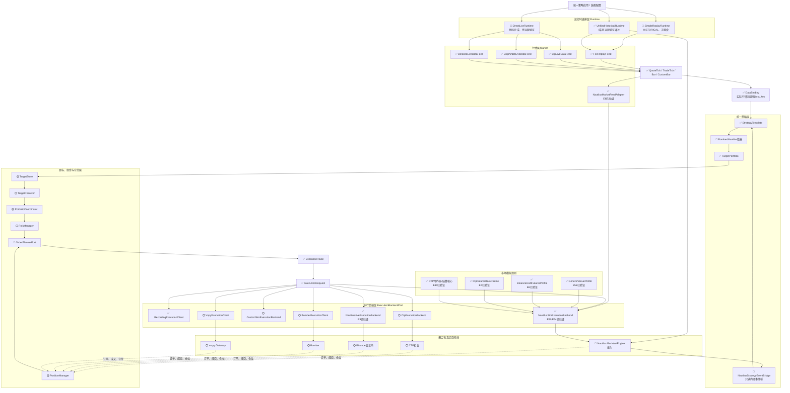
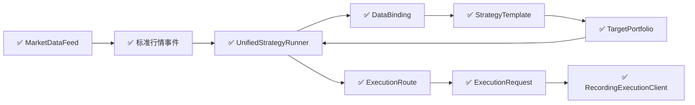
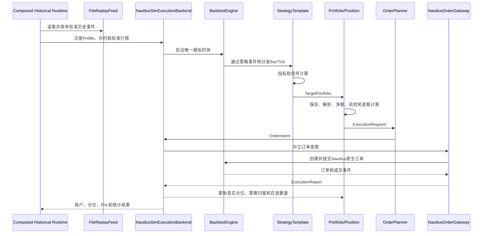

# 统一策略框架：架构、模块职责与完成情况

> 更新日期：2026-09-20  
> 适用目录：`pro/strategy`、`pro/market`、`pro/tests/run_strategy.py`

> 2026-09-20架构澄清：`market` 是在线与离线行情的唯一入口；Nautilus自带
> DataClient不再作为应用层行情入口。模拟撮合与实盘执行统一抽象为平级的
> `ExecutionBackendPort`；`NautilusSimExecutionBackend`复用公共撮合内核，
> Binance、CTP及各交易所差异通过`VenueSimulationProfile`、`OrderPlanner`和
> 可插拔手续费、保证金、持仓、结算模型表达。

## 1. 文档目的

本文用于说明 Bomber 项目中统一策略框架的整体结构，并持续记录实现和验证进度。

框架的核心目标是：

1. 策略无感知行情源切换，包括离线文件、CTP、DolphinDB 和 Binance；
2. 策略无感知交易客户端切换，包括模拟执行、NT、Bomber 和 vn.py；
3. 行情标的和交易标的可以不同，跨市场关系由装配层配置；
4. 策略只处理标准行情、逻辑数据键和逻辑目标仓位；
5. 目标仓位、真实仓位、组合管理和实际订单相互分离；
6. 所有能力先通过最小测试逐步验证，再进入真实交易环境。

### 1.1 Nautilus 集成决策

Nautilus 在本项目中承担两类可独立使用的能力：

1. Bomber/Nautilus 数据模型和指标组件，例如 `Bar`、`QuoteTick`、EMA、ATR；
2. 默认的正式回测内核，包括模拟时钟、订单生命周期、撮合、账户、仓位和盈亏。

统一策略不继承 Nautilus 原生 `Strategy`，仍然继承本项目的 `StrategyTemplate`。
默认主链由`UnifiedStrategyRunner`托管策略，并通过统一Execution Client进入模拟或实盘
Backend。只有Nautilus内部聚合Bar需要`NautilusStrategyEventBridge`做只读事件转发；旧
`NautilusStrategyBridge`保留为原生StrategyEngine兼容入口，不再是默认执行路径。

完整 `BacktestEngine` 不是普通交易客户端。架构上拆成三个正交边界：

- `RuntimePort` 控制时间、事件循环和模块生命周期；
- `MarketDataFeed` 是所有离线与在线行情的唯一入口；
- `ExecutionBackendPort` 接收`OrderIntent`，模拟Backend与实盘Backend为同级实现。

`ExecutionClientPort`在迁移期间保留为兼容接口，逐步收口到
`ExecutionBackendPort`。正式回测使用`NautilusSimExecutionBackend`，自研撮合使用
与其平级的`CustomSimExecutionBackend`，而不是继承后在一个类中判断交易场所。

上期所、中金所和 Binance 的差异优先通过合约工厂、手续费、保证金、交易时段、
涨跌停、开平今昨、结算和期权行权等策略组件组合实现。只有 Nautilus 没有扩展入口时，
才增加薄的专用Backend；不直接修改其BacktestEngine。

### 1.2 最终组合原则

1. `market/replay`和`market/stream`可以互换，策略只接收标准行情；
2. `NautilusSimExecutionBackend`与`CustomSimExecutionBackend`平级；
3. `NautilusLiveExecutionBackend`与CTP、Bomber、vn.py等自定义实盘Backend平级；
4. 回测由Replay Feed、模拟Backend和Profile组合；
5. 实盘由Stream Feed和实盘Backend组合；在线行情加模拟Backend属于Paper Trading；
6. 策略不感知Feed、Backend与Profile，可以直接使用Bomber/Nautilus纯计算指标；
7. 策略不得直接订阅具体数据源或调用具体交易客户端API。

典型组合如下：

| 行情积木 | 执行积木 | 结果 |
|---|---|---|
| FileReplayFeed | NautilusSimExecutionBackend + BinanceProfile | Binance正式回测 |
| FileReplayFeed | NautilusSimExecutionBackend + CtpProfile | 国内期货正式回测 |
| FileReplayFeed | CustomSimExecutionBackend | 自研撮合回测 |
| BNWSStreamDataFeed | NautilusLiveExecutionBackend | Binance实盘 |
| Ctp/Dolphin Stream Feed | Ctp/Bomber/vn.py Backend | 国内期货实盘 |
| 任意Stream Feed | 任意SimExecutionBackend | 在线仿真/Paper Trading |

### 1.3 Profile与Backend边界

`NautilusSimExecutionBackend`只提供公共模拟时钟、订单生命周期、撮合、账户和报告。
市场差异由Profile组合进去：

```text
NautilusSimExecutionBackend
  └─ VenueSimulationProfile
      ├─ BinanceUsdtFuturesProfile
      ├─ CtpFuturesBasicProfile（NETTING基础近似）
      ├─ CtpShfeProfile
      ├─ CtpIneProfile
      ├─ CtpCffexProfile
      ├─ CtpDceProfile
      └─ CtpCzceProfile
```

Profile可提供`FillModel`、`FeeModel`、`MarginModel`、`LatencyModel`、交易时段、
结算和订单约束。目标到订单的差异由`OrderPlanner`承担：Binance可生成
`reduceOnly`订单；CTP可生成开仓、平仓、平今和平昨订单。今昨仓账本属于
`CtpPositionLedger`，不能放入策略或普通FillModel。

## 2. 总体架构

```text
                              RuntimePort
                                  │
             ┌────────────────────┼────────────────────┐
             │                    │                    │
      MarketDataFeed       StrategyTemplate      ExecutionBackendPort
             │                    │                    │
      Replay / Stream       Nautilus指标可用       Simulation / Live
             │                    │                    │
             └─ 标准事件 → DataBinding              │
                                  │                    │
                           TargetPortfolio             │
                                  │                    │
             TargetStore → PortfolioCoordinator       │
                                  │                    │
                         ExecutionRequest               │
                                  │                    │
                  PositionManager → OrderPlanner       │
                                  │                    │
                            OrderIntent ────────────────┘
```

完整运行链路：

```text
原始行情
  → Reader / Native Driver
  → Parser / Converter
  → QuoteTick / TradeTick / Bar / CustomBar
  → MarketDataFeed
  → UnifiedStrategyRunner
  → DataBinding
  → StrategyTemplate
  → TargetPortfolio
  → TargetStore / ExecutionRoute
  → PortfolioCoordinator
  → ExecutionRequest
  → PositionManager / OrderPlanner → OrderIntent
  → ExecutionBackend
  → 模拟撮合器或真实交易端
```

`UnifiedStrategyRunner` 与其他模块是装配关系，不是继承关系。每个模块通过稳定接口连接，可以独立替换。

### 2.1 调整后的运行时与执行端边界

```text
             MarketDataFeed          ExecutionBackendPort
                    │                         │
          ┌─────────┴────────┐       ┌────────┴──────────────┐
          │                  │       │                       │
     FileReplayFeed       Stream   SimExecutionBackend   LiveExecutionBackend
          │                  │       │                       │
          └─────────┬────────┘       ├─ NautilusSim          ├─ NautilusLive
                    │                └─ CustomSim            ├─ CTP/Bomber
                    │                                        └─ vn.py
                    └──────── RuntimePort统一编排 ─────────────┘
```

运行时和执行端不是“回测/实盘”两个互斥继承树，而是两个维度。典型组合为：

| Runtime行情 | ExecutionBackend | 用途 |
|---|---|---|
| `FileReplayFeed` | `RecordingExecutionBackend` | 快速验证信号、目标和路由 |
| `FileReplayFeed` | `NautilusSimExecutionBackend + Profile` | 正式撮合、资金和绩效回测 |
| `FileReplayFeed` | `CustomSimExecutionBackend` | 自研撮合回测 |
| Stream Feed | `NautilusLive/CTP/Bomber/vn.py Backend` | 实时交易 |
| Stream Feed | 任意Sim Backend | Paper Trading |

正式回测必须由`NautilusSimExecutionBackend`内部唯一的
`BacktestEngine`掌握模拟时钟。Runtime只编排Feed、策略与Backend，不再另建
回测引擎。`FileReplayFeed`只读取、解析和排序，不能与BacktestEngine各自推进
一套时钟，否则策略回调与撮合顺序会不一致。

### 2.2 完整目标架构与模块位置

状态标记：`✅` 已实现并验证；`🟡` 核心已实现但尚未接入主链路；`🔵` 当前阶段；
`⚪` 后续实现。



### 2.3 当前已经运行的主链路



当前`UnifiedStrategyRunner.submit()`已经依次经过`TargetStore`和
`PortfolioCoordinator`，默认以`PositionManager`提供策略仓位查询，再向迁移期
Recording Client发送账户净额`ExecutionRequest`。`TargetResolver`、`RiskManager`、
真正的`OrderPlanner`实现和Backend接线尚未实现。

### 2.4 三种运行流程

#### 轻量文件回放：HISTORICAL

```text
CSV / Feather
  → Reader
  → Parser
  → FileReplayFeed
  → SimpleReplayRuntime / UnifiedStrategyRunner
  → StrategyTemplate
  → TargetPortfolio
  → RecordingExecutionClient
```

用途是快速验证解析、排序、信号、目标和路由；不包含撮合、手续费、保证金和PnL。

#### Nautilus正式回测：HISTORICAL



正式回测的数据仍然只来自`FileReplayFeed`，但由Runtime交给Nautilus Backend；
唯一模拟时钟由Nautilus BacktestEngine推进，Feed本身不再独立广播第二套回放时钟。

#### 实时运行：LIVE

```text
CTP / DolphinDB / Binance Feed
  → DirectLiveRuntime / UnifiedStrategyRunner
  → DataBinding
  → StrategyTemplate
  → TargetPortfolio
  → 组合、风控和执行规划
  → CTP / Binance / Bomber / vn.py ExecutionClient
  → 委托、成交、仓位回报
  → PositionManager
```

### 2.5 Runtime、MarketDataFeed与ExecutionBackend是三个维度

| 行情 | ExecutionBackend | 用途 |
|---|---|---|
| `SimpleReplayRuntime` | `RecordingExecutionClient` | 快速策略逻辑测试 |
| `FileReplayFeed` | `NautilusSimExecutionBackend` | 正式回测 |
| Stream Feed | Recording Backend | 实时行情探针，禁止下单 |
| CTP/Dolphin Feed | CTP/Bomber/vn.py Backend | 国内期货实盘 |
| Binance Feed | Nautilus/Binance Live Backend | Binance实盘 |

Runtime负责编排时间、事件推进和生命周期；MarketDataFeed是唯一行情入口；Backend负责
目标执行、订单、成交和仓位回报。模拟与实盘Backend共同遵守
`ExecutionBackendPort`。旧`ExecutionClientPort.submit_targets()`只作为迁移期兼容接口；
新Backend使用`submit_order(OrderIntent)`，目标差额与开平规则不会进入撮合器或柜台适配器。

### 2.6 交易所扩展规则的位置

Nautilus是默认通用回测内核，但SHFE、CFFEX和Binance差异通过组合规则实现，默认
不派生或修改完整 BacktestEngine：

```text
NautilusSimExecutionBackend
  → VenueSimulationProfile
      ├─ CtpShfeProfile
      │   ├─ TradingSessionCalendar
      │   ├─ CommissionModel
      │   ├─ MarginModel
      │   ├─ PositionOffsetPolicy
      │   ├─ PriceLimitPolicy
      │   └─ SettlementPolicy
      ├─ CtpCffexProfile
      │   ├─ CommissionModel
      │   ├─ MarginModel
      │   ├─ SettlementPolicy
      │   └─ OptionExercisePolicy
      └─ BinanceUsdtFuturesProfile
          ├─ CommissionModel
          ├─ MarginModel
          └─ FundingPolicy
```

只有Nautilus没有合适扩展入口时，才增加组合式专用Backend；不直接修改完整引擎。

### 2.7 代码目录位置

```text
market/
├─ basic/                  标准行情对象、合约元数据和MarketDataFeed
├─ replay/
│  ├─ readers/            CSV、Feather等存储格式
│  └─ parsers/            CTP/BN Tick和Bar字段解析
├─ native/
│  ├─ ctp/                CTP原生绑定和Driver
│  └─ dolphin/            DolphinDB SDK Driver
└─ stream/
   ├─ ctp/                CTP实时标准行情Feed
   ├─ dolphin/            DolphinDB流表标准行情Feed
   └─ bn/                 Binance WebSocket标准行情Feed

strategy/
├─ contracts.py           DataBinding、TargetPortfolio、ExecutionRequest等契约
├─ template.py            StrategyTemplate和StrategyContext
├─ runner.py              当前轻量装配、分发与路由器
├─ portfolio.py           TargetStore、PortfolioCoordinator、PositionManager
├─ ports.py               迁移期ExecutionClientPort和PositionProvider
├─ execution/
│  ├─ contracts.py       OrderIntent、ExecutionReport和开平语义
│  ├─ ports.py           Backend、Planner和Profile协议
│  ├─ live/              Nautilus Live Backend、TradingNode Driver、Runner适配器
│  ├─ ctp/               CTP今昨仓账本、平仓规划、手续费与逐日结算
│  ├─ simulation/        通用Backend、Generic/Binance/CTP基础Profile
│  └─ nautilus.py        旧Bridge使用的兼容适配器，待主链迁移后移除
└─ runtime/
   ├─ base.py             RuntimePort、HistoricalRuntimePort、BacktestRuntimePort
   ├─ direct.py           DirectLiveRuntime
   ├─ market_adapter.py   MarketDataFeed到模拟Backend的标准行情桥
   ├─ replay.py           SimpleReplayRuntime
   └─ nautilus.py         迁移期兼容Runtime；新正式回测由Sim Backend拥有引擎
```

## 3. 核心边界

### 3.1 策略目标仓位

策略目标仓位表示“策略希望最终持有什么”，不是立即执行的买卖订单。

```text
trade_leg = +2  表示希望最终持有2手多头
trade_leg =  0  表示希望最终清仓
trade_leg = -1  表示希望最终持有1手空头
```

当前使用 `TargetPortfolio` 表达一个策略版本的目标仓位快照。

### 3.2 真实仓位

真实仓位来自撮合引擎、交易客户端、经纪商或交易所查询结果，是账户实际持有的仓位。

实盘中真实仓位的最终权威来源应是 Bomber/CTP 查询结果，而不是策略自行推测。

### 3.3 组合管理

组合管理汇总多个策略和多个交易腿的目标，并应用净额、资金、限仓和风险规则。

```text
策略A：rb +2
策略B：rb -1
----------------
账户净目标：rb +1

账户真实仓位：rb 0
待执行变化量：买入1手
```

三层职责不能混合：

| 层次 | 主要问题 | 当前对象 |
|---|---|---|
| 策略目标 | 策略想持有什么 | `TargetPortfolio` |
| 目标保存 | 每个策略最新目标、版本和更新模式 | `TargetStore` 内存核心已实现 |
| 组合管理 | 多策略目标如何汇总和净额 | `PortfolioCoordinator` 内存核心已实现 |
| 真实仓位 | 账户实际持有什么 | `PositionManager` 已实现，真实客户端同步待接入 |

## 4. 模块职责

### 4.1 UnifiedStrategyRunner

文件：`strategy/runner.py`

Runner 是装配器和调度器，负责：

- 注册行情源；
- 注册交易客户端；
- 注册策略；
- 建立行情订阅和策略逻辑数据键之间的绑定；
- 启动、停止各模块；
- 将标准行情事件分发给策略；
- 将策略目标按执行路由转换成 `ExecutionRequest`；
- 通过 `PositionProvider` 向策略提供持仓查询。

Runner 不负责：

- 计算策略信号；
- 解析原始行情字段；
- 真实持仓同步；
- 多策略净额计算；
- 风控、订单定价和开平今昨转换；
- 交易所撮合。

当前回放模式要求只配置一个具有 `replay()` 能力的聚合回放行情源。

### 4.2 MarketDataFeed

文件：`market/basic/base.py`

所有行情源共同遵守的接口，统一提供：

- 合约元数据注册；
- 行情订阅与退订；
- 连接与断开；
- Quote、Trade、Bar、CustomBar 事件处理器；
- 标准行情事件发布。

策略永远不接收原始 CSV 字典、CTP 结构体、DolphinDB 行或 Binance JSON。

#### FileReplayFeed

文件：`market/replay/base.py`

负责离线 CSV/Feather 文件的读取、解析、时间排序、订阅过滤和历史回放。

它目前是历史事件播放器，不是完整回测撮合引擎，不负责资金、手续费、滑点和成交。

#### CtpLiveDataFeed

目录：`market/stream/ctp`

负责连接原生 CTP MdApi、登录、订阅合约，并将 `DepthMarketData` 转换为标准 `QuoteTick` 和快照推导的 `TradeTick`。

它只负责行情，不负责 CTP TraderApi 下单。

#### DolphinDbLiveDataFeed

目录：`market/stream/dolphin`

负责订阅 DolphinDB 共享流表，将标准化流表行转换成 `QuoteTick`、`TradeTick` 或 Bar。

当前 SHFE Tick 使用 `stream_ctp_shfe_std` 26列标准流表。49列的 `stream_ctp_shfe` 是原始 CTP 流，不使用现有26列转换器。

#### Binance Feed

目录：`market/stream/bn`

负责连接 Binance WebSocket，将 `trade`、`bookTicker` 等消息转换成标准行情事件。

### 4.3 DataBinding

文件：`strategy/contracts.py`

`DataBinding` 把具体行情订阅映射为策略认识的逻辑数据键：

```python
DataBinding(
    data_key="ctp_quote",
    feed_id="ctp-tick-replay",
    instrument_id=InstrumentId.from_str("rb2610.SHFE"),
    data_type=DataType.QUOTE_TICK,
)
```

含义：

```text
ctp-tick-replay 中 rb2610.SHFE 的 QuoteTick
    → 策略逻辑数据键 ctp_quote
```

策略只判断 `data_key`，不判断行情来自文件、CTP、DolphinDB 还是 Binance。

### 4.4 StrategyTemplate

文件：`strategy/template.py`

所有策略共用的基础模板，提供：

- `on_start()`、`on_stop()` 生命周期；
- `on_quote_tick()`、`on_trade_tick()`、`on_bar()` 等标准回调；
- `set_target()` 和 `set_targets()` 目标提交方法；
- `position()` 策略持仓查询方法；
- 自动递增的目标修订号。

策略不直接访问行情源和交易客户端，也不包含 CTP、DolphinDB、BN 等来源判断。

### 4.5 StrategyContext

文件：`strategy/template.py`、`strategy/runner.py`

这是策略和外部运行系统之间的窄接口：

```python
class StrategyContext(Protocol):
    def submit(self, intent: TargetPortfolio) -> None: ...
    def position(self, target_key: str) -> Decimal: ...
```

策略只能通过它提交目标和查询持仓。

#### CapturingContext

文件：`tests/run_strategy.py`

测试专用的最小上下文替身：

- `submit()` 把策略目标保存到列表；
- `position()` 固定返回零；
- 不包含数据源、Runner、交易客户端和真实持仓。

它用于脱离整套系统单独测试策略信号逻辑。

#### _RuntimeContext

文件：`strategy/runner.py`

正式运行时由 Runner 创建：

- `submit()` 转发到 `runner.submit()`；
- `position()` 转发到 `runner.position()`。

### 4.6 TargetPortfolio

文件：`strategy/contracts.py`

表示策略级目标仓位快照：

```python
TargetPortfolio(
    strategy_id="ctp-tick-file-probe",
    revision=1,
    ts_event=event_time,
    targets={"trade_leg": Decimal("1")},
)
```

主要字段：

| 字段 | 含义 |
|---|---|
| `strategy_id` | 目标属于哪个策略 |
| `revision` | 目标版本号，用于去重和拒绝旧目标 |
| `ts_event` | 产生目标的行情事件时间 |
| `targets` | 逻辑目标键到目标数量的映射 |
| `update_mode` | REPLACE完整替换或PATCH局部更新 |
| `execution_policy` | DIRECT、TWAP、SPREAD 等执行策略标识 |
| `deadline_ns` | 目标执行截止时间 |
| `metadata` | 信号价格、数据来源等审计信息 |

`TargetPortfolio` 不是订单。`TargetStore` 已负责内存中的保存、PATCH合并、版本和
过期校验；持久化与重启恢复仍未实现。

### 4.7 TargetStore、PortfolioCoordinator 与 PositionManager

文件：`strategy/portfolio.py`

- `TargetStore`：按策略保存最新目标，将PATCH物化成完整快照，拒绝重复、倒序和已过期目标；
- `PortfolioCoordinator`：汇总已经解析成真实账户腿的策略贡献，同一客户端同一合约净额，不同客户端不净额；
- `PositionManager`：分别保存策略归属仓位、账户真实仓位和在途数量，并实现`PositionProvider`协议。

当前三者是可独立验证的内存核心，尚未接入`UnifiedStrategyRunner`。动态合约解析、
资金分配、风险裁剪、订单规划、执行回报归属和状态持久化仍属于后续阶段。

### 4.8 PositionProvider

文件：`strategy/ports.py`

向策略提供当前有效持仓：

```python
position(strategy_id, target_key) -> Decimal
```

`PositionManager` 已提供内存实现；当前没有向Runner传入它时，Runner仍使用
`_ZeroPositionProvider` 并始终返回零。这只是测试占位，不代表真实持仓。

未来至少需要：

- 回测持仓 Provider；
- Bomber/CTP 真实持仓 Provider；
- 策略归属持仓和账户仓位之间的映射；
- 重连后的持仓恢复与核对。

### 4.9 ExecutionRoute

文件：`strategy/contracts.py`

将策略逻辑目标键映射到具体执行客户端和实际交易标的：

```python
ExecutionRoute(
    target_key="trade_leg",
    client_id="bomber-ctp",
    instrument_id=InstrumentId.from_str("rb2610.SHFE"),
)
```

它只负责静态映射，不负责持仓计算、风控或下单。

跨市场关系也由这里配置。例如策略可以读取 BTC 行情，而将 `trade_leg` 路由到 CTP 的螺纹钢合约。

### 4.9 ExecutionRequest

文件：`strategy/contracts.py`

Runner 解析 `ExecutionRoute` 后，为单个执行客户端生成的请求：

```python
ExecutionRequest(
    client_id="bomber-ctp",
    targets={InstrumentId.from_str("rb2610.SHFE"): Decimal("1")},
    logical_targets={"trade_leg": Decimal("1")},
)
```

它仍然表示实际合约的目标仓位，不是具体买卖订单。

### 4.10 ExecutionClientPort（迁移期兼容）

文件：`strategy/ports.py`

所有执行客户端共同遵守的协议：

```text
start()
stop()
submit_targets(request)
cancel_strategy(strategy_id)
```

#### RecordingExecutionClient

文件：`tests/run_strategy.py`

测试专用客户端，只保存收到的 `ExecutionRequest`，不撮合、不修改持仓、不连接真实交易端。

#### NT Client

目标能力：将目标转换为 NT 订单，使用 NT ExecutionEngine、Portfolio 和模拟或真实交易 Adapter。尚未实现。

#### Bomber Client

目标能力：把策略目标交给 Bomber，由 Bomber 执行风控、开平转换、CTP 下单和状态同步。尚未实现。

#### vn.py Client

目标能力：将统一目标转换为 vn.py 订单请求并通过 Gateway 执行。尚未实现。

新代码优先实现`ExecutionBackendPort`。模拟与实盘Backend共享生命周期和订单接口，
但分别通过`SimExecutionBackendPort.process_market_event()`与
`LiveExecutionBackendPort.reconcile()`声明不同能力。`OrderPlannerPort`把目标请求规划为
中立`OrderIntent`，`VenueSimulationProfilePort`向通用撮合内核提供市场规则。

### 4.11 RuntimePort

目录：`strategy/runtime`

运行时负责“系统如何运行”，包括时间来源、事件推进、启动和停止；它不计算策略信号，
也不代替执行客户端。

- `DirectLiveRuntime`：包装当前 LIVE Runner，真实时间和实时 Feed 推动事件；
- `HistoricalRuntimePort`：有限历史运行的公共协议，统一提供 `run()`；
- `SimpleReplayRuntime`：HISTORICAL模式，由 `FileReplayFeed` 做确定性回放；
- `BacktestRuntimePort`：同属HISTORICAL，但额外代表撮合、账户、仓位和结果统计能力，后续由Nautilus实现。

`SimpleReplayRuntime` 不是正式回测引擎，不提供撮合、手续费、保证金和 PnL。
阶段一只建立运行时边界并保持 Runner 行为不变。

## 5. 两条核心运行路径

### 5.1 行情进入策略

```text
行情源产生标准事件
    → Runner.publish(feed_id, event)
    → 根据 feed_id + DataType + InstrumentId 找到 DataBinding
    → 转换成 data_key
    → StrategyTemplate._handle_event(data_key, event)
    → on_data()
    → on_quote_tick()/on_trade_tick()/on_bar()
```

### 5.2 策略目标进入执行端

```text
StrategyTemplate.set_target()
    → TargetPortfolio
    → StrategyContext.submit()
    → UnifiedStrategyRunner.submit()
    → TargetStore / ExecutionRoute
    → PortfolioCoordinator
    → ExecutionRequest
    → PositionManager / OrderPlanner
    → OrderIntent
    → ExecutionBackendPort.submit_order()
```

当前Runner链路仍止于`ExecutionRequest`，但目标保存、跨策略账户净额和仓位查询已
接入。风控、订单规划、`OrderIntent`、Backend和真实交易回报是下一阶段能力。

## 6. 当前完成情况与状态台账

本节是项目状态的唯一权威台账。每完成一个阶段，必须同时更新：状态、验证命令、
验证环境和关键结果。正文中的架构图只表达模块关系，不代替本节状态。

状态定义：

- `已验证`：目标环境测试命令已经通过；
- `代码完成待验证`：实现和本地语法检查完成，但尚未取得目标环境运行结果；
- `核心已验证待接入`：组件单独测试通过，但尚未进入Runner主链；
- `尚未实现`：只有架构位置或接口规划。

### 6.1 已实现、已验证及待接入核心

| 能力 | 状态 | 说明 |
|---|---|---|
| 通用行情接口 | 已实现 | `MarketDataFeed` |
| CTP CSV Tick解析 | 已验证 | QuoteTick、TradeTick |
| CTP Feather Bar解析 | 已验证 | Bar、CustomBar |
| Binance离线Bar解析 | 已验证 | 现货/期货，多周期 |
| CTP原生行情驱动 | 已验证 | 登录、订阅、标准Tick |
| DolphinDB流式行情 | 已验证 | Tick使用`stream_ctp_shfe_std`；Bar使用`stream_cffex_1min`并由`T2703.CFFEX`完成实流验收 |
| 实时行情健康状态 | 已验证 | G1-G3统一三态、异常检测及DolphinDB真实Bar流已完成；H1-H5策略执行闸门远程验证通过 |
| Binance实时行情基础能力 | Kline代码完成待验证 | Feed已支持现货/永续Quote、Trade及已收盘Kline；EMA-L1-L4待远程验收 |
| StrategyTemplate | 已实现 | 标准事件回调和目标提交 |
| UnifiedStrategyRunner | 已验证 | 已按策略依赖聚合行情健康状态，并在提交目标前执行行情闸门；H系列远程通过 |
| DataBinding | 已实现 | 逻辑数据键绑定 |
| TargetPortfolio | 已实现 | 策略目标契约 |
| TargetStore | 已验证 | REPLACE/PATCH、版本、过期校验及Runner接入 |
| PortfolioCoordinator | 已验证 | 按客户端/真实合约净额并保留策略贡献 |
| PositionManager | 已验证 | E9增量成交、F1a权威快照、F1b订单状态和F1d恢复均已接入 |
| ExecutionRoute | 已实现 | 逻辑目标到客户端/合约映射 |
| RecordingExecutionClient | 代码完成待验证 | 已从测试替身提升为框架正式安全探针客户端，不真实下单 |
| ExecutionBackendPort | 已验证 | Simulation与Live Backend平级能力协议 |
| OrderIntent/ExecutionReport | 已验证 | BN reduceOnly、CTP开平语义和统一回报 |
| OrderPlanner/Profile协议 | 已验证 | 目标规划和交易所规则从策略中分离 |
| GenericVenueProfile | 已验证 | 完整映射`BacktestEngine.add_venue`通用参数，不包含专用交易所规则 |
| NautilusSimExecutionBackend | 已验证 | E5b引擎生命周期和E5c原生订单、撮合、统一回报均通过 |
| NautilusMarketFeedAdapter | 已验证 | E8标准Quote/Trade/Bar到模拟Backend的串行桥接和异步撮合闭环 |
| NetTargetOrderPlanner | 已验证 | 净目标跨零拆为reduce-only平仓和反向开仓 |
| NautilusLiveExecutionBackend | 已验证 | TradingNode Driver生命周期、订单和统一执行回报 |
| BackendExecutionClient | 已验证 | Runner目标经Planner进入Backend，并同步账户/在途仓位 |
| CTP今昨仓与结算核心 | 已验证 | 双向今昨仓、平今平昨、差异手续费和逐日盯市 |
| DolphinDB标准Feed | 已验证 | `cu2611.SHFE` Quote/Trade |
| RuntimePort基础边界 | 已验证 | DirectLive/SimpleReplay及Backtest能力协议；远程N1-N3通过 |
| 第一类单标的EMA策略 | 离线已验证、在线待验收 | N4-N7已通过；J系列已补CTP/BN在线离线统一装配 |
| CTP离线Tick驱动策略 | 已验证 | `run_strategy.py`阶段7已处理40,783个QuoteTick和28,705个TradeTick |
| Binance在线行情驱动策略 | 已验证 | `run_strategy.py`阶段10已由实时Quote生成Recording执行请求，不真实下单 |
| NautilusStrategyBridge | 兼容保留 | 旧原生托管链，不再作为默认回测执行路径 |
| UnifiedHistoricalRuntime | 已验证 | 统一Runner、Feed、模拟时钟和Backend生命周期；I2/I3远程通过 |
| SimulationExecutionClient | 已验证 | Planner/Risk/统一回报语义接入模拟Backend；I1及真实Nautilus引擎远程通过 |
| NautilusStrategyEventBridge | 已验证 | 仅转发Nautilus内部聚合Bar，不持有执行职责；N7远程通过 |
| CTP正式Bar/Tick回测示例 | 已验证 | N6外部Bar与N7内部聚合Bar均已通过统一主链远程验收 |
| Binance统一在线EMA示例 | 代码完成待验证 | 已改为BNWS Feed→Runner→Planner/Risk→Recording或Live Backend，不再使用旧Bridge |

#### 6.1.1 当前模块评估（替代旧版评估表）

| 模块 | 当前状态 | 后续调整 | 难度 |
|---|---|---|---|
| `market/basic` | 标准事件和Feed基类已验证 | 保持稳定 | 低 |
| `market/replay` | CSV/Feather、Parser、排序已验证 | 后续补分块/流式读取 | 低至中 |
| `market/stream/ctp` | CTP原生实时行情已验证 | 保持行情职责 | 低 |
| `market/stream/dolphin` | Tick与Bar实流均已验证 | 保持行情职责；后续仅随新增表结构扩展Schema | 低 |
| `market/stream/bn` | Tick已验证；已收盘Kline代码完成待验证 | 远程验证现货/永续Kline与断线恢复 | 中 |
| `StrategyTemplate` | 与数据源、执行端解耦 | 保持稳定 | 低 |
| `UnifiedStrategyRunner` | E4已接Target/Portfolio/Position，H1-H5行情闸门已验证 | 继续收口Runtime装配 | 中高 |
| `TargetStore` | REPLACE/PATCH、版本、过期校验及F1d持久化已验证 | 保持稳定 | 低 |
| `PortfolioCoordinator` | 多策略账户净额已验证 | 接风控和资金分配 | 中 |
| `PositionManager` | 策略/账户/在途、F1a权威快照和F1d恢复已验证 | 具体柜台查询随Adapter验收 | 中 |
| `NautilusStrategyBridge` | 旧正式回测链兼容层 | 停止扩展；原生托管旧例需要时保留 | 低 |
| `NautilusBacktestRuntime` | 旧Bridge兼容Runtime | 停止扩展；新代码使用UnifiedHistoricalRuntime | 低 |
| `NautilusExecutionAdapter` | 旧Bridge专用目标差额适配器 | 停止扩展；已由Planner+Gateway取代 | 低 |
| `GenericVenueProfile` | E5a已验证 | 作为专用Profile的通用底座 | 低 |
| `NautilusSimExecutionBackend` | E5b/E5c已验证 | 接Runner、PositionManager和策略事件桥 | 中高 |
| `BinanceUsdtFuturesProfile` | E6a/E6b/E6c已验证 | 后续补Funding和更完整的限制规则 | 中 |
| `CtpFuturesBasicProfile` | E7a/E7b已验证 | NETTING基础近似；验证乘数、保证金、固定每手手续费和基础开平仓 | 中 |
| `NautilusMarketFeedAdapter` | E8a/E8b已验证 | 将标准Quote/Trade/Bar串行推进模拟Backend；接入统一组合Runtime | 中 |
| `NautilusLiveExecutionBackend` | E9a/E9b/E9c已验证 | 后续仅在显式授权下进行Binance DEMO订单验证 | 中高 |
| CTP高保真核心 | E10a/E10b/E10c已验证 | 今昨仓、平今平昨和逐日结算已验证；涨跌停和交易时段仍待补 | 高 |

### 6.2 已实现但等待策略链路验证

| 能力 | 状态 |
|---|---|
| 第一类单标的EMA策略 | example01/02已合并；N4指标测试和N5-N7正式回测链均已验证 |
| DolphinDB实时行情驱动策略 | 阶段6已由`cu2611.SHFE`真实流验证标准QuoteTick/TradeTick |

### 6.3 尚未实现

| 能力 | 说明 |
|---|---|
| PortfolioCoordinator增强 | 资金分配、风险裁剪和动态合约解析 |
| 高级执行规划 | 基础净目标与CTP平今平昨已实现；仍需订单拆分和价格策略 |
| 风控增强 | F1c基础数量、仓位、名义金额、行情时效和Kill Switch已完成；频率、资金和裸腿风险待补 |
| NT执行客户端真实环境验收 | Backend和TradingNode Driver已实现，尚未在真实/DEMO账户下单验证 |
| Bomber执行客户端 | 尚未实现 |
| vn.py执行客户端 | 尚未实现 |
| CTP TraderApi适配 | 当前只有MdApi行情能力 |
| 完整交易所级回测细节 | 今昨仓和结算核心已实现；滑点、涨跌停、交易时段和完整品种费率待补充 |

## 7. 分阶段验证计划

原则：每一阶段只增加一个变量，失败时能够快速定位层次。

| 顺序 | 验证内容 | 数据环境 | 执行端 | 状态 |
|---:|---|---|---|---|
| 1 | 基础数据契约 | 手工对象 | 捕获上下文 | 已完成 |
| 2 | StrategyTemplate | 手工Bar | CapturingContext | 已完成 |
| 3 | 行情源切换契约 | 手工Feed | Recording | 已完成 |
| 4 | 交易客户端切换契约 | 手工Feed | 多个Recording客户端 | 已完成 |
| 5 | 多策略和跨市场路由 | 手工BN Bar | Recording | 已完成 |
| 6 | DolphinDB实时Feed驱动策略 | 实时 `cu2611` | Recording | 已验证 |
| 7 | CTP离线Tick驱动策略 | `rb2610` CSV | Recording | 已验证 |
| 8 | CTP离线Bar驱动EMA | `rb2704` Feather | Simulation Backend | N6已验证；J3a增加固定基准待回归 |
| 9 | Binance离线Bar驱动EMA | 期货1分钟CSV | Simulation Backend | J3c代码完成待验证 |
| 10 | Binance在线行情驱动策略 | Binance WebSocket | Recording | 已验证 |
| 11 | 原生CTP实时Tick聚合驱动EMA | CTP MdApi | Recording | J5c代码完成待交易时段验证 |
| 12 | DolphinDB实时行情驱动策略 | DolphinDB流表 | Recording | Tick策略链及Tick/Bar Feed实流均已验证 |

### 7.1 Nautilus 回测接入阶段

接入过程独立于既有行情阶段，每一步均提供可单独执行的测试脚本：

| 阶段 | 内容 | 测试入口 | 验收重点 | 状态 |
|---:|---|---|---|---|
| N1 | RuntimePort边界 | `python tests/run_runtime.py --stage 1` | LIVE生命周期委托 | 已验证 |
| N2 | 轻量回放Runtime | `python tests/run_runtime.py --stage 2` | HISTORICAL只调用现有回放链路 | 已验证 |
| N3 | 时间模式和能力协议 | `python tests/run_runtime.py --stage 3` | HISTORICAL/LIVE；简单回放与正式回测能力分离 | 已验证 |
| N4 | Bomber/Nautilus指标 | `python tests/strategies/single_ema/run_test.py` | 原生EMA驱动统一策略 | 已验证 |
| N5/I3 | 统一Runner正式回测 | `python tests/run_formal_strategy.py --stage 5` | 内存Bar经Planner/Risk/Simulation Backend成交 | 已验证 |
| N6/I4 | CTP Bar统一正式回测 | `python tests/run_formal_strategy.py --stage 6` | rb2704 Feather经统一主链撮合 | 已验证 |
| N7/I4 | CTP Tick统一正式回测 | `python tests/run_formal_strategy.py --stage 7` | rb2609 Tick由只读EventBridge转发内部1分钟Bar | 已验证 |
| N8/J6 | Binance统一在线EMA | `python examples/single_ema/ema_binance_live.py` | 默认Recording；显式授权后进入统一Live Backend | 代码完成待验证 |
| N9 | 交易所扩展规则 | `python tests/run_ctp_high_fidelity.py` | 今昨仓和结算代码完成；涨跌停、时段、期权生命周期待补 | 部分实现待验证 |

N1-N3不加载 Nautilus BacktestEngine、不连接网络、不创建真实订单；只固定后续集成
所依赖的架构边界。

### 7.2 Backend/Profile重构阶段

本轮开始按下表迁移。迁移期间旧的`ExecutionClientPort`和正式回测链路保持可运行，
每一阶段通过后再替换下一层，禁止一次性改写Runner、Bridge和BacktestEngine。

| 阶段 | 内容 | 测试入口 | 状态 |
|---:|---|---|---|
| E1 | OrderIntent/ExecutionReport中立契约 | `python tests/run_execution_backend.py --stage 1` | 已验证 |
| E2 | Simulation/Live Backend平级能力协议 | `python tests/run_execution_backend.py --stage 2` | 已验证 |
| E3 | OrderPlanner/VenueProfile协议 | `python tests/run_execution_backend.py --stage 3` | 已验证 |
| E4 | TargetStore/PortfolioCoordinator/PositionManager接入Runner | `python tests/run_portfolio.py` | 已验证 |
| E5a | GenericVenueProfile映射 | `python tests/run_simulation_backend.py --stage 1` | 已验证 |
| E5b | NautilusSimExecutionBackend引擎所有权与生命周期 | `python tests/run_simulation_backend.py --stage 2` | 已验证 |
| E5c | OrderIntent转原生订单并产生真实成交 | `python tests/run_simulation_backend.py --stage 3` | 已验证 |
| E6a | BinanceUsdtFuturesProfile和线性永续合约映射 | `python tests/run_binance_simulation.py --stage 1` | 已验证 |
| E6b | Binance离线Bar开仓/reduce-only平仓回测 | `python tests/run_binance_simulation.py --stage 2` | 已验证 |
| E6c | Binance初始/维持保证金率运行语义 | `python tests/run_binance_simulation.py --stage 3` | 已验证 |
| E7a | CtpFuturesBasicProfile和期货合约映射 | `python tests/run_ctp_simulation.py --stage 1` | 已验证 |
| E7b | CTP Feather Bar基础开平仓回测 | `python tests/run_ctp_simulation.py --stage 2` | 已验证 |
| E8a | MarketDataFeed到模拟Backend的绑定、过滤和生命周期 | `python tests/run_market_stream_adapter.py --stage 1` | 已验证 |
| E8b | StreamDataFeed异步队列到Nautilus撮合闭环 | `python tests/run_market_stream_adapter.py --stage 2` | 已验证 |
| E9a | 净目标基础OrderPlanner | `python tests/run_live_backend.py --stage 1` | 已验证 |
| E9b | Nautilus Live Backend与TradingNode Driver | `python tests/run_live_backend.py --stage 2` | 已验证 |
| E9c | Binance标准Stream到Live Backend与仓位同步 | `python tests/run_live_backend.py --stage 3` | 已验证 |
| E10a | CTP双向今昨仓和逐日结算账本 | `python tests/run_ctp_high_fidelity.py --stage 1` | 已验证 |
| E10b | CTP平今/平昨/反向开仓规划与手续费 | `python tests/run_ctp_high_fidelity.py --stage 2` | 已验证 |
| E10c | ExecutionReport记账与HEDGING Profile | `python tests/run_ctp_high_fidelity.py --stage 3` | 已验证 |

E1-E4已在远程`uv-nautilus`环境通过。E4只使用Recording执行替身，不接入网络、
不撮合、不创建真实订单；已验证Runner输出多策略账户净额快照，并在REPLACE移除
目标腿时明确发送0。`tests/run_strategy.py`阶段1-5、7、10兼容回归已通过。

E5拆为三个小步：E5a只验证Profile配置映射；E5b验证Backend拥有唯一
BacktestEngine和生命周期；E5c才接入原生订单及成交回报。这样Profile错误、
引擎错误和订单适配错误可以分开定位。

原策略阶段7仍可独立回归：

```bash
python tests/run_strategy.py --stage 7
```

阶段测试期间统一使用 `RecordingExecutionClient`，禁止连接真实交易端。

## 8. 当前CTP离线Tick策略验证

```text
rb2610_20260701.csv
    → CsvReader
    → CtpTickParser
    → QuoteTick + TradeTick
    → FileReplayFeed
    → UnifiedStrategyRunner
    → ctp_quote / ctp_trade
    → CtpTickProbeStrategy
    → TargetPortfolio(trade_leg=1)
    → ExecutionRoute
    → ExecutionRequest(rb2610.SHFE=1)
    → RecordingExecutionClient
```

验收条件：

1. QuoteTick数量大于零；
2. TradeTick数量大于零；
3. 策略收到的事件数量与回放统计一致；
4. 策略只产生一份目标；
5. Runner正确解析为 `rb2610.SHFE`；
6. 没有撮合和真实下单。

## 9. 设计约束

后续实现必须继续遵守：

1. `strategy` 包只放框架能力；EMA、CTA、套利等具体业务策略必须放在应用层
   （当前示例为 `examples/single_ema/strategies`），框架不得反向导入业务策略；
2. 具体策略代码不得导入具体行情源；
3. 具体策略代码不得导入CTP、DolphinDB、Binance或交易客户端SDK；当前Bomber是Nautilus
   Trader的改名构建，策略可以直接使用其EMA、ATR、RSI等纯计算指标；
4. 策略使用逻辑 `data_key` 和 `target_key`；
5. 具体合约和客户端由 `DataBinding`、`ExecutionRoute` 配置；
6. `TargetPortfolio` 表示目标状态，不表示重复买卖命令；
7. 真实账户持仓必须有唯一权威来源；
8. 测试阶段默认使用 Recording 客户端；
9. 行情适配器只负责标准化行情，不负责策略和下单；
10. 交易适配器只负责执行，不参与策略信号计算；
11. 每增加一个真实组件，都先保留其他组件为测试替身。

## 第五类策略进度（JM/I/RB次主力信号，RB主力执行）

已新增 `datahub/sector_roles.py`、`examples/black_sector/` 和
`tests/run_black_sector.py`。角色/因子 as-of 查询、纯 30/15 收益率信号
已在本地验证；真实 Bar 同步、可选额外 Bar 延迟提交及 Nautilus 基础
撮合入口已编码，待在远程 `uv-nautilus` 与真实 Feather 数据中逐阶段验收。
组装链路仍为统一的 Feed → StrategyTemplate → Target/Portfolio → Planner
→ Risk → Backend，动态 `rb_main` 由既有 Resolver/SafeRollCoordinator 处理。
详见 `examples/black_sector/README.md`。在 V3/V4 通过前，本类状态为
**实现中**，不得将零订单或程序正常退出视为成交验证。

## 10. 下一步

E1-E7b以及原有策略回归已在远程`uv-nautilus`环境通过。
E6使用以下三个分阶段命令验证Profile、离线Bar撮合和保证金语义：

```bash
python tests/run_binance_simulation.py --stage 1
python tests/run_binance_simulation.py --stage 2
python tests/run_binance_simulation.py --stage 3
```

E6a不读取文件也不撮合；E6b从`market/replay`读取了1,440根Binance期货
1分钟Bar，并使用前两根Bar完成可重复的开仓/平仓往返。远程结果确认：两张
市价单均成交，平仓单携带`reduce-only`，开仓/平仓Taker手续费分别为
`0.01290065 USDT`和`0.01289785 USDT`，最终仓位归零。费率是显式回测参数，
不代表Binance当前费率。

E6日志同时暴露出一个需要在进入E7前处理的保证金语义问题：当前Venue使用
Nautilus默认`LeveragedMarginModel`，该模型会先将名义价值除以`leverage`，再乘
合约的`margin_init`/`margin_maint`。现有Profile又把`margin_init`设置为`1/leverage`
并把`margin_maint`设置为目标维持保证金率，产生了重复折算。日志中的持仓名义
价值为`25.8013 USDT`，配置维持保证金率为`0.005`，预期维持保证金应为
`0.12900650 USDT`，实际却为`0.01290065 USDT`。因此E6a/E6b证明订单、
`reduce-only`、手续费和仓位生命周期正确，但尚不能证明保证金金额正确；该项列为
E6c单独修正和验证。

E6c现已将Binance Profile改为显式使用`StandardMarginModel`。该模型直接按
`名义价值 × 合约保证金率`计算，因此`leverage=10`派生的`margin_init=0.1`以及
独立配置的`margin_maint=0.005`不会再被重复除以杠杆。stage 3已经验证：

1. `25.8013 USDT`名义价值对应`2.58013000 USDT`初始保证金；
2. 同一名义价值对应`0.12900650 USDT`维持保证金；
3. 真实开仓后账户锁定金额等于成交名义价值的0.5%；
4. `reduce-only`平仓后维持保证金释放且净仓位归零。

单独回归保证金语义的命令：

```bash
python tests/run_binance_simulation.py --stage 3
```

远程完整回归已经通过。实际开仓成交价为`25,795.70 USDT`、数量为`0.001 BTC`，
名义价值为`25.79570 USDT`，账户锁定维持保证金为`0.12897850 USDT`，正好等于
名义价值的0.5%。随后`reduce-only`平仓成交，维持保证金和锁定余额均清零，净仓位
归零。因此E6保证金重复折算问题已关闭，下一阶段为E7 CTP基础Profile离线回测。

E7已拆为两个独立验证阶段：

```bash
python tests/run_ctp_simulation.py --stage 1
python tests/run_ctp_simulation.py --stage 2
```

E7a不读取行情文件，验证`CtpFuturesBasicProfile`使用CNY保证金账户、
`StandardMarginModel`、1倍账户杠杆、每手固定手续费，以及rb合约的1元最小变动、
10吨乘数和整数手数量规则。E7b通过`market/replay`读取
`rb2704_20260728.feather`，用真实Bar完成一手开仓与`PositionEffect.CLOSE`平仓，
验证10%初始保证金、8%维持保证金、每次成交1元手续费、平仓保证金释放及最终零仓位。

E7明确采用`OmsType.NETTING`基础近似。它不宣称支持CTP真实双向持仓、今昨仓、
平今/平昨费率、交易日切换或每日结算；这些能力仍属于E10高保真Profile，防止基础
测试通过后误认为CTP全部规则已经完成。

E7远程完整回归已经通过，共读取351根`rb2704.SHFE`一分钟Bar。开仓和平仓均以
`3,139 CNY`成交一手，10倍合约乘数下的持仓名义价值为`31,390 CNY`，8%维持
保证金为`2,511.20 CNY`，与账户实际锁定金额完全一致。两次成交各收取`1 CNY`
测试手续费，同价开平后账户由`1,000,000 CNY`变为`999,998 CNY`；随后保证金
释放、净仓位归零。E7基础CTP Profile验证关闭，下一阶段为E8通用Stream行情适配器。

E8实现位于`strategy/runtime/market_adapter.py`，分为两个验证阶段：

```bash
python tests/run_market_stream_adapter.py --stage 1
python tests/run_market_stream_adapter.py --stage 2
```

E8a不加载Nautilus引擎，使用同步Feed和Backend替身验证：声明式订阅、标的和周期
过滤、启动/停止幂等、事件计数，以及`CustomBar`不能作为第二份撮合行情推进时钟。
E8b使用真实`StreamDataFeed`后台分派队列和`NautilusSimExecutionBackend`，手工向
队列推入三根标准Bar，完成初始化、一手开仓和`PositionEffect.CLOSE`平仓，并验证
成交回报、`reduce-only`原生订单、最终零仓位和Backend释放结果。它不连接网络、
不发送真实订单。

E8远程完整回归已经通过。E8a确认Quote、Trade和Bar订阅过滤、生命周期幂等以及
`CustomBar`边界正常。E8b共异步处理3根Bar并生成2张订单：一手多单以`3,102 CNY`
成交，平仓单以`3,103 CNY`成交且原生订单携带`reduce_only=True`。10倍合约乘数下
毛收益为`10 CNY`，扣除两次各`1 CNY`手续费后账户由`1,000,000 CNY`变为
`1,000,008 CNY`；`2,481.60 CNY`维持保证金随后释放，最终仓位归零。引擎统计为
3次迭代、2张订单、1个已关闭仓位，DataEngine、RiskEngine、ExecEngine和Gateway
均正常停止并释放。E8验证关闭，下一阶段为E9。

`NautilusMarketFeedAdapter`只面向`SimExecutionBackendPort.process_market_event()`，
用于Stream行情驱动在线仿真/Paper Trading。真实执行Backend不消费行情：实盘时同一
Stream Feed通过Runner驱动策略，策略产生的`OrderIntent`再进入Live Backend。因此
E9的正确并行链路是：

```text
BNWSStreamDataFeed → UnifiedStrategyRunner → StrategyTemplate
                                      └→ OrderIntent → NautilusLiveExecutionBackend

BNWSStreamDataFeed → NautilusMarketFeedAdapter → NautilusSimExecutionBackend
                                      （仅Paper Trading组合）
```

N1-N3运行时边界已经在远程 `uv-nautilus` 环境通过：

```bash
python tests/run_runtime.py --stage 1
python tests/run_runtime.py --stage 2
python tests/run_runtime.py --stage 3
```

N4已经在远程 `uv-nautilus` 环境通过：第一类策略直接使用当前Bomber构建中的
`bomber.indicators.ExponentialMovingAverage`，并通过纯数值 `update_raw()` 驱动。
N5-N7测试代码已在I4迁移到统一主链并完成远程重新验收。N6读取351根Feather Bar，
策略按`skip_single_price=True`过滤单一价格Bar后使用7根有效Bar，生成并成交1张订单；
N7读取42,530个Tick事件，内部聚合并使用112根分钟Bar，生成并成交45张订单。
N8的Binance脚本已重新标记为原生SDK
临时探针：它直接使用Nautilus Binance DataClient，绕过了`market`唯一行情入口，
不能作为最终架构范例。最终实盘链路将在E9中改为
`BNWSStreamDataFeed → UnifiedStrategyRunner → NautilusLiveExecutionBackend`；E8适配器
只负责把同一标准Stream行情送入模拟Backend，构成在线仿真链路。

E8目标环境的两阶段验证已经通过；后续E9也已按“先Live Backend契约和订单映射，
再接Binance标准Stream”的顺序完成验证，没有同时引入网络和真实下单变量。

### E9：Binance Stream与Nautilus Live Backend

E9代码分为三个可独立验证的阶段：

```bash
python tests/run_live_backend.py --stage 1
python tests/run_live_backend.py --stage 2
python tests/run_live_backend.py --stage 3
```

E9a验证`NetTargetOrderPlanner`。例如账户从`+2`切换到`-1`时，必须生成一张数量2的
`reduce-only CLOSE`卖单，再生成一张数量1的`OPEN`卖单，不能用一张订单隐式穿越
零轴。E9b验证`NautilusLiveExecutionBackend`拥有TradingNode Gateway、线程、停止释放
和运行期对账边界。E9c保留真实`BNWSStreamDataFeed.on_ws_message()`转换及异步队列，
只把网络连接和柜台替换为内存测试驱动，验证以下完整组合：

```text
Binance bookTicker报文
  → BNWSStreamDataFeed
  → QuoteTick
  → UnifiedStrategyRunner / DataBinding
  → StrategyTemplate / TargetPortfolio
  → ExecutionRequest
  → NetTargetOrderPlanner
  → OrderIntent
  → NautilusLiveExecutionBackend
  → ExecutionReport
  → PositionManager账户仓位和在途数量
```

E9测试不会连接交易账户、不会发送真实订单。真实Binance DEMO或LIVE下单属于单独的
显式授权验收：调用方先配置只含原生Exec Client的TradingNode，再交给
`NautilusTradingNodeDriver`；LIVE环境仍必须保留双重确认和凭证检查。

E9远程完整回归已经通过：E9a确认净目标跨越零轴时正确拆成reduce-only平仓和
反向开仓；E9b确认TradingNode Driver、Gateway线程、停止释放和运行期对账边界；
E9c确认Binance标准Stream已经贯通策略、Planner、Live Backend、ExecutionReport
及PositionManager账户仓位/在途数量同步。该结果验证的是安全内存柜台闭环，不表示
已经向Binance DEMO或LIVE账户发送过订单。

### E10：CTP今昨仓、平仓标志和逐日结算

E10代码同样拆为三个阶段：

```bash
python tests/run_ctp_high_fidelity.py --stage 1
python tests/run_ctp_high_fidelity.py --stage 2
python tests/run_ctp_high_fidelity.py --stage 3
```

E10a验证`CtpPositionLedger`同时保存多头今仓、多头昨仓、空头今仓和空头昨仓；每日
结算按`(结算价-持仓成本) × 数量 × 合约乘数`逐日盯市，然后把今仓滚为下一交易日
昨仓。E10b验证`CtpClosePlanner`按可配置优先级生成`CLOSE_TODAY`、
`CLOSE_YESTERDAY`及剩余反向`OPEN`订单，并由`CtpCommissionRule`分别核算开仓、
平昨和平今手续费。E10c验证统一`ExecutionReport`包含订单方向、原始数量和开平标志，
由`CtpExecutionAccounting`写回账本；`CtpFuturesHedgingProfile`使用Nautilus
`OmsType.HEDGING`，但不会把Nautilus不理解的CTP今昨仓语义伪装成普通FillModel。

E10的“高保真”范围限定为今昨仓、平今/平昨、差异手续费和逐日结算核心。涨跌停、
交易时段、夜盘交易日映射、具体品种费率表及CTP TraderApi仍是后续生产化能力，不能
因为E10核心测试通过就宣称所有交易所细节已经完成。

E10远程完整回归已经通过：E10a确认双向今昨仓、逐日盯市、今转昨及指定平今/平昨；
E10b确认跨零目标生成平今、平昨、反向开仓三段订单，并按不同费率计费；E10c确认
统一ExecutionReport可同步CTP账本，HEDGING Profile与每日结算正常。E10规划范围内
的今昨仓、开平标志、差异手续费和结算核心已经关闭。

## 11. F系列：实盘安全闭环

E系列完成行情、模拟/实盘Backend及交易所核心规则后，F系列补齐真实交易前必须具备
的安全状态边界。任何阶段都先使用内存Driver验证，不直接连接真实账户。

| 阶段 | 内容 | 测试入口 | 状态 |
|---:|---|---|---|
| F1a | 权威账户仓位快照、启动对账和下单闸门 | `python tests/run_reconciliation.py` | 远程验证通过 |
| F1b | 部分成交、撤单、拒单、重复/乱序回报状态机 | `python tests/run_order_state.py` | 远程验证通过 |
| F1c | 数量、仓位、名义金额、行情时效和Kill Switch风控 | `python tests/run_risk_manager.py` | 远程验证通过 |
| F1d | Target、订单、仓位、CTP账本持久化与重启恢复 | `python tests/run_state_recovery.py` | 远程验证通过 |

F1a的强制规则：

1. Live Backend启动后必须先取得柜台权威仓位快照；
2. 快照以单调递增版本原子替换`PositionManager`中的该客户端全部账户仓位；
3. 未出现在新快照中的旧合约必须归零；
4. 对账成功前，`BackendExecutionClient`拒绝任何`ExecutionRequest`；
5. 对账失败时停止Backend并保持下单闸门关闭；
6. 停止客户端后清除已对账状态，重启必须重新取得权威快照。

F1a的实现边界如下：

- `AccountPositionSnapshot`是Live Backend对外返回的标准权威快照，包含Backend、
  单调版本、柜台时间和全部净仓；
- `NautilusTradingNodeDriver.reconcile()`只负责从具体Nautilus/Bomber账户查询逻辑
  取得原始仓位映射，`NautilusLiveExecutionBackend`负责统一标的、数值和版本；
- `PositionManager.apply_account_snapshot()`在同一把锁内先把该客户端旧仓位归零，再
  写入新快照并登记成功版本，重复或倒序版本会被拒绝；
- `BackendExecutionClient.start()`按“启动Backend → 权威对账 → 打开闸门”执行；任何
  一步失败都会停止Backend，策略目标不能进入Planner和交易端；
- 已运行客户端可主动再次调用`reconcile()`。对账期间闸门关闭，成功后才重新开放；
- 本阶段只对账账户净仓。在线部分成交及撤单回报一致性属于F1b；活动订单的重启恢复
  与持久化属于F1d，因此不能用F1a测试通过代替断线重连全链路验收。

目标环境验证顺序：

```bash
python tests/run_reconciliation.py
python tests/run_execution_backend.py
python tests/run_live_backend.py
python tests/run_portfolio.py
```

第一条验证F1a新增规则；后三条确认E1-E9和原有仓位管理没有被新对账契约破坏。

F1a已在远程`uv-nautilus`环境完成上述四组验证：新增的F1a1-F1a3全部通过，
`run_execution_backend.py`、`run_live_backend.py`和`run_portfolio.py`也全部回归通过。
因此F1a范围正式关闭，后续活动订单和执行回报一致性由F1b继续完成。

### F1b：执行回报状态机

F1b把原先散落在`BackendExecutionClient`中的剩余数量计算抽成独立的
`OrderReportStateMachine`。每个订单显式保存原始数量、累计成交、未成交数量、终态、
最后序号和最后事件时间。`ExecutionReport`新增可选的`report_id`与`sequence`：原生
Gateway会为每份回报生成稳定ID和单调序号；其他柜台暂时未提供这两个字段时，状态机
使用回报类型、时间、成交量、成交价和原因组成保守去重键。

状态机遵守以下规则：

1. `filled_quantity`表示本份回报的新增成交量，不是累计成交量；
2. 部分成交只增加账户真实仓位，并等量扣减在途数量；
3. 撤单或拒单只释放尚未成交的剩余量，不回滚已经成交的仓位；
4. 相同`report_id`、相同序号或完全相同的回报不会重复入账；
5. 小于等于已处理序号的乱序回报被忽略，终态之后的迟到回报也被忽略；
6. 过量成交、`FILLED`与累计数量不一致、同一订单标的/方向/原始数量变化均视为
   状态冲突；客户端不会猜测修复，而是关闭已对账标志和下单闸门；
7. 状态冲突时保留当时的真实仓位和在途量供审计，后续必须进行活动订单级核查，
   不能继续由策略覆盖；只重新查询账户净仓也不会自动重开闸门。

F1b分阶段验证：

```bash
python tests/run_order_state.py --stage 1
python tests/run_order_state.py --stage 2
python tests/run_order_state.py --stage 3
python tests/run_live_backend.py
python tests/run_execution_backend.py
```

前三项分别验证幂等/乱序、部分成交后撤单以及矛盾回报关闭闸门；后两项确认E9和执行
契约回归。测试全部使用内存Driver，不连接真实账户。

F1b1-F1b3已经在远程`uv-nautilus`环境通过：部分成交、拒单、撤单、重复/乱序回报
及矛盾回报关闭闸门均符合预期。待`run_live_backend.py`、
`run_execution_backend.py`、`run_reconciliation.py`和`run_portfolio.py`兼容回归通过后，
F1b状态正式关闭。

### F1c：统一下单前风控

F1c新增`PreTradeRiskManager`，固定装配位置为：

```text
ExecutionRequest
  → OrderPlanner（生成整个订单批次）
  → PreTradeRiskManager（整批检查，不产生副作用）
  → PositionManager登记在途量
  → ExecutionBackend
```

风控规则不进入策略，也不进入Binance、CTP等具体Driver。`RiskLimits`支持默认规则及
逐标的覆盖，目前包含单笔最大数量、绝对仓位上限、单笔名义金额、持仓名义金额、行情
最大年龄和合约乘数。一个目标可能由Planner拆成先平后开的多张订单，因此风控会按
顺序模拟整个批次的预计仓位；任意一张不合规时整批拒绝，不会先发送前半批订单。

`MarketReferencePriceStore`只消费标准`QuoteTick`、`TradeTick`、`Bar`或`CustomBar`，
不感知行情来自文件、Binance、CTP还是DolphinDB。把同一个实例通过
`UnifiedStrategyRunner.add_market_observer()`注册后，行情会先更新风控参考价，再进入
策略。旧时间戳行情不能覆盖新价格。

Kill Switch有三种模式：

- `NORMAL`：执行常规数量、仓位、名义金额和行情时效检查；
- `REDUCE_ONLY`：只允许严格降低绝对仓位且不穿越零轴的订单；
- `HALTED`：拒绝全部新订单。

切换到`REDUCE_ONLY`或`HALTED`时，`BackendExecutionClient.set_risk_mode()`默认要求
Backend撤销该客户端已见策略的活动订单。撤单结果仍必须由F1b标准回报状态机确认，
调用撤单接口本身不代表订单已经撤销。

F1c验证命令：

```bash
python tests/run_risk_manager.py
python tests/run_order_state.py
python tests/run_live_backend.py
python tests/run_reconciliation.py
```

第一条测试分三阶段覆盖限制和行情时效、Planner与Backend之间的无副作用拒绝、
REDUCE_ONLY及HALTED；后三条用于回归F1b、E9和F1a。

F1c1-F1c3已经在远程`uv-nautilus`环境通过，确认限制计算、批次无副作用拒绝、
REDUCE_ONLY和HALTED均符合预期。待F1b及既有执行链兼容回归通过后正式关闭。

### F1d：状态持久化与重启恢复

F1d新增`JsonStateStore`和`RuntimeStateManager`。当前选择版本化JSON而不是pickle：状态
文件需要可审计、可做schema升级，也不能在加载时执行任意Python对象。文件写入使用
同目录临时文件、`flush + fsync`、权限`0600`和`os.replace`原子替换；外层包含
`schema_version`、单调`generation`、保存时间及SHA-256校验和。

`generation`同时承担单文件CAS：只有调用方看到的上一版本与磁盘当前版本一致时才能
保存，避免两个进程或两个过期实例静默互相覆盖。校验和不匹配、JSON截断或未知schema
会拒绝恢复，不使用“尽量加载”掩盖损坏。

一次Runtime快照包含：

- `TargetStore`中各策略已经物化的REPLACE目标、版本、截止时间和可JSON化metadata；
- `PortfolioCoordinator`的策略贡献、策略版本、已知账户腿和组合版本；
- `PositionManager`的策略归属、账户仓位、在途量及内部版本；
- `OrderReportStateMachine`的订单状态、累计成交、最后序号和幂等键；
- 每个CTP账户的交易日、双向今昨仓数量及各自成本价。

恢复采用先完整解码校验、再应用的方式；跨组件应用失败时回滚到恢复前内存状态。
但本地状态不是柜台权威，因此恢复后有两道强制安全规则：

1. 持久化的“已对账”标志一律作废，账户仓位必须重新执行F1a柜台查询；
2. 如果快照存在非零在途量或未终结订单，则设置`recovery_required`。即使账户仓位查询
   成功，`BackendExecutionClient`仍拒绝启动；只有柜台活动订单查询结果通过
   `PositionManager.complete_working_recovery()`原子替换在途量后才能解除。

F1d验证命令：

```bash
python tests/run_state_recovery.py
python tests/run_risk_manager.py
python tests/run_order_state.py
python tests/run_reconciliation.py
python tests/run_live_backend.py
python tests/run_portfolio.py
python tests/run_ctp_high_fidelity.py
```

第一条分三阶段验证文件原子性/CAS/损坏检测、完整状态往返，以及“持仓对账不能替代
活动订单恢复”的重启闸门；其余命令用于回归F1a-F1c、E9、组合状态和E10账本。

### F系列验收结论

F1a-F1d已经在远程`uv-nautilus`环境完成全量验收。以下测试全部通过：

```text
run_reconciliation.py       F1a1-F1a3
run_order_state.py          F1b1-F1b3
run_risk_manager.py         F1c1-F1c3
run_state_recovery.py       F1d1-F1d3
run_execution_backend.py    E1-E3回归
run_portfolio.py            阶段1-5/E4回归
run_live_backend.py         E9a-E9c回归
run_ctp_high_fidelity.py    E10a-E10c回归
```

因此F系列“实盘安全闭环”的框架范围正式关闭：账户仓位对账、执行回报幂等状态机、
统一前置风控、Kill Switch、状态文件损坏/并发保护及重启双重恢复闸门均已验证。这里的
“关闭”指通用框架和内存Driver验收完成，不等于真实Binance/CTP账户已经完成生产验收；
具体柜台查询、活动订单查询和真实撤单回报仍需在对应Execution Adapter接入时验证。

## G系列：行情可用性与实时Bar验收

G系列不改变策略与行情源解耦的既有结构。它是在`MarketDataFeed`积木之下补运行期可观测
能力，并把已经实现的DolphinDB Bar链路放到真实流表中验收。

### G1：统一行情健康状态

所有`StreamDataFeed`现在公开同一种健康快照：

- `READY`：已收到及时、顺序正常的标准行情；
- `DEGRADED`：已连接但等待首条行情、行情超时、流中断、队列溢出、时间戳回退或分派异常；
- `DISCONNECTED`：尚未连接、显式停止或连接失败。

`health_snapshot`是不可变快照，包含状态版本、原因、最近事件时间以及各类异常累计次数；
`register_health_handler()`用于监控和未来运行时闸门，不进入策略代码。连接成功只表示网络
生命周期建立，因此在首条有效行情到达前状态是`DEGRADED`，不能误报为`READY`。

### G2：公共实时流异常检测

检测逻辑位于`market/stream/health.py`和`StreamDataFeed`公共队列层，因此CTP、Binance和
DolphinDB不用分别复制：

1. 连接后长期没有首条数据或最近行情超过时效，标记`STALE`；
2. CTP前置断开、CTP API错误、Binance WebSocket错误/非主动关闭会直接上报流中断；
   DolphinDB SDK没有等价断线回调时，由无数据超时覆盖；
3. 队列满时仍会丢弃当前事件，但不再静默发生：状态降级并累计`queue_overflows`；
4. 时间戳按“事件类型 + 标的 + Bar类型”分别检查，默认丢弃回退事件，避免多合约交错
   到达造成误报；
5. 队列溢出、时间戳回退和分派异常属于需要核查/补洞的粘滞故障，只有显式调用
   `acknowledge_health_degradation()`才可清除。普通超时或短暂断流在新事件恢复后自动回到
   `READY`。

默认首条数据宽限和后续静默阈值均为30秒，可通过`StreamHealthConfig`按市场和数据周期
调整。分钟Bar显然不能使用30秒静默阈值，实际装配时应设置为大于一个Bar周期并考虑休市。

### G3：DolphinDB实时Bar的准确边界

`market/stream/dolphin`此前已经实现：

```text
DolphinDB Bar流表
  → OfficialDolphinDbDriver订阅
  → DolphinDbMarketConverter.convert_bar
  → 标准Bar + 带open_interest/turnover等因子的CustomBar
  → StreamDataFeed异步分发
```

`tests/run_dolphin_live.py --stage 3`已经用内存Driver验证Bar转换、标准/自定义Bar分发和
重复Bar抑制。因此G3不是新建另一套Bar模块，而是新增`--stage 7`，使用真实
`DDB_BAR_STREAM_TABLE`完成端到端验收。

目标环境验证命令：

```bash
python tests/run_market_health.py
python tests/run_dolphin_live.py --stage 3
timeout 180s python tests/run_dolphin_live.py --stage 7
```

真实Bar探针需要额外配置：

```dotenv
DDB_BAR_STREAM_TABLE='stream_cffex_1min'
DDB_BAR_ACTION='bomberBarStandardProbe'
DDB_BAR_SYMBOL='IF2610'
DDB_BAR_EXCHANGE='CFFEX'
DDB_BAR_SPEC='1-MINUTE'
DDB_BAR_TIMEOUT='120'
```

标的和合约元数据必须按实际流表调整；探针同时收到标准`Bar`和`CustomBar`才算G3通过。

### G4：所谓“统一切换边界”是否需要新增模块

当前架构已经能通过显式积木装配切换行情：相同`DataBinding`和策略可以绑定
`FileReplayFeed`、`CtpLiveDataFeed`、`DolphinDbLiveDataFeed`或Binance Feed。若“统一
切换”仅指启动时选择一种行情源，则能力已经存在，不应再开发一个重复模块。

只有出现以下新需求时才需要单独的切换协调器：程序启动后先读取历史数据追到某个水位，
再自动切入实时流，并保证切换点不重、不漏、断流可回补。那一能力需要DataHub提供统一
revision/watermark和缺口查询，属于未来的“历史—实时连续性协调”，不是本轮G1-G3的
组成部分。G4当前状态因此记录为“无需新增；自动无缝切换随DataHub延期”。

### G系列状态

| 阶段 | 能力 | 验证命令 | 状态 |
|---|---|---|---|
| G1 | READY/DEGRADED/DISCONNECTED健康快照 | `python tests/run_market_health.py --stage 1` | 已验证 |
| G2a | 超时、流中断、时间戳回退 | `python tests/run_market_health.py --stage 2` | 已验证 |
| G2b | 队列溢出降级和计数 | `python tests/run_market_health.py --stage 3` | 已验证 |
| G3离线 | DolphinDB Bar转换、去重和分发 | `python tests/run_dolphin_live.py --stage 3` | 已验证 |
| G3实流 | `T2703.CFFEX`真实流表到Bar/CustomBar | `timeout 180s python tests/run_dolphin_live.py --stage 7` | 已验证 |
| G4 | 启动时积木切换 | 既有DataBinding/Runner测试 | 已具备，无需新增模块 |
| G4扩展 | 历史追赶后无缝切实时 | 等DataHub watermark/缺口能力 | 延后 |

## H系列：行情健康状态进入策略与执行安全链

G系列回答“行情源现在是否健康”，H系列回答“健康状态变化后，哪些策略还能提交什么
目标”。实现位于`strategy/market_health.py`，由`UnifiedStrategyRunner`按`DataBinding`
自动建立策略到Feed的依赖关系。策略本身仍只接收标准行情并提交`TargetPortfolio`，不需要
感知CTP、DolphinDB或Binance，也不需要在策略代码内判断健康状态。

### H1：按策略聚合依赖Feed

`MarketHealthGate`只汇总某个策略实际绑定的Feed，而不是使用一个全局行情开关。同一进程
中，依赖`feed-a`的策略可以处于`DEGRADED`，依赖健康`feed-b`的策略仍保持`READY`。
离线Feed没有实时健康协议，不会被误判为故障。

策略级状态为：

- `READY`：所有受监控的依赖Feed均健康，并且没有待确认事故；
- `DEGRADED`：至少一个依赖Feed不健康；
- `AWAITING_CONFIRMATION`：Feed已经重新收到新鲜事件，但事故锁尚未人工解除。

### H2：目标提交前的第一道闸门

Runner在`TargetStore.apply()`之前检查目标。异常期间使用该策略最后一个已接受的逻辑目标
比较新目标：允许绝对值变小或归零，不允许增仓，也不允许穿越零轴后反向开仓。拒绝发生
在revision写入之前，因此修复问题后可以用同一revision安全重试，不会污染TargetStore和
PortfolioCoordinator。

### H3：执行端按权威实仓再次校验

Runner通过`ExecutionRequest.metadata["market_health_mode"]`把`REDUCE_ONLY`传到
`BackendExecutionClient`。Live执行端必须配置`PreTradeRiskManager`，它依据F1a对账得到的
账户真实仓位和在途量再次验证Planner产生的订单。这样即使逻辑目标与真实账户仓位存在
短暂差异，也不能借“策略认为自己在减仓”绕过真实账户风险控制。模拟与Recording客户端
仍可接收该元数据用于验证和审计。

### H4：人工恢复确认流程

人工确认不是“看到行情又来了，手工把状态改成READY”，而是一个带前置条件和审计记录的
解锁动作：

1. Feed从`READY`进入超时、断流、队列溢出、时间戳回退等异常时，系统锁定受影响策略，
   状态为`DEGRADED`且只允许减风险；
2. 运维确认网络和订阅已经恢复；若发生过队列溢出、时间戳回退或分派异常等粘滞故障，
   先核对缺口/回补结果，再调用Feed的`acknowledge_health_degradation()`；
3. Feed必须在故障发生时间之后收到新的有效事件并重新进入`READY`。此时策略状态只变为
   `AWAITING_CONFIRMATION`，仍然只允许减风险；
4. 值班人员检查数据缺口、时间顺序、交易账户对账、活动订单和当前目标是否一致；
5. 通过受控运维入口调用
   `runner.confirm_market_recovery(strategy_id, operator=..., reason=...)`；
6. 系统再次检查所有依赖Feed均为`READY`且受影响Feed已有故障后的新鲜事件，然后记录
   `RecoveryConfirmation(strategy_id, operator, reason, confirmed_ns, feeds, gate_version)`并
   恢复`NORMAL`。

不能在Feed仍异常时提前确认；`operator`和`reason`不能为空。Runner正常停止产生的
`EXPLICIT_DISCONNECT`属于生命周期操作，不触发人工恢复锁。当前代码完成的是领域状态机
和Runner入口；生产中的权限认证、审批页面/命令行、告警通知及审计落库应由运维控制面
接入，不能由策略自动调用。

H4默认不自动撤销所有活动订单，因为其中可能包含保护性平仓单；自动撤单属于按场景配置
的执行策略。需要全停时应使用F1c `HALTED` Kill Switch，需要保留平仓能力时使用
`REDUCE_ONLY`，撤单结果仍由F1b订单状态机确认。

### H5：故障域隔离

事故只影响直接依赖故障Feed的策略。多个策略共享同一Feed时会一起降级；使用其他Feed的
策略不受影响。这个隔离边界由装配时的`DataBinding.feed_id`决定，而不是策略自行声明。

### H系列状态与验证

```bash
python tests/run_market_health_gate.py
python tests/run_market_health.py
python tests/run_risk_manager.py
python tests/run_strategy.py
```

| 阶段 | 能力 | 测试阶段 | 状态 |
|---|---|---|---|
| H1 | 按策略依赖聚合Feed健康状态 | `run_market_health_gate.py --stage 1` | 远程验证通过 |
| H2 | 异常期间目标禁增仓、可减风险 | `run_market_health_gate.py --stage 2` | 远程验证通过 |
| H3 | Runner逻辑目标与Live权威实仓双重REDUCE_ONLY | `--stage 2`、`--stage 4` | 远程验证通过 |
| H4边界 | 新鲜事件前置检查、人工确认和审计记录 | `--stage 3` | 远程验证通过；运维控制面待接入 |
| H5 | 不同Feed依赖策略的故障隔离 | `--stage 2` | 远程验证通过 |
| 生命周期边界 | 正常stop不触发人工恢复锁 | `--stage 5` | 远程验证通过 |

H系列已在远程`uv-nautilus`环境完成验收。`run_market_health_gate.py`五项检查全部通过；
同时回归`run_market_health.py`、`run_risk_manager.py`和`run_strategy.py`均通过。Binance实时
策略请求确认携带`market_health_mode=NORMAL`、`market_health_state=READY`，说明健康状态
已经进入统一策略请求链而没有破坏CTP离线回放、Binance在线行情、Planner或既有风控。

## I系列：正式回测与实盘的统一积木装配

I系列消除迁移期的两条执行链。目标主链固定为：

```text
MarketDataFeed
  → UnifiedStrategyRunner / StrategyTemplate
  → TargetStore / PortfolioCoordinator
  → ExecutionClientPort
  → Planner → Risk
  → Simulation或Live Backend
  → ExecutionReport → PositionManager
```

回测和实盘只替换Feed、Venue Profile、Execution Client和Backend，不替换策略、目标、
组合、Planner及Risk结构。`NautilusStrategyBridge → NautilusExecutionAdapter`保留为迁移期
兼容入口，不再是新策略的默认正式回测路径。

I系列按以下边界实施：

| 阶段 | 内容 | 状态 |
|---|---|---|
| I1 | `SimulationExecutionClient`接入Planner、Risk、模拟Backend和统一回报 | 远程验证通过 |
| I2 | `UnifiedHistoricalRuntime`统一Runner、Feed、模拟行情时钟和生命周期 | 远程验证通过 |
| I3 | 验证事件N产生的订单最早在事件N+1撮合，防止同Bar前视 | 远程验证通过 |
| I4 | N5-N7迁移到统一主链，旧Bridge降为兼容入口 | 远程验证通过 |

历史运行的事件顺序必须由Runtime固定，不能依赖偶然的回调注册顺序：模拟Backend先消费
事件N并推进唯一撮合时钟，Runner随后把事件N交给策略；策略产生的订单因此进入Backend
队列，最早由事件N+1撮合。`CustomBar`只进入策略因子链，不作为第二份行情重复推进时钟。
统一装配使用`NautilusMarketFeedAdapter(manage_lifecycle=False)`：适配器只提前挂载时钟
转发回调，Backend生命周期唯一归`SimulationExecutionClient`，Feed生命周期唯一归Runner，
避免多个组件同时拥有同一资源。

目标环境分步验证：

```bash
python tests/run_unified_historical_runtime.py --stage 1
python tests/run_unified_historical_runtime.py --stage 2
python tests/run_unified_historical_runtime.py --stage 3
python tests/run_formal_strategy.py --stage 5
python tests/run_formal_strategy.py --stage 6
python tests/run_formal_strategy.py --stage 7
```

前三项不依赖真实数据文件；N6/N7使用既有CTP Feather/Tick路径。由于Nautilus日志器是
进程级单例，完整`run_formal_strategy.py`仍会把N5-N7放到独立子进程执行。

I系列已在远程`uv-nautilus`环境完成验收：I1验证模拟Execution Client完整贯通Planner、
Backend、ExecutionReport和PositionManager；I2/I3验证统一生命周期以及严格的N→N+1
撮合顺序；真实Nautilus引擎生成5张订单并取得5笔成交。I4迁移后的N5通过；N6读取351根
CTP Feather Bar并形成1张已成交订单；N7读取42,530个CTP Tick事件，内部形成112根有效
分钟Bar并产生45张订单和45笔成交。E1-E3、E5c、E8b、F1c及Portfolio阶段1-5同时回归
通过。因此正式历史回测主路径已经收口为统一积木链，旧Bridge仅保留兼容职责。

## J系列：第一类单标的EMA策略完整闭环

J系列把“策略逻辑、内存验证、离线正式回测、结果审计、在线安全探针、可选实盘执行”
固化为后续五类策略复用的六步模板。

`examples/single_ema/ema_bar_backtest.py`另提供一份CTP/Binance离线Bar的**积木式装配示例**。
它通过替换文件/Parser、Venue Profile/合约、风控阈值及目标数量，复用同一个
`EmaCrossTargetStrategy → Runner → Target/Portfolio → Planner → Risk → Simulation Backend`
主链。`DataBinding`把逻辑`primary_bar`接到Feed；`ExecutionRoute`把逻辑`position`接到
交易客户端与合约；`MarketStreamBinding`把同一行情事件接到模拟时钟，并非第二份Feed。
各积木职责、逐Bar执行顺序、替换边界及当前脚本的BN覆盖RB选择问题，详见
[`examples/single_ema/README.md`](../examples/single_ema/README.md)。
用户反馈该示例已正常运行，但尚未提供两分支各自的固定数量与逐笔时序审计，不能据此
更新下表J3/J4正式验收状态；本文件仅装配模拟客户端，不包含真实下单。

| 阶段 | 内容 | 测试入口 | 状态 |
|---|---|---|---|
| J1 | EMA参数、预热、多空目标、防重和原生指标 | `python tests/strategies/single_ema/run_test.py` | 已验证 |
| J2 | 内存Bar进入统一Runner和Nautilus模拟撮合 | `python tests/run_unified_historical_runtime.py --stage 3` | 已验证 |
| J3a | CTP Feather Bar固定基准回测 | `python examples/single_ema/ema_ctp_backtest.py --source bar` | 代码增强待回归 |
| J3b | CTP Tick内部聚合固定基准回测 | `python examples/single_ema/ema_ctp_backtest.py --source tick` | 代码增强待回归 |
| J3c | Binance期货1分钟Bar统一EMA回测 | `python examples/single_ema/ema_binance_backtest.py` | 代码完成待验证 |
| J4 | 订单/成交/仓位/在途及N→N+1结果审计 | 随J2/J3执行 | 代码完成待验证 |
| J5a | Binance Kline与CTP Tick聚合离线探针 | `python tests/run_single_ema_online.py --stage offline` | 代码完成待验证 |
| J5b | Binance真实Kline→EMA→Recording | `python tests/run_single_ema_online.py --stage 4` | 代码完成待实流验证 |
| J5c | CTP真实Tick→分钟Bar→EMA→Recording | `python tests/run_single_ema_online.py --stage 5` | 代码完成待交易时段验证 |
| J6 | Binance统一Live Backend可选执行 | `python examples/single_ema/ema_binance_live.py` | 默认Recording安全；DEMO/实盘待授权验证 |

J3的正式回测均使用`UnifiedHistoricalRuntime + SimulationExecutionClient`。CTP固定文件新增
严格基准：Bar为351条输入、7根有效EMA Bar、1张订单和1笔成交；Tick为42,530条输入、
112根有效EMA Bar、45张订单和45笔成交。Binance固定文件要求完整读取1,440根Bar，并检查
最终账户仓位等于策略目标、在途数量归零、订单/成交/统一回报数量一致。外部Bar
要求每笔成交时间严格晚于信号时间；CTP Tick内部聚合允许成交与信号同毫秒，
但拒绝成交早于信号，并单独报告同时间戳数量。该现象尚不能单凭时间戳证明
Tick链严格符合N→N+1事件顺序，仍需事件序号级审计。

J5引入两个通用能力：`BNWSStreamDataFeed`只在Kline的`x=true`时输出标准Bar，并按配置区分
现货`BTCUSDT.BINANCE`与永续`BTCUSDT-PERP.BINANCE`；`TradeTickBarFeed`把原生CTP
TradeTick聚合成已收盘1分钟Bar，不补造无成交分钟，也不在停机时发出未完成Bar。

J6已经移除示例中的旧`NautilusStrategyBridge`执行职责。默认模式使用正式
`RecordingExecutionClient`；只有显式`--enable-orders`才装配`BackendExecutionClient →
Planner → Risk → NautilusLiveExecutionBackend`，LIVE还必须额外传`--confirm-live`。

CTP EMA离线Bar/Tick现已接入同一`MarketReferencePriceStore` Observer及RB风控阈值：
2手单笔、1手绝对仓位、50,000元订单与持仓名义金额、120秒行情时效、乘数10。
Tick内部Bar信号时间可能早于触发其生成的Quote/Trade；模拟执行风控评估时间取
信号时间与已处理参考行情时间较新者，原信号时间保留在回测审计元数据中。
`tests/run_risk_manager.py --stage 4`验证乘数与时间边界；两份真实数据的
J3固定基准仍须服务器回归，不能将代码装配完成写作回测通过。

## K系列：第二类五品种截面动量（离线分阶段）

以`example03`（CTP一档Quote Tick→MID分钟Bar）和`example04`（Feather分钟Bar）为
同一策略类的两个行情装配。目标规则是20根完整同步Bar计算截面收益率、每5个
完整同步时点做多最强做空最弱、其余目标归零，并一次提交五腿`TargetPortfolio`。
行情层增加`CtpQuoteParser`、`FixedInstrumentBarParser`和`QuoteMidBarFeed`；策略层增加
不前向填充的`BarSynchronizer`。两种来源都通过既有Runner、Portfolio、Planner、
Risk和Simulation Backend，不复制策略代码。完整入口及目录约束见
[`examples/cross_section/README.md`](../examples/cross_section/README.md)。

| 阶段 | 验证内容 | 状态 |
|---|---|---|
| K1 | 五路同时间戳同步、缺路、重复与回退 | 代码完成，待服务器测试 |
| K2 | 同一策略排名、预热、调仓、五腿完整目标 | 代码完成，待服务器测试 |
| K3 | 五路Feather Bar与CTP Quote Tick→MID Bar离线解析 | 代码完成，待服务器测试 |
| K4 | 两种输入分别进入Nautilus正式模拟回测 | 代码完成，待服务器测试 |
| K5a | 指定CTP五份2026-07-28 Feather数据先做Feed同步，再做正式回测 | 路径与代码已接入，待服务器输出 |
| K5b | 指定BN五份2023-09-02 1m期货CSV先做Feed同步，再做正式回测 | 路径与代码已接入，待服务器输出 |
| K5c | 实际五品种CTP Tick数据验收 | 尚未提供Tick文件；临时样本测试不等于实际验收 |

此阶段仅验证基础净持仓和独立订单的截面组合；多腿提交不是原子成交，动态主力
合约解析和真实今昨仓规则仍由后续专项解决，不应写作本阶段已完成。

## L系列：第三类期货/期权联动与安全换月

第三类不在策略中写死主力合约：连续合约Bar只生成逻辑方向和
`future/call/put`目标；选约由`ContractResolverPort`完成，换月由
`SafeRollCoordinator`根据活动订单和账户仓位推进。当前人工合约表实现
`ScheduledContractResolver`，将来DataHub实现同一接口即可替换。
装配说明见[`examples/futures_option/README.md`](../examples/futures_option/README.md)。

| 阶段 | 验证内容 | 状态 |
|---|---|---|
| L1 | 合约表按生效与可用时间做因果as-of解析 | 代码与离线测试已写，待服务器运行 |
| L2 | 单腿撤单、平旧、确认归零、保留最新信号与状态恢复 | 代码与离线测试已写，待服务器运行 |
| L3 | 单逻辑目标的动态路由接入统一Runner，固定路由不变 | 代码与离线测试已写，待服务器运行 |
| L4 | example05连续合约信号输出期货/Call/Put逻辑目标 | 代码与离线测试已写，待服务器运行 |
| L5 | 三腿协调、选权、裸腿上限与失败补偿 | 未实现，不能实盘使用 |
| L6 | DataHub真实主力/期权解析及正式模拟回测 | 待外部主数据和期权行情 |

当前动态路由刻意限制为HISTORICAL模式、单逻辑目标且独占交易客户端；LIVE
在生产级回报恢复和持久化验收前明确禁用。不允许直接把期货和
两条期权腿交给它下单。这个限制是执行安全边界，不是策略表达能力限制。

### 第三类正式验收所需外部数据（2026-09-21确认）

当前L1～L4仅验证合成信号和人工合约表下的单腿换月，不等于CTP或Binance
期货/期权正式回测。后续验收需要：

1. 拟交易的期权Call/Put分钟Bar或Tick及可撮合报价，用于成交、估值和盈亏；
2. 历史期货主力/次主力映射，记录交易日、生效时间、最早可用时间及版本；
3. 期权合约主数据及选约结果，至少含标的期货、Call/Put、行权价、到期日、乘数，
   并能确定换月时实际交易的期权合约；
4. 相应真实期货合约的行情，覆盖换月前后至少两个合约及足够长的信号预热区间。

DataHub尚未接入时，2、3可由显式且有时间戳的测试表提供；期权成交也可先用
标明为合成的行情夹具验证执行机制。但这只能算机制验收，不是实际策略绩效。
现有CTP单日RB Bar和Binance期货K线可先验证真实行情到信号/Recording的链路，
不能替代期权回测。L5三腿协调完成前，不允许把三个动态目标直接送入Runner。

## M系列评估：第四类真实合约行情、因果角色数据与复权研究价

`example06/07`的目标是用真实未复权合约Bar进行撮合，以按决策时点可见的
`main/secondary/near/far`角色及因果复权价格生成信号，再把逻辑目标路由到
真实主力。复权价格只能用于研究信号，不创建可交易Instrument或Bar。

可复用：`FileReplayFeed`及标准Bar、`StrategyTemplate`逻辑数据键、
`TargetPortfolio`/组合管理、`ContractResolverPort`与单腿`SafeRollCoordinator`、
现有Nautilus模拟Backend。第四类只有单个主力执行目标，原则上无需第三类的
期货+Call+Put三腿执行协调器；但这不代表现有代码已经能完整运行第四类。

主要缺口：

1. 研究数据端口：按`as_of_ns`返回角色映射和复权价，同时校验`event_ns`、
   `available_ns`、原始行情时间及新鲜度；不得混入账户仓位和活动订单。
2. 因果复权构建器：在角色切换时仅用当时已知的旧/新真实价格生成因子，
   缺Bar只允许有限度地用历史最近价格向前延续，不可用未来价回填。
3. 多真实合约的Bar装配与数据审计：真实Bar同时供策略时钟和Backend撮合，
   同时戳多合约只决策一次；角色表须由前一交易日数据生成或外部明确提供。
4. 单腿换月到正式回测的连接：Runner已有HISTORICAL单腿动态路由原型，
   但需将权威订单/仓位回报、检查点恢复和回测撮合结果作端到端验收；LIVE仍禁用。

最小验收数据：至少两个真实RB合约、跨越角色切换的多日分钟Bar，以及带
生效/可用时间的四角色表；单日单合约文件只能测试信号读入，不能验证复权
切换和安全换月。当前`datahub/`仅是格式无关的最小研究数据核；示例装配
使用现有Feather样本和人工确认的来源交易日，未来可替换其Provider，不改变
策略和执行积木。

M0已将研究数据从`strategy/research`移到独立`datahub/`：`core.py`定义
不可变`RoleSnapshot`及`RoleResearchProvider`端口，`MinimalDataHub`对外
提供因果as-of查询；`role_prices.py`实现四角色独立复权；
当前样本文件加载只存在`examples/role_cross/local_input.py`，不属于DataHub。
`temporal.py`另提供格式无关的D0时间/Provider核；能力清单及
后续分阶段计划见[`DATAHUB_MINIMAL_CORE.md`](DATAHUB_MINIMAL_CORE.md)。策略包不再读取参考文件，
也不负责复权。M1/M2本机纯标准库合成夹具验证通过，Linux真实
Feather仍待运行，尤其要确认pcr因子的方向、来源/生效交易日和累计锚点；
实现说明见[`examples/role_cross/README.md`](../examples/role_cross/README.md)。
M3a已实现`RoleCrossSignal`与`RoleCrossTargetStrategy`：四角色复权均价穿越
产生单个`rb_main`逻辑目标，策略不读取文件，也不执行换月；纯标准库信号
测试已通过。`tests/run_role_cross.py --stage 2`使用四路手动Bar、Runner和
Recording客户端验证装配，待完整Bomber环境运行。M3b真实分钟Bar入口见
`tests/strategies/role_cross/run_bar_probe.py --day YYYY-MM-DD --price-increment <已核实步长>`；
2026-07-28样本已验证1,317根Bar、264个完整帧，价差全负，故0信号/0请求
是正确结果。为防止预加载研究价导致未来Bar泄漏，目前要求四张角色合约Bar
同分钟全部到达才决策；受控前填及缺Bar容忍待单独设计。M4a在
`tests/run_role_cross.py --stage 3`加入单目标动态换月的合成验证；M4b在
`--stage 4`加入原生模拟撮合的合成验证，真实Bar基础回测装配位于
`examples/role_cross/run_backtest.py`。这些新增测试和正式回测入口尚待服务器
运行；跨换月真实成交、pcr对账及上期所高保真结算仍**未验收**。

## 第六类：外部完整目标计划与独立时钟（S系列）

此类对应`example101/cta_by_pos`和`cta_rn`。DataHub新增格式无关的
`TargetScheduleStore`：目标时点、发布时间、来源版本、完整目标及零仓语义。
本地CSV适配器仅在`examples/scheduled_targets/local_input.py`，后续可替换为
数据库或服务端Provider。`ScheduledTargetStrategy`只在`on_time`提交一个
`TargetPortfolio(REPLACE)`；`ManualClockFeed`或`TimedFileReplayFeed`提供时钟，
不再依赖`onBatchBar(isLast)`。历史相同时间戳先处理行情再触发目标，防止该Bar
产生的目标在本Bar成交；末尾无行情时不会虚构时钟或成交。

`tests/run_scheduled_targets.py`分S1～S4验证计划、策略、Runner及回放顺序，
另有S6合成执行审计；`examples/scheduled_targets/run_ctp_bar_backtest.py`为
S5真实期货Bar+原生模拟撮合入口，运行方法及边界见
[示例说明](../examples/scheduled_targets/README.md)。
用户服务器已验证S1～S5全部通过：完整目标与因果读取、精确触发、
无Bar的Runner路由、历史事件顺序以及真实CTP Bar与原生模拟撮合均已验收。
S5使用2026-07-28的RB/SA分钟Bar，得到698根Bar、2个计划时点、2次目标提交、
4笔订单和4笔成交，进程退出码为0。S5单独只证明基础装配与撮合链路；
逐笔时间、数量、费用和仓位由下述S6审计，不代表混合期权策略已完成。
S6逐笔执行审计也已在用户服务器真实数据通过（退出码0）：09:40的RB买1手、
SA卖1手均在09:41成交；09:45的RB卖1手、SA买1手均在09:46成交。
四笔成交价格依次为3126、1079、3126、1079，手续费各1 CNY、合计4 CNY；
最终目标、统一仓位与原生仓位均为0。审计对目标时点、严格晚于信号的成交、
每时点净变仓、原生/统一成交数、示例手续费规则及无在途量均作了校验。
这仍是基础CTP Profile的单日模拟，不等同于交易所真实平今/平昨费用或
滑点、盘口成交能力的高保真验收，也不代表混合期权策略完成。

### 第六类剩余工作（2026-09-22）

下表是**未完成或未验收**，不因S1～S6基础期货回测通过而自动完成。

| 项目 | 当前边界 | 完成所需及验收标准 |
|---|---|---|
| 混合资产正式回测 | 期货/期权/指数CSV仅验证计划契约；真实回测只覆盖RB与SA期货 | 接入期权真实合约主数据、历史分钟Bar或可撮合报价、合约乘数/到期日及对应Venue Profile；明确指数是研究输入还是可交易目标；用同一计划验证多资产成交、估值和终态仓位 |
| 权威合约有效性 | 示例静态路由和到期日期仅适合样本 | 从DataHub按时点读取上市/最后交易日、期权标的与行权价、交易状态；到期或停牌时明确拒绝、撤单/平仓策略，禁止由代码字符串猜到期日 |
| 交易日历与生产时钟 | `ManualClockFeed`只是外部调度入口，没有自动唤醒或持久化 | 接入交易所日历、时区和夜盘交易日；持久化每个时点的提交/接受状态；重启后对未触发、已提交及未知状态作对账，不重复发单或静默漏单；时钟故障进入健康/风控闸门 |
| 多腿执行一致性 | 一份`TargetPortfolio(REPLACE)`是原子的目标版本，并非交易所层面的原子成交 | 对部分成交、拒单、超时、撤单及补偿制定规则；跨客户端/跨Venue时不能把一次目标提交误认为同步成交；用故障注入测试最终仓位与在途量 |
| 历史无Bar时点 | `TimedFileReplayFeed`可以触发计划，但模拟Backend的内部时钟仍随行情推进 | 若要验证Bar间超时、撤单或精确成交时间，增加Backend时间事件；测试无行情时点、跨休市时点及最后一根Bar之后的计划，不把未发生的撮合算作成交 |
| CTP高保真执行 | S5/S6采用基础CTP Profile、通用净目标Planner和示例每手1 CNY费用 | 对接平今/平昨、今昨仓、保证金、逐日盯市、不同品种/日期费率及真实盘口/滑点规则；与CTP权威样本逐笔核对，不把基础Profile绩效当真实交易所结果 |
| 数据源替换与修订 | CSV适配器可替换，但尚无远端目标计划Provider | 在DataHub接入数据库/服务端Provider，记录`available_ns`与来源版本；拒绝晚发布/冲突修订并做重放一致性测试；策略和执行代码保持不变 |

建议顺序：先准备期权主数据与行情并完成混合资产历史回测；随后补生产日历、
持久化时钟和重启恢复；最后按实际交易所规则验收执行保真度。上述顺序不授权
在缺少权威数据时伪造实盘可用性。
